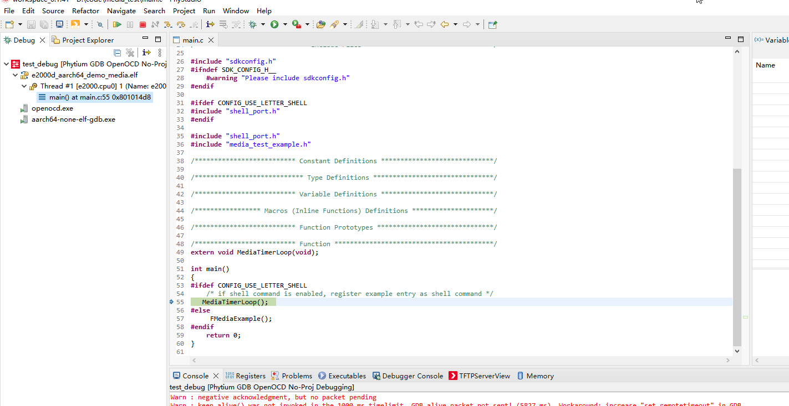

# Phytium-FreeRTOS-SDK

**v1.2.0** [ReleaseNote](./docs/ChangeLog.md)

**如需Phytium全系CPU的软件适配支持，请联系 ``linan1284@phytium.com.cn``**

[飞腾腾云S系列高性能服务器CPU](https://www.phytium.com.cn/homepage/production/list/0)

[飞腾腾锐D系列高效能桌面CPU](https://www.phytium.com.cn/homepage/production/list/1)

[飞腾腾珑E系列高端嵌入式CPU](https://www.phytium.com.cn/homepage/production/list/2)

## 1. 介绍

本项目发布了Phytium系列CPU的FreeRTOS源代码，参考例程以及配置构建工具

代码仓库整体共分为两个分支： 
- master 分支：开发分支，用于保存最新的协作开发代码以及bug修复后的代码。其只要求保障新功能基本正确并且能够满足基本的使用需求，并没有经过系统性和复杂条件下的测试。 
- release 分支：发布分支，包含核心启动代码、芯片外设驱动、用户使用例程和构建的脚本工具。用于保存经过系统性测试的代码并对外发布版本。

---

## 2. 快速入门

- 目前支持在Windows和Linux上使用SDK，支持在x86_64和arm aarch64设备上完成交叉编译

- 参考如下说明搭建Phytium FreeRTOS SDK的软件环境

    [Windows10 快速入门](./docs/reference/usr/install_windows.md)

    [Linux x86_64 快速入门](./docs/reference/usr/install_linux_x86_64.md)

    [Linux arm aarch64 快速入门](./docs/reference/usr/install_linux_aarch64.md)

    [PhyStudio用户手册 无工程调试](./docs/reference/ide/debug_noproj.md)
	

- 参考[使用说明](./docs/reference/usr/usage.md), 新建Phytium FreeRTOS SDK的应用工程，与开发板建立连接
- 参考[例程](./example/template/), 新建Phytium FreeRTOS SDK的例程，在开发板上运行
- 参考[添加板卡](./docs/reference/usr/how_to_add_board.md)，添加自定义板卡

---

## 3. 硬件参考

参考[phytium standalone sdk README.md 3. 硬件参考](https://gitee.com/phytium_embedded/phytium-standalone-sdk/blob/master/README.md#3-%E7%A1%AC%E4%BB%B6%E5%8F%82%E8%80%83)

## 4. 例程支持情况

| Feature            | Platform Supported                        | Platform Developing                  | Component              |
| -------------------| ------------------------------------------| ------------------------------------ | ---------------------- |
| EVENTGROUP         | PD1904  PD2008  PE220X  PD2308  PD2408 |                                      | eventgroup           |
| INTERRUPT          | PD1904  PE220X  PD2008  PD2308  PD2408 |                                      | interrupt                |
| QUEUE              | PD1904  PD2008  PE220X  PD2308  PD2408 |                                      | queue           |
| RESOURCE           | PD1904  PE220X  PD2008  PD2308  PD2408 |                                      | resource                |
| SOFTWARE_TIMER     | PD1904  PD2008  PE220X  PD2308  PD2408 |                                      | software_timer           |
| TASK               | PD1904  PE220X  PD2008  PD2308  PD2408 |                                      | task                |
| TASK_NOTIFY        | PD1904  PD2008  PE220X  PD2308  PD2408 |                                      | task_notify           |

| Network            | Platform Supported                        | Platform Developing                  | Component              |
| -------------------| ------------------------------------------| ------------------------------------ | ---------------------- |
| LWIP               | PD1904  PD2008  PE220X  PD2308  PD2408 |                                      | lwip_startup           |
| UDP                | PD1904  PE220X  PD2008  PD2308  PD2408 |                                      | sockets/udp_multicast  |
| WLAN               | PE220X                                             |                                      | wlan/wlan_hostapd      |

| Peripherals                    | Platform Supported                                 | Platform Developing                  | Component            |
| ------------------------------ | ---------------------------------------------------| ------------------------------------ | -------------------- |
| ADC                            |                                                    | PE220X                               | adc                  |
| CAN                            | PD1904  PE220X  PD2308  PD2008            |                                      | can/can              |
| DDMA                           | PE220X  PD2308                                  |                                      | dma/ddma             |
| GDMA                           | PE220X  PD2008                                  |                                      | dma/gdma             |
| GPIO                           | PE220X  PD2008  PD2308  PD2408            |                                      | gpio                 |
| I2C                            | PE220X  PD2308  PD2408                       | FT2004/PD2008                        | i2c                  |
| I2S                            | PE220X                                             |                                      | i2s                  |
| MEDIA                          | PE220X                                             |                                      | media                |
| QSPI (Nor Flash)               | PE220X  PD2008  PD1904  PD2408            |                                      | qspi                 |
| SPI                            | PE220X  PD2308  PD2408                       |                                      | spi                  |
| TIMER & TACHO                  | PE220X  PD2308                                  |                                      | timer&tacho          |
| SDIF                           | PE220X  PD2408                                  |                                      | sd                   |
| PWM                            | PE2204  PD2308  PD2408                       |                                      | pwm                  |
| USB(Host/Device)               | PE220X  PD2408                                  |                                      | usb                  |
| WDT                            | PD1904  PD2008  PD2308  PE220X  PD2408 |                                      | wdt                  |

| Storage            | Platform Supported                        | Platform Developing                  | Component              |
| -------------------| ------------------------------------------| ------------------------------------ | ---------------------- |
| FATFS              | PE220X  PD2308  PD2408              |                                      | fatfs           |
| QSPI_SPIFFS        | PD1904  PD2308  PE220X  PD2008   |                                      | qspi_spiffs                |
| SPIM_SPIFFS        | PE220X   PD2308  PD2408             |                                      | spim_spiffs           |

| System             | Platform Supported                                 | Platform Developing                  | Component              |
| -------------------| ---------------------------------------------------| ------------------------------------ | ---------------------- |
| AMP                | PE220X  PD2008  PD2308  PD2408            |   PD1904                         | amp/openamp            |
| ATOMIC             | PD1904  PD2008  PE220X  PD2308  PD2408 |                                      | atomic            |
| EXCEPTION_DEBUG    | PD1904  PD2008  PE220X  PD2308  PD2408 |                                      | exception_debug        |
| NESTED_INTERRUPT   | PD1904  PD2008  PE220X  PD2308  PD2408 |                                      | nested_interrupt       |
| POSIX              | PD1904  PD2008  PE220X  PD2308  PD2408 |                                      | posix                |

---
## 5. 参考资料

- The FreeRTOS Reference Manual API Functions and Configuration Options
- Mastering the FreeRTOS Real Time Kernel A Hands-On Tutorial Guide
- FT-2000／4 软件编程手册-V1.4
- D2000 软件编程手册-V1.0
- 飞腾腾珑E2000系列处理器软件编程手册V0.8.1 
- 飞腾派软件开发手册-V1.0

---
## 6. 贡献方法

请联系飞腾嵌入式软件部

huanghe@phytium.com.cn

zhugengyu@phytium.com.cn

wangxiaodong1030@phytium.com.cn

liushengming1118@phytium.com.cn

---

## 7. 许可协议

[Phytium Public License](./LICENSE)