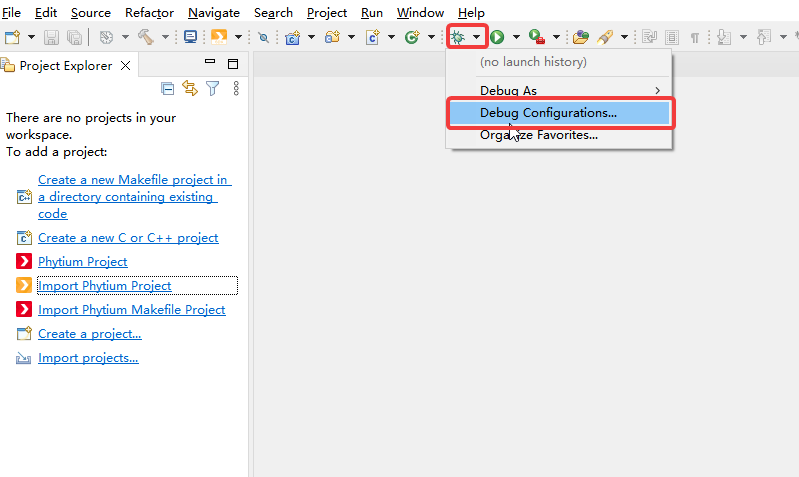
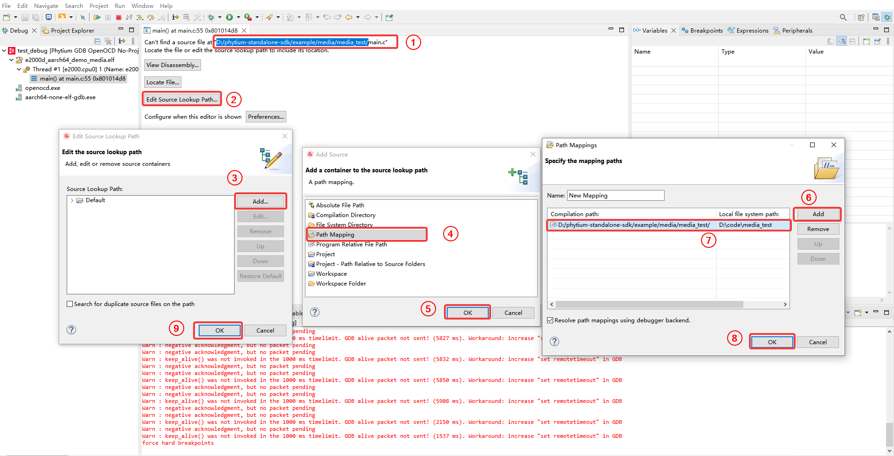
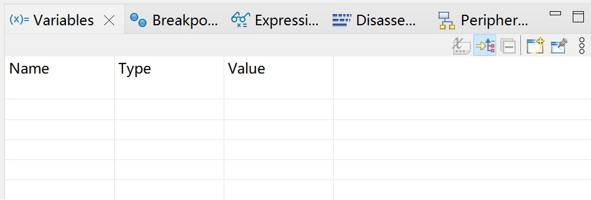
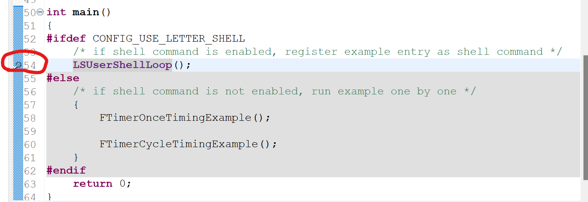
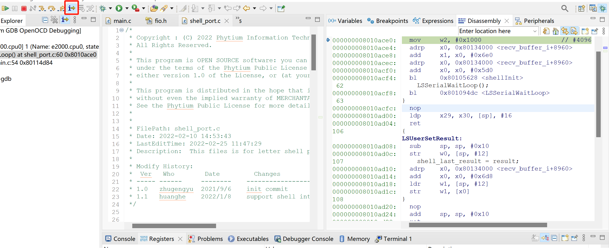
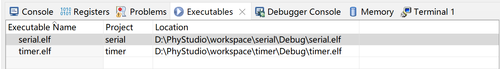
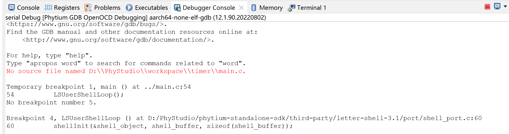

## 无工程调试教程
PhyStudio支持无工程调试，顾名思义也就是在没有创建工程的情况下进行调试，这主要是针对只想使用PhyStudio调试功能的用户，用户选择一个外部的elf文件，然后导入PhyStudio进行调试
### 1.1 创建调试配置
- 点击工具栏的调试菜单下拉箭头->Debug Configurations..



- 在弹出的对话框中双击Phytium GDB OpenOCD No-Proj Debugging选项创建一个新的调试配置，输入名字，选择Aarch类型，然后选择需要调试的elf文件


- Debugger选项卡中，包含启动openocd和gdb的调试配置。Probe对应使用的调试适配器。选择不同的Probe会有不同的Config options启动脚本来启动openocd


- Startup选项卡，包括一些用于配置调试会话的openocd选项。


  
上述字段会按照如下顺序生成命令发送给gdb：

```csharp
monitor reset init
monitor halt
monitor arm semihosting enable
symbol-file ".../wdt/Debug/est.elf"
load ".../wdt/Debug/est.elf"
monitor gdb_breakpoint_override hardware
break main
monitor reset halt
monitor halt
```
### 1.2 启动调试会话

* 启动调试会话前，确保：

  * 开发板具有JTAG接口，并且通过调试适配器将开发板的JTAG接口和主机的USB接口连接起来。

  * 开发板上电。

* 在调试配置框中点击Debug按钮进行调试

### 1.3 配置源码
- 无工程调试启动后默认是没有关联源码的，需要手动添加，先从①处复制elf文件编译路径->点击Edit Source Lookup Path，按照下图所示步骤添加源码路径映射，把编译所在的源码路径和本机所在的源码路径关联起来，完成后就可以查看源码了，调试方式跟有工程调试一样



### 1.4 调试应用

* 基本调试功能位于顶部的栏中。下图按钮从左至右依次为：      
  

  * Resume：继续执行程序；如果没有断点就一直执行，直到执行结束；如果运行过程中有断点，就跳转到该断点。             

  * Suspend：停止执行。

  * Terminate：终止调试会话。

  * Connect/Disconnect：断开调试连接，已禁用。

  * Step Into：下一步，若下一步是函数，则会进入函数体内部执行。

  * Step Over：下一步，不会进入函数体。

  * Step Return：从进入的函数中跳出来或者跳转到所在函数中的下一个断点。

* Variables视图             
  
  该视图中自动填充调试程序的上下文中存在的变量。包含三列：

  * Name 变量名称。

  * Type 变量数据类型。

  * Value 变量的值。

* 注：该视图不允许添加或删除行，只允许自动填充变量。

* Breakpoints视图                      
  显示当前所有断点信息。

     

  添加断点方式：在源代码区域。双击需要添加的断点的代码显示代码行数的位置。

  

* Disassembly视图
  
  点击红框中图标将会跳出Disassembly视图，可以查看对应执行的汇编指令。    

  

* Console视图
  
  显示openocd进程执行情况。                               
  

* Registers视图              
  显示所有寄存器的值。                
  

* Problems视图               
  显示编译、运行和调试过程中产生的警告和错误信息。               
  

* Executables视图                     
                      

* Debugger Console视图                 
  显示gdb调试信息。                         
                     
  可添加需要监测的地址，监测该地址中的值的变化。                 
  

* Terminal视图                 
  点击Window->Show View->Terminal,生成该视图，显示连接开发板的串口信息。          
                 