# PhyStudio IDE 开发环境

- PhyStudio 基于 Eclipse CDT C/C++ 开发，可以便利开发人员在集成开发环境中开发面向 Phytium 系列 CPU 平台的 Standalone 应用程序。本开发环境集成了编辑、编译、网络下载和调试等基础功能，还有管理工程硬件平台、配置 SDK 和 TFTP 服务器等附加功能，可以简化开发工具的安装流程、提升开发调试体验、增加 Standalone 应用程序的开发体验

- PhyStudio 目前支持 Windows x64 操作系统
- PhyStudio 目前支持 E2000 D/Q Demo 板（开发下载和调试）和飞腾派（开发和下载）

- PhyStudio 集成了如下运行环境
	- `OpenJDK17`，开源的 JAVA SE 平台实现
	- `Python 3.8`，Python 平台支持
	- `Eclipse Embedded CDT 2023-03`，基于开源 Eclipse 环境进行了修改
	- `OpenOCD 0.12.0`, 本环境中的 openocd.exe 基于开源软件修改后编译，如果需要修改后的源码，可以联系 `opensource_embedded@phytium.com.cn` 获取
	- `xpack-aarch64-none-elf-gcc-11.3.1-1.2`， xpack 发布的[64位交叉编译链](https://github.com/xpack-dev-tools/aarch64-none-elf-gcc-xpack)，用于 Windows 环境交叉编译 ARM64 目标码
	- `xpack-arm-none-eabi-gcc-12.2.1-1.2-win32-x64`，xpack 发布的[32位交叉编译链](https://github.com/xpack-dev-tools/arm-none-eabi-gcc-xpack)，用于 Windows 环境交叉编译 ARM32 目标码
	- `xpack-windows-build-tools-4.3.0-1`, xpack 发布的[Windows平台构建工具](xpack-windows-build-tools-4.3.0-1)，包含 win32 平台的 make, busybox 工具
	- `Phytium Standalone SDK`，用于 Phytium 系列 CPU 的 嵌入式软件开发工具包

## 1. 快速开始

### 1.1 下载 PhyStudio 安装包

- 从下面的链接中下载开发环境安装包

- [PhyStudio_Setup_V0.1.4.exe](https://pan.baidu.com/s/1azuFUjzg0jZgilQB4r1OlA)
> 提取码： phyt

### 1.2 安装/卸载 PhyStudio

- 安装 PhyStudio 通过双击安装包 .exe 文件，安装界面如图所示


- 点击`安装`后，开始安装，等待安装完成后，勾选`运行 PhyStudio`，然后点击`完成`启动 PhyStudio

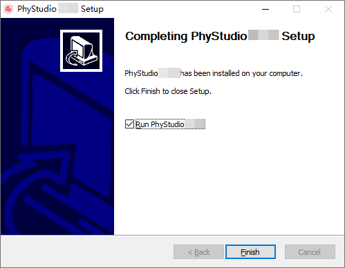

- 启动后会提示选择一个 workspace, 选择一个目录点击 `Launch`即可，勾选`Use this as the default and do not ask again`下次启动会记住这次选择不再询问

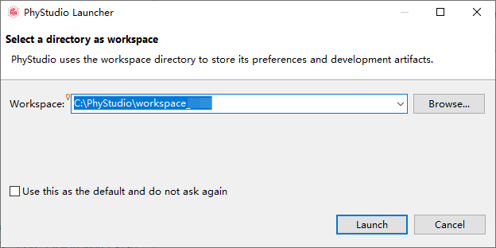

- 卸载 PhyStudio 通过双击安装目录下的 uninst.exe 完成

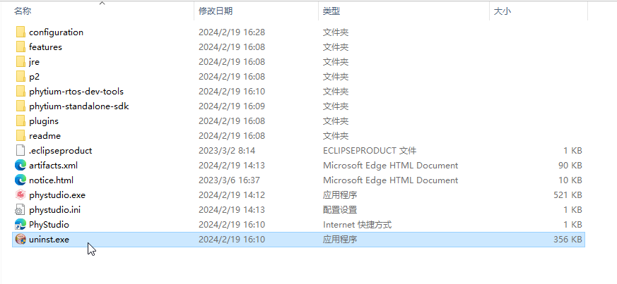


- 卸载完成后手动删除安装目录即可

### 1.3 工作主界面介绍

- PhyStudio 基于 Eclipse 平台开发，界面风格继承自 Eclipse，启动后的欢迎界面如下图所示，从上至下，依次是使用文档中心，使用 issue 提交中心、管理 SDK 的入口，以及导入managed工程和makefile工程

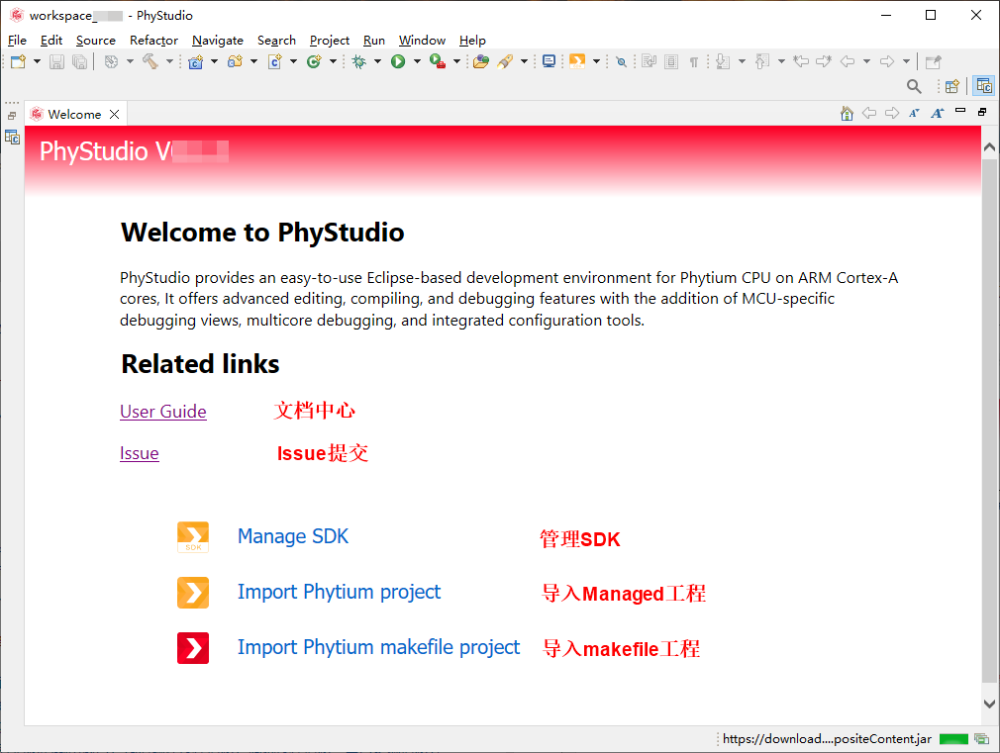

- 创建/导入工程后进入工作主界面，如下图所示，主界面主要包括四大区域:
	- 工程视图区
	- 编辑区
	- 透视图区
	- 信息输出区

- 其中，工程视图区顾名思义是管理特定工程项目的，通过在工程视图选中一个工程，在菜单栏可以进行编译、调试等操作，同时，一些常用操作会在工具栏以图标的形式提供快捷方式
- 编辑区提供编码、调试视图等一系列特定功能，窗口可以移动、关闭、最大化和最小化
- 透视图定义了当前界面呈现的菜单栏，工具栏，以及功能窗口集合及其布局，不同透视图提供了完成特定类型任务的功能集合，例如 C 透视图组合了项目开发，源文件编辑，项目构建等常用的开发功能窗口，菜单和功能按钮，调试透视图包含了调试项目程序常用的调试功能窗口，菜单和功能按钮
- 信息输出区提供了各种信息的输出窗口，包括编译过程信息，调试过程信息、串口终端信息等


### 1.4 Phytium Standalone SDK管理
 在PhyStudio中SDK可以分为全局SDK和工程SDK：
 1. 全局的SDK作用是在创建工程的时候提供模板示例工程，并初始化工程
 2. 工程的SDK作用是提供头文件包含，组件文件链接等

#### 1.4.1 修改全局SDK路径
- 在离线的情况下，可以提前下载好Phytium Standalone SDK，然后在工具栏点击SDK Manage下拉菜单->Config SDK Path配置新的SDK路径，点击`Apply and Close`后就会加载新的SDK模板工程，可能会耗时几分钟


#### 1.4.2 在线更新SDK
- 如果用户需要在现有的SDK上面进行更新，则需要按照上面步骤先找到SDK Path（默认是PhyStudio的安装路径）

- 进入 Phytium Standalone SDK 的路径，通过 git 工具更新 SDK，需要注意的是可能会出现冲突

```
cd ./phytium_standalone_sdk
git remote add pub https://gitee.com/phytium_embedded/phytium-standalone-sdk.git
git fetch pub
git pull
```

- 进入 `tools\export_ide` 目录，双击运行脚本 `gen_proj.bat`，将 Standalone SDK 的 example 转换为 PhyStudio 工程

- Phytium Standalone SDK 资源的详细介绍可以[参考](https://gitee.com/phytium_embedded/phytium-standalone-sdk)

#### 1.4.3 修改工程的SDK路径
- 全局的SDK主要是在创建工程的时候加载模板工程并给工程设置初始的SDK路径，对创建完成的工程不生效
- 如果某个工程需要修改SDK的路径，选中工程右键点击Properties->Resource->Linked Resources->SDK_DIR，按照下图的操作进行修改

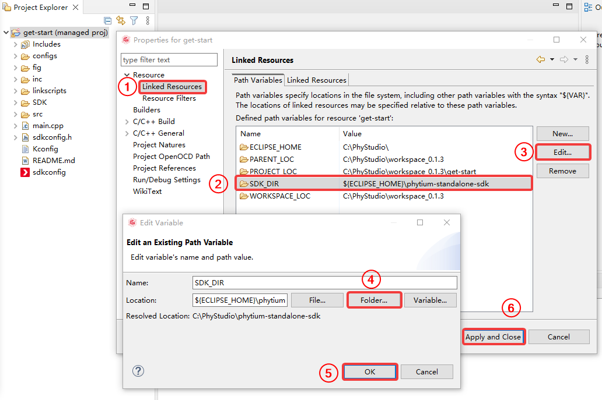

#### 1.4.4 打开工程的SDK路径
- 通过选中工程，右键菜单选择`Open SDK Location`可以打开工程所在的SDK目录，如下图所示:

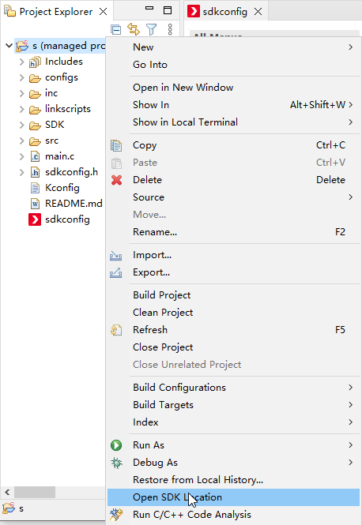

### 1.5 导入或新建项目
PhyStudio支持`Managed工程`和`makefile工程`两种类型，用户需要根据自己的使用场景和使用习惯进行选择，两者的区别如下：
- `Managed工程`通过界面配置，编译时会自动生成makefile文件，工程的用户文件保存在Workspace下面，通过文件链接的方式引用SDK
- `makefile工程`配置编译选项需要修改makefile文件，工程保存在SDK的example目录下面，使用灵活度较高

#### 1.5.1 Managed工程
在PhyStudio中可以创建一个空的工程或者基于SDK的example导入工程此类工程，推荐通过导入的方式创建，以导入example工程为例：
- 点击 File > New > Import Phytium Project，可以导入现有的 Phytium Standalone SDK 工程


- 进入项目导入界面后，选择一个导入例程，选择运行平台，如 e2000d 和运行模式，如 aarch64，最后点击 Finish 开始导入


- 等待一段时间导入完成，然后可以通过工程浏览器查看文件


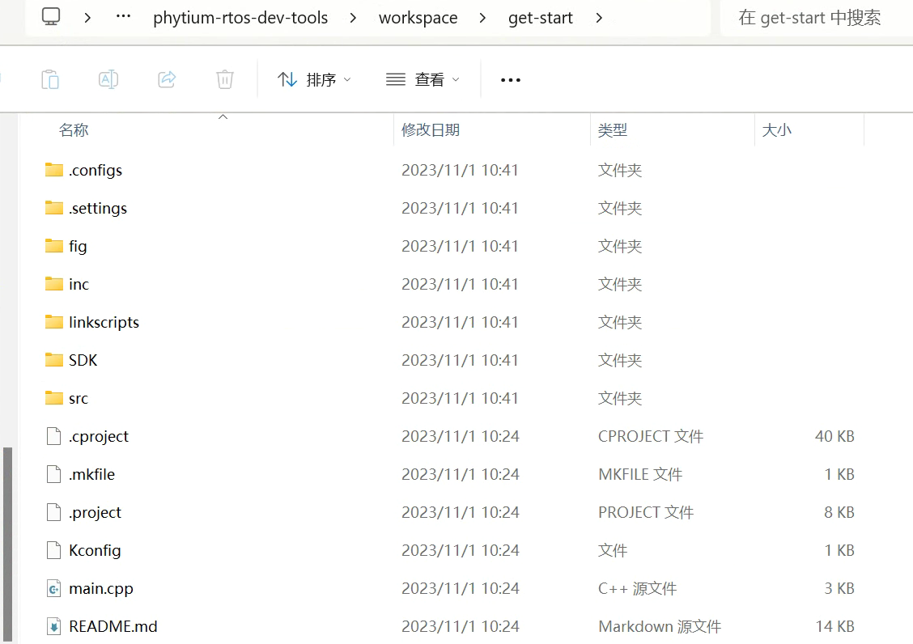

- 如上图所示，其中
    - inc 和 src 是工程的头文件和源文件目录，文件存在在 workspace 的工程目录下
    - SDK 是工程依赖的 Standalone SDK 目录，以文件链接的方式存在，不在工程目录下
    - linkscripts 是工程编译依赖的链接脚本
    - README.md 和 fig 是工程的说明文档及相关图片
    - sdkconfig 是用于本工程的 SDK 配置 
- 配置编译和链接选项，选中工程右键点击Properties->C/C++ Build->Settings->Tool Settings，如果是配置汇编的选项则是在GNU Arm Cross Assembler下，C和C++同理，链接选项在Linker下面配置。以包含C的头文件路径为例，在GNU Arm Cross C Compiler下面进行配置，需要注意的是，在选择路径的时候可以选择Workspace或者File system，如果头文件路径是在工程内就选择Workspace，然后找到对应工程下面的文件夹：

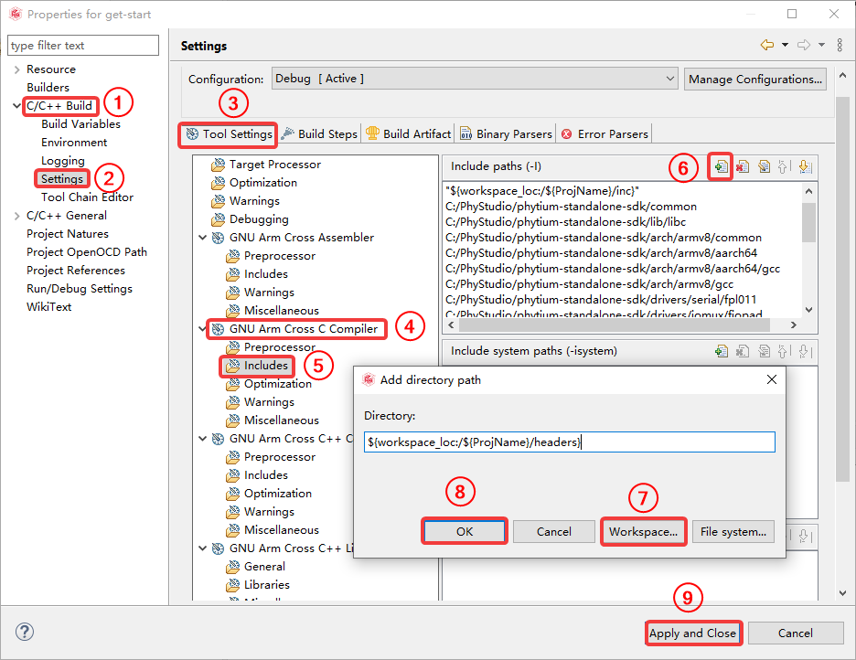

- 此外，可以通过 File > New > Phytium Project，进入工程创建向导，创建一个新的项目

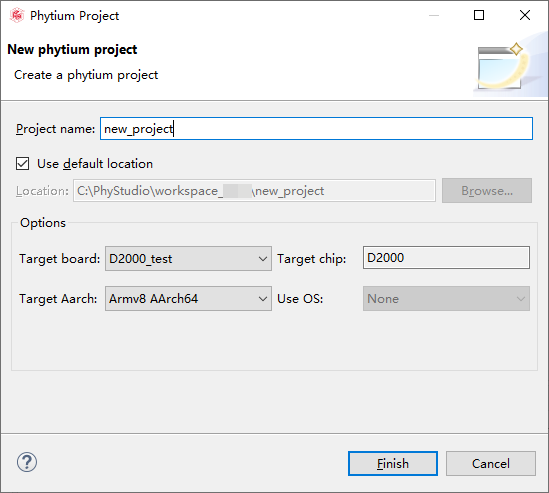

- 创建完成后的工程与导入的工程类似


#### 1.5.2 Makefile工程
此工程类型需要用户自己管理makefile源文件以及头文件的编译，开发方式与命令行方式一样，适用于比较熟悉makefile的用户，目前支持通过SDK的示例工程导入，需要注意的是此类工程是完全链接SDK下的示例工程

- 点击 File > New > Import Phytium Makefile Project，可以导入现有的 Phytium Standalone SDK 工程


- 进入项目导入界面后，选择一个导入例程，选择运行平台，如 e2000d 和运行模式，如 aarch64，最后点击 Finish 开始导入


- 等待一段时间导入完成并初始化后，然后可以通过工程浏览器查看文件


- 如上图所示，其中
    - inc 和 src 是工程的头文件和源文件目录，文件存在于SDK的example目录下
    - SDK 是工程依赖的 Standalone SDK 目录，以文件链接的方式存在，不在工程目录下
    - linkscripts 是工程编译依赖的链接脚本
    - README.md 和 fig 是工程的说明文档及相关图片
    - sdkconfig 是用于本工程的 SDK 配置 
	- makefile 用于编译的makefile，用户需要自己管理

- 配置编译链接选项可以直接修改makefile或者配置sdkconfig来实现，sdkconfig的配置方式将在后面章节中进行介绍

- 如果增加了新的头文件和源文件需要在makefile中进行添加，才能编译通过。如果增加了工程路径之外的源文件编译和头文件包含，除了在makefile中添加之外，还需要在工程中配置头文件的包含路径，才能在编辑器中找到符号表，右键选中工程点击Properties->C/C++ General->Paths and Symbols->选择为Assembly/C/C++添加头文件路径。配置宏定义和库文件路径分别是在Symbols和Library Paths下


### 1.6 配置和构建项目

#### 1.6.1 配置sdkconfig
PhyStudio支持通过sdkconfig配置工程，`Makefile工程`类型支持绝大多数的sdkconfig配置，而`Managed工程`目前仅支持配置组件，其他的一些配置通过sdkconfig可能不会生效，如编译选项，target类型等。
- 双击工程浏览器（Project Explorer）中的 sdkconfig 进入 SDK 配置界面

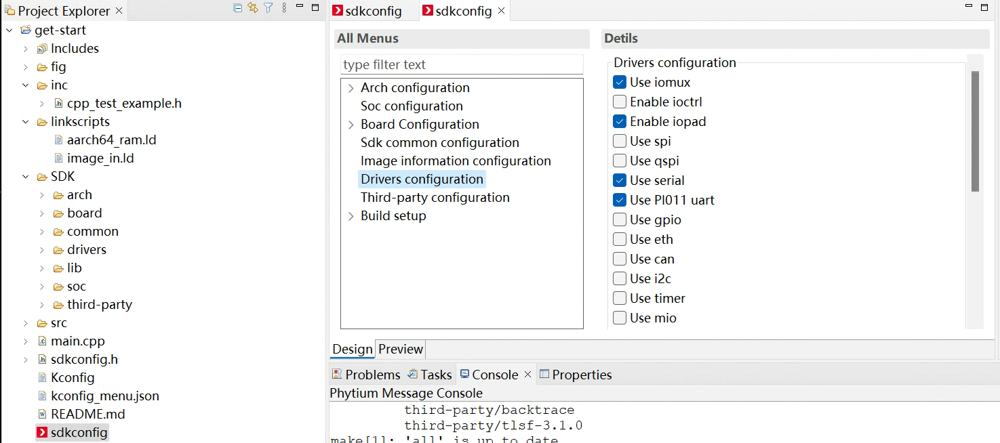

- 在 SDK 配置界面可以按需要选择或者删除配置，例如，选中 Drivers configuration > Use gpio 和 Use FGPIO，然后按 Ctrl + S 保存配置后，工程会新增一个 fgpio 的路径，后面就可以使用 GPIO 驱动了


#### 1.6.2 构建项目

- 完成配置后选中编译的工程，点击工具栏的`Build`图标开始编译

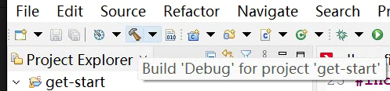


- 编译完成后，生成的 ELF 文件保存在 Debug 目录下


### 1.7 使用串口工具连接开发板

- 启动开发板，PhyStudio 所在的主机通过串口连接开发板

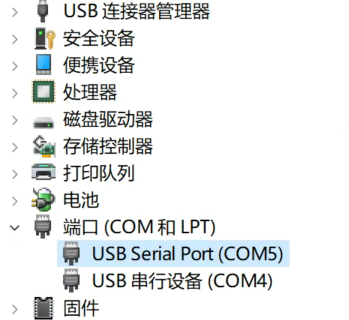

- 在 Windows > Show View > Terminal 中启动串口终端工具，通过`Open a Terminal` 启动一个新的串口终端，


- 这里连接的是串口 COM5，点击`OK`连接成功后可以和开发板进行交互


> 注意有些开发板启动后默认会进入 Linux 环境，要进行后续开发和调试，需要在 U-Boot 界面中修改 bootcmd 使得开发板启动后停留在 U-Boot 界面

- 串口视图支持命令快捷键，可以为一连串命令创建快捷键，在成功连接串口之后在底部点击右键->Add Action，在弹出的对话框中输入名称和命令，完成之后会在底部显示快捷键，点击快捷键按钮直接发送命令，编辑和删除的操作跟添加类似。


### 1.8 通过网络下载程序

- 对于有网口的开发板，可以使用 TFTP 直接将镜像加载到开发板上进行启动，首先需要用网线连接开发板，PhyStudio 主机侧连接开发板的网络需要配置好 ip 网段与开发板后续配置的 ip 配套
- 如下图所示，进入连接开发板的网络适配器配置，PhyStudio 主机侧的 ip 地址设置为 `192.168.4.50`，子网掩码设置为 `255.255.255.0`，网关设置为 `192.168.4.1`

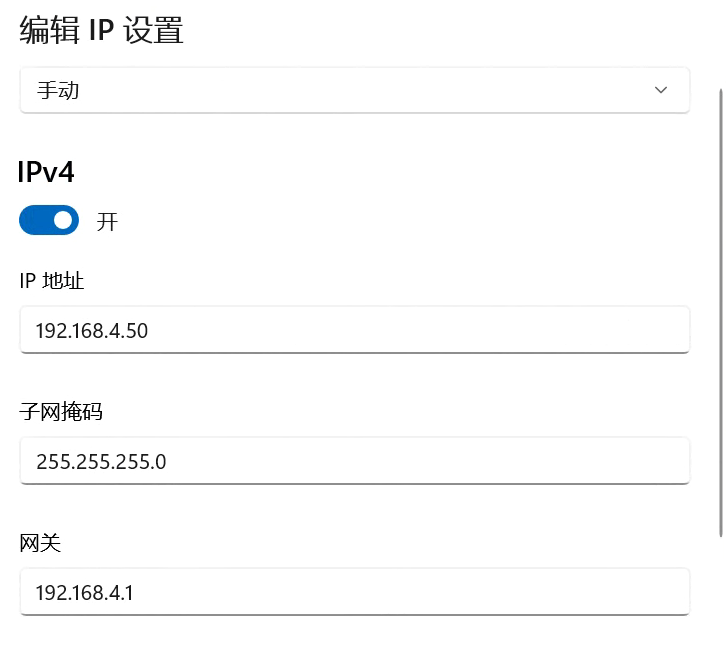

- 然后点击 PhyStudio 的 Window > Show View > TFTPServerView，配置 TFTP 服务

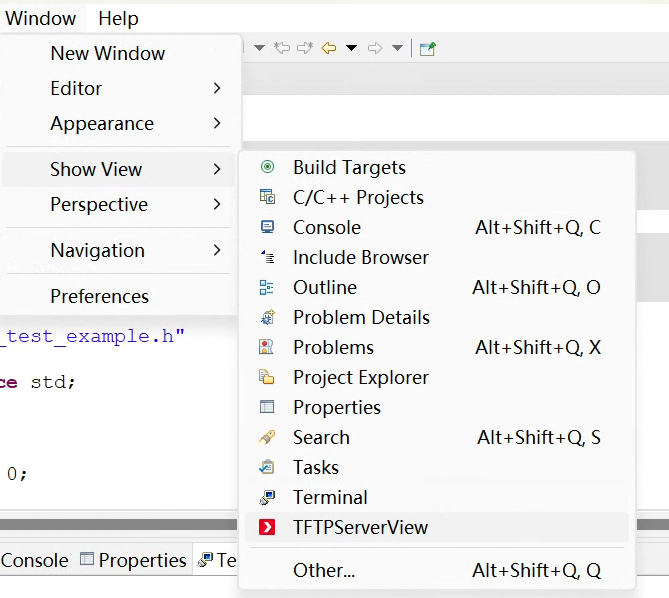

- 点击 `Config FTP Server` 进入配置界面


- 配置 `Listener Host` 为之前设置的主机 ip `192.168.4.50`，TFTP 服务的路径默认为安装路径下的tftp目录，也可以进行修改，配置完成后点击 `Apply and Close` 生效配置

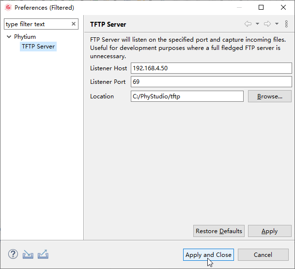

- 配置完成之后点击`Start FTP server`按钮启动 TFTP 服务，启动成功之后按钮状态显示为这样，对工程进行编译，elf文件会自动拷贝到TFTP目录下面去，用户也可以手动拖拽elf文件到TFTP视图中去。*注意：如果启动失败，请检查网络配置、是否已经启动过TFTP服务了，或是端口被占用。*


- 在连接开发板的串口终端中，依次输入下列命令，配置开发板网络，加载并启动镜像 get-start.elf

```
setenv ipaddr 192.168.4.20  
setenv serverip 192.168.4.50 
setenv gatewayip 192.168.4.1 
tftpboot 0xa0100000 get-start.elf
bootelf -p 0xa0100000
```

> 镜像的名字根据实际情况设置

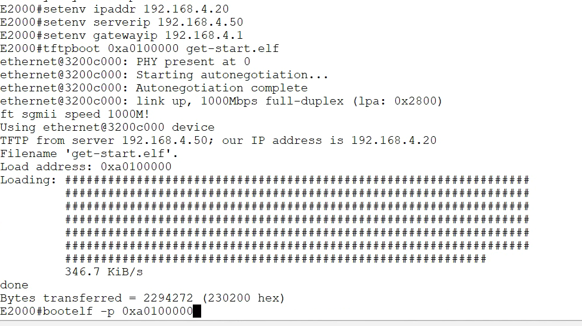

- 随后可以看到开发板的运行输出

### 1.9 启动程序调试运行

- 对于有 FJTAG 接口的开发板，可以使用调试运行功能，首先参考[jtag_debugging.md](../jtag_debugging/jtag_debugging.md)进行硬件连接

> 目前支持 FJTAG 调试的开发板包括 E2000 D/Q Demo 板

- 如果使用 CMSIS DAP/DAPLink 作为 JTAG 适配器，连接成功后，设备管理器上应该会看到枚举出的 HID 设备

> 具体设备类型取决于 CMSIS DAP 的生成厂家

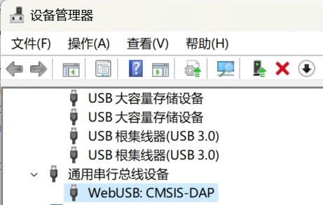

- 如果使用 Jlink 作为适配器，连接成功后，设备管理器上应该会看到枚举出的 Bulk 设备

> 注意 PhyStudio 使用 OpenOCD 作为调试代理，用 Jlink 作为适配器时不能使用 Jlink 的官方驱动，必须用 libusb 将 Jlink 设备识别为 USB Bulk 设备，相关内容可以参考 [Using J-Link with OpenOCD](https://wiki.segger.com/OpenOCD)，[解决 OpenOCD 不能识别 J-Link的方法](https://blog.csdn.net/weixin_45467056/article/details/119886361)

- 用适配器连接 PhyStudio 主机和开发板后，在 PhyStudio 的工程中创建调试配置，通过 Debug Configurations 进入调试配置界面，双击 Phytium GDB OpenOCD Debug 创建一个调试配置


- 进入调试配置界面，一般只需要选择适配器（Probe）是 Jlink 还是 DAP，其他配置可以参考 Eclipse OpenOCD 的[配置说明](https://eclipse-embed-cdt.github.io/debug/openocd/)修改，修改完成后点击`Apply`保存配置 

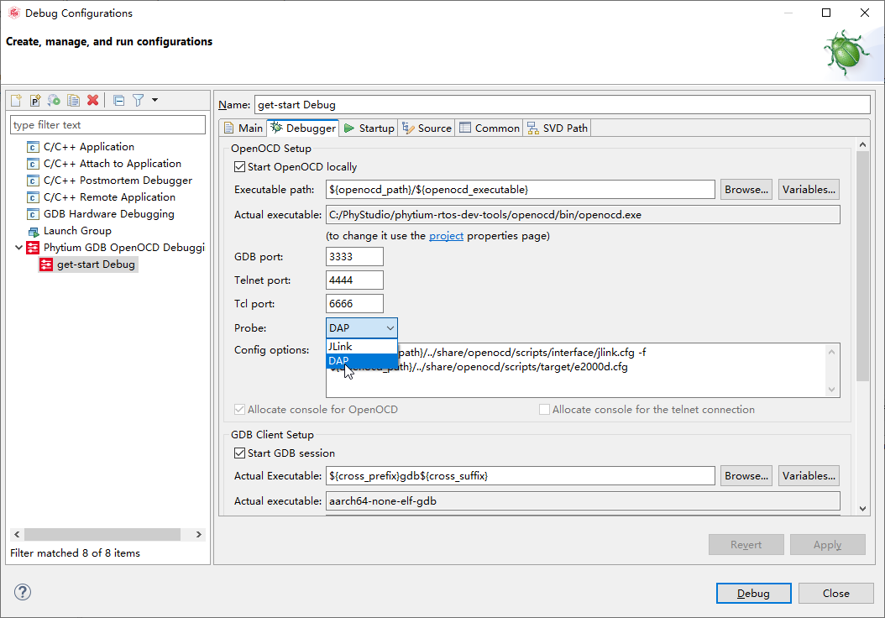

- 然后复位开发板，保证开发板停留在 U-Boot 界面，然后选中待调试的工程，点击 `Debug As` 启动调试


- 启动调试后进入调试视图，默认会停在在 main 函数入口断点

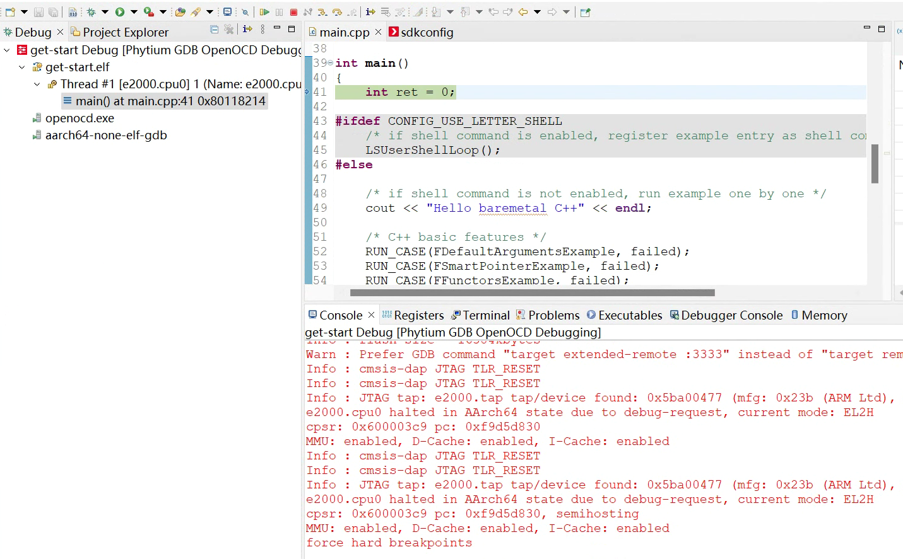
- 如果启动后调试后没有显示符号表，可能是elf文件较大还在下载中，请耐心等待一会。或者是没有勾选sdkconfig中的Generate debug symbols选项，勾选之后重新编译即可
- 在调试过程中，通过工具栏的`Step Into`、`Step Over` 和 `Continue` 等控制程序的运行


- 通过`Variables`、`Breakpoints` 和 `Expressions` 等窗口进行调试观察

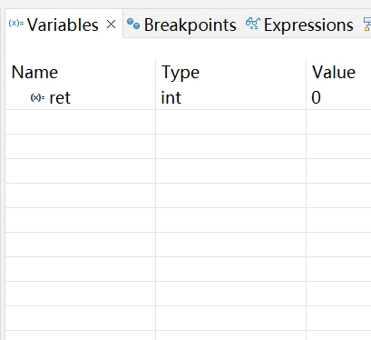


- 通过 Windows > Show View > Disassembly 查看反汇编信息

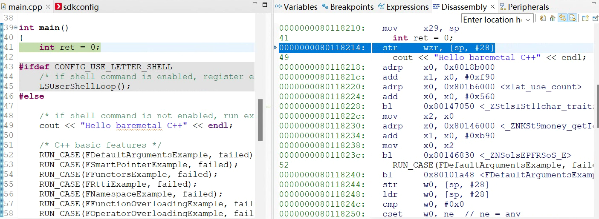

- 通过 Windows > Show View > Register 查看实时寄存器信息


> 选择 Number Format > Hex 可以显示16进制的寄存器值

- 通过 Windows > Show View > Memory 查看运行实时内存


### 1.10 无工程调试
PhyStudio支持无工程调试，顾名思义也就是在没有创建工程的情况下进行调试，这主要是针对只想使用PhyStudio调试功能的用户，用户选择一个外部的elf文件，然后导入PhyStudio进行调试
#### 1.10.1 创建调试配置
- 点击工具栏的调试菜单下拉箭头->Debug Configurations..


- 在弹出的对话框中双击Phytium GDB OpenOCD No-Proj Debugging选项创建一个新的调试配置，输入名字，选择Aarch类型，然后选择需要调试的elf文件，在Debugger页签选择好调试接口类型后点击Debug按钮进行调试


#### 1.10.2 配置源码
- 无工程调试启动后默认是没有关联源码的，需要手动添加，先从①处复制elf文件编译路径->点击Edit Source Lookup Path，按照下图所示步骤添加源码路径映射，把编译所在的源码路径和本机所在的源码路径关联起来，完成后就可以查看源码了，调试方式跟有工程调试一样


### 1.11 Git版本控制
- PhyStudio加入了EGit插件，支持git版本控制，具体使用方法参照官方文档[EGit用户指导](https://wiki.eclipse.org/EGit/User_Guide "EGit用户指导")，这里介绍一些基本的用法
#### 1.11.1 从远程仓库克隆
- 点击右上角的按钮，切换到Git透视图，如下图所示，或者点击菜单栏的Window->Show View->Other..->Git->Git Repositories

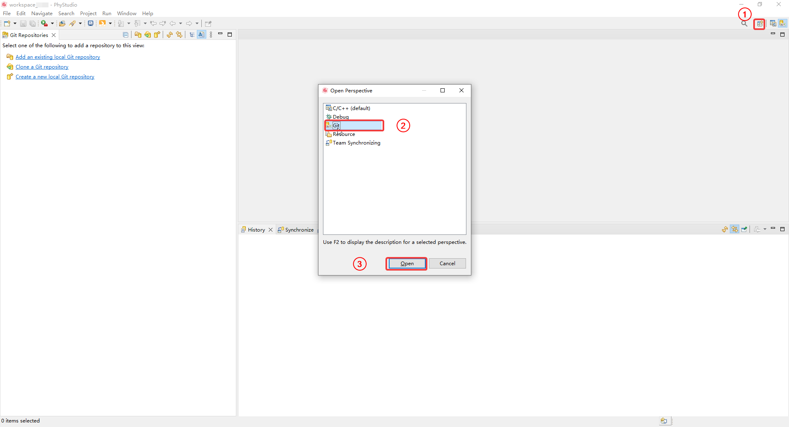

- 在Git视图中点击克隆远程仓库的按钮，输入仓库地址，输入用户名和密码，点击Next按钮

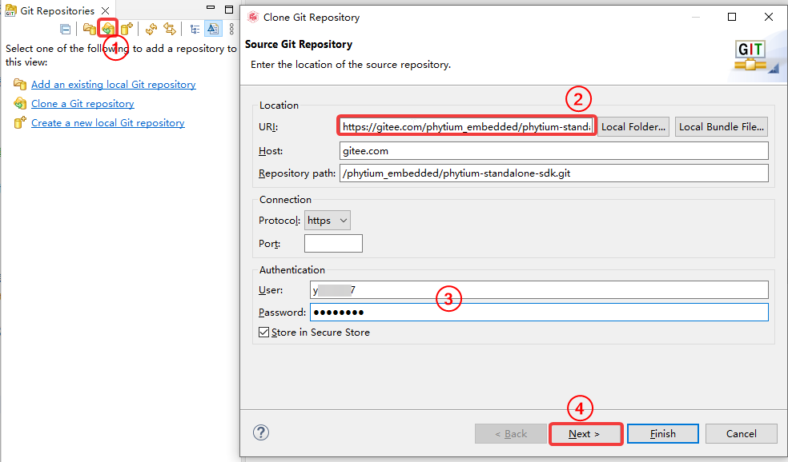

- 选择需要克隆的分支，然后点击Next按钮

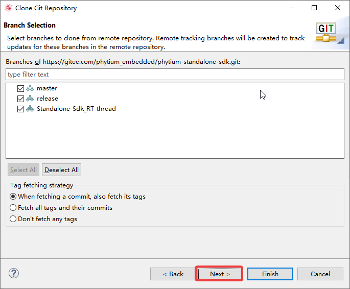

- 选择目录，然后点击Finish按钮，等待克隆完成之后会在Git视图中显示


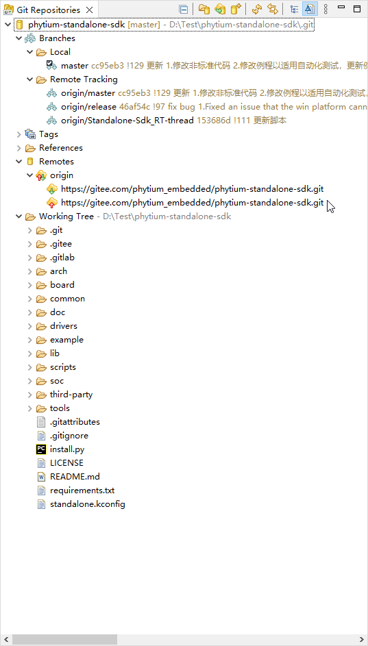

#### 1.11.2 创建一个新的Git仓库
- 在Git视图中点击创建Git新仓库按钮，选择仓库目录，点击`Create`按钮


- 创建完之后关联远程仓库，在仓库的Remotes节点上面右键点击`Create Remote..`按钮，然后在弹出的对话框中点击`Create`按钮


- 点击左侧的`Change..`按钮，在右侧输入仓库地址和用户名密码，点击`Finish`按钮，然后点击左侧的`Save`按钮


- 添加完成后在仓库下就能看见远程仓库，如果没有显示就点击一下Git视图的刷新按钮


#### 1.11.3 把代码推送到远程仓库

- 如果代码还没有加入到git仓库里面，需要右键点击工程->Team->Share Project..


- 选择一个已有的仓库或者新建一个仓库然后选择，点击`Finish`按钮，此时工程代码已经被添加到了代码库。注意：如果代码已经添加到仓库了，直接忽略添加的步骤。


- 右键选择工程->Team->Commit，把要提交的内容从Unstaged Changes加入到Staged Changes中去，然后输入提交信息，最后点击`Commit`按钮


- 右键选择工程->Team->Push Branch 'master'，在弹出的对话框中点击`Push`按钮进行推送。
> 注意: 如果推送失败，有可能是远程分支上面的提交没有同步，此时可能需要fetch、pull或是merge之后才能进行推送

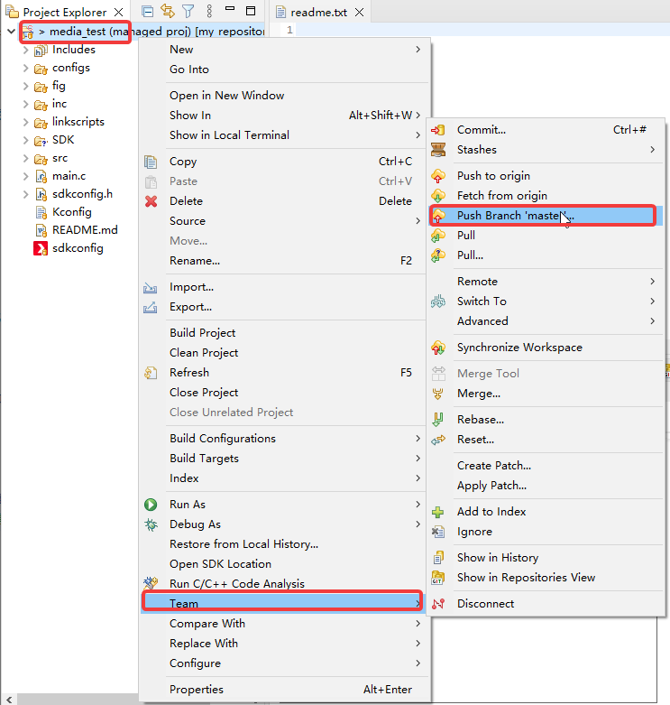


### 1.12 开发技巧
#### 1.12.1 常用快捷键
	Alt+/                     代码提示
	F3或者Ctrl+鼠标左键        查看定义或声明
	F4                        查看继承关系
	Ctrl+Alt+H                选中函数，查看调用关系
	Ctrl+Shift+G              查看所有引用
	Ctrl+Shift+F              格式化代码（可能和其他应用的快捷键冲突）
	Ctrl+H                    全局搜索
	Ctrl+D                    删除当前行
	Ctrl+Alt+ ↓或↑            向下或者向上复制
	Ctrl+/                    注释当前行, 再按则取消注释
	Ctrl+Shift+/              块注释
	Ctrl+Shift+\              取消块注释
	Alt+ ←或→                 光标定位到前一个或者后一个位置
	Ctrl+Q                    定位到最后编辑的地方
	Ctrl+K                    参照选中的 Word 快速定位到下一个
	Ctrl+L                    定位到某行
	Shift+Enter               在当前行的下一行插入空行

