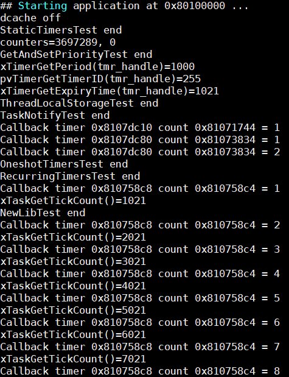

<!--
 * @ : Copyright (c) 2021 Phytium Information Technology, Inc. 
 *  
 * SPDX-License-Identifier: Apache-2.0.
 * 
 * @Date: 2021-09-06 11:37:27
 * @LastEditTime: 2021-09-06 16:24:00
 * @Description:  This files is for freertos test
 * 
 * @Modify History: 
 *  Ver   Who        Date         Changes
 * ----- ------     --------    --------------------------------------
-->
# function test base on freertos

## 1. 例程介绍

本例程示范了freertos环境下的功能性能测试。
主要包括中断中的浮点计算，任务优先级，静态任务、定时器、队列、信号量的创建，任务状态追踪获取，绝对延时，钩子函数，流式缓冲测试等。

## 2. 如何使用例程

本例程需要用到
- Phytium开发板（FT2000-4/D2000）
- [Phytium freeRTOS SDK](https://gitee.com/phytium_embedded/phytium-free-rtos-sdk)
- [Phytium standalone SDK](https://gitee.com/phytium_embedded/phytium-standalone-sdk)

### 2.1 硬件配置方法

本例程支持的硬件平台包括

- FT2000-4
- D2000

对应的配置项是，

- CONFIG_TARGET_F2000_4
- CONFIG_TARGET_D2000

### 2.2 SDK配置方法

由于使用到了看门狗中断配合进行测试，本例程需要

- 使能wdt模块

对应的配置项是，

- Use FWDT

具体的测试项见main.c的宏定义，可根据具体的测试需求修改宏定义的值，以下对测试项宏的具体含义进行简单说明
```
ISR_FLOAT_TEST----测试中断处理函数中的浮点数计算
BACKPORT_TEST----静态内存分配API的测试，xTaskCreateStatic等函数
DEBUG_QUEUE_REGISTER_TEST----队列queue registry测试
EVENT_GROUPS_TEST----事件组event_groups测试
TASK_GET_STATE_TEST----获取任务运行状态测试
MUTEX_TEST----互斥信号量测试
SCHEDULING_TIME_TEST----调度时间测试
TASK_DELAY_UNTIL_TEST----绝对延时测试
DELETE_TASK_TEST----任务删除测试
TASK_NOTIFY_TEST----任务通知测试
TRACE_FACILITY_TEST----任务状态追踪测试
ISR_LATENCY_TEST----中断延时测试
HOOK_TEST----钩子函数测试
NEWLIB_REENT_TEST----函数重入测试
PANIC_TEST----cpu报错测试
QUEUE_SET_GET_TEST----队列发送接收测试
STREAM_TEST----流缓存区测试
PRIORITY_TEST----任务优先级测试
THREAD_LOCAL_TEST----线程局部存储thread local storage测试
TIMER_TEST----定时器测试
```

本例子已经提供好具体的编译指令，以下进行介绍:
- make 将目录下的工程进行编译
- make clean  将目录下的工程进行清理
- make boot   将目录下的工程进行编译，并将生成的elf 复制到目标地址
- make load_d2000_aarch64  将预设64bit d2000 下的配置加载至工程中
- make load_d2000_aarch32  将预设32bit d2000 下的配置加载至工程中
- make load_ft2004_aarch64  将预设64bit ft2004 下的配置加载至工程中
- make load_ft2004_aarch32  将预设32bit ft2004 下的配置加载至工程中
- make menuconfig   配置目录下的参数变量
- make backup_kconfig 将目录下的sdkconfig 备份到./configs下

具体使用方法为:
- 在当前目录下
- 执行以上指令

### 2.3 构建和下载

#### 2.3.1 构建过程

- 在host侧完成配置
>配置成ft2004，对于其它平台，使用对于的默认配置，如D2000 `make load_d2000_aarch32`

- 选择目标平台
```
make load_ft2004_aarch32
```

- 选择例程需要的配置
```
make menuconfig
```

- 进行编译
```
make
```

- 将编译出的镜像放置到tftp目录下
```
make boot
```

#### 2.3.2 下载过程

- host侧设置重启host侧tftp服务器
```
sudo service tftpd-hpa restart
```

- 开发板侧使用bootelf命令跳转
```
setenv ipaddr 192.168.4.20  
setenv serverip 192.168.4.50 
setenv gatewayip 192.168.4.1 
tftpboot 0x90100000 freertos.elf
bootelf -p 0x90100000
```

### 2.4 输出与实验现象

- 启动进入后，cpu运行所有的测试任务，打印任务运行信息




## 3. 如何解决问题

Q: 程序运行过程中报exception错误

A: 考虑以下任务创建时分配的栈空间大小和优先级设置

Q: 程序运行过程中优先级报错

A: 考虑任务创建时的优先级设置是否过大


## 4. 修改历史记录

v0.0.5  合入freertos_test测试


