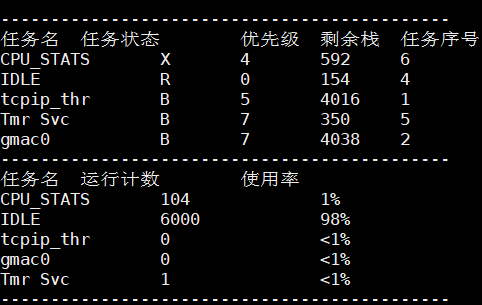
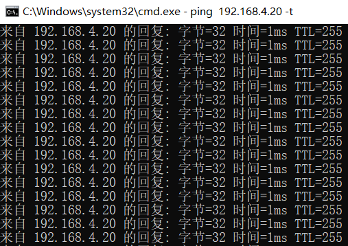

<!--
 * @ : Copyright (c) 2021 Phytium Information Technology, Inc. 
 *  
 * SPDX-License-Identifier: Apache-2.0.
 * 
 * @Date: 2021-09-06 11:37:27
 * @LastEditTime: 2021-09-06 16:24:00
 * @Description:  This files is for 
 * 
 * @Modify History: 
 *  Ver   Who        Date         Changes
 * ----- ------     --------    --------------------------------------
-->
# lwip base on freertos

## 1. 例程介绍

本例程示范了freertos环境下的lwip移植。
本例程目前支持在freertos下，移植lwip，使网络能够ping通，freertos的cpu状态信息任务正常运行。

## 2. 如何使用例程

本例程需要用到
- Phytium开发板（FT2000-4/D2000）
- [Phytium freeRTOS SDK](https://gitee.com/phytium_embedded/phytium-free-rtos-sdk)
- [Phytium standalone SDK](https://gitee.com/phytium_embedded/phytium-standalone-sdk)
### 2.1 硬件配置方法

本例程支持的硬件平台包括

- FT2000-4
- D2000

对应的配置项是，

- CONFIG_TARGET_F2000_4
- CONFIG_TARGET_D2000

### 2.2 SDK配置方法

本例程需要，

- 使能LWIP

对应的配置项是，

- Use LWIP 

### 2.3 构建和下载

#### 2.3.1 构建过程

- 在host侧完成配置
>配置成D2000，对于其它平台，使用对于的默认配置，如FT2000-4 `make config_ft2004_configs`
```
$ make config_d2000_configs 
$ make menuconfig
```

- 在host侧完成构建
```
$ make
```

#### 2.3.2 下载过程

- host侧设置重启host侧tftp服务器
```
sudo service tftpd-hpa restart
```

- 开发板侧使用bootelf命令跳转
```
setenv ipaddr 192.168.4.20  
setenv serverip 192.168.4.50 
setenv gatewayip 192.168.4.1 
tftpboot 0x90100000 baremetal.elf
bootelf -p 0x90100000
```

### 2.4 输出与实验现象

- 启动进入后，cpu状态任务打印状态信息



#### 2.4.1 使用网线连接计算机和开发板网口0，ping 192.168.4.20命令进行网络测试




## 3. 如何解决问题

Q: 程序运行过程中queue.c的debug信息报错

A: 考虑自身任务创建时分配的栈空间大小，考虑tcpip_thread任务的栈空间大小TCPIP_THREAD_STACKSIZE

Q: 程序运行过程中ping大包异常

A: 考虑以下两个宏的大小：PBUF_POOL_SIZE定义缓冲池的个数，PBUF_POOL_BUFSIZE定义单个缓冲区的大小

## 4. 修改历史记录

v0.0.4  初次合入lwip


