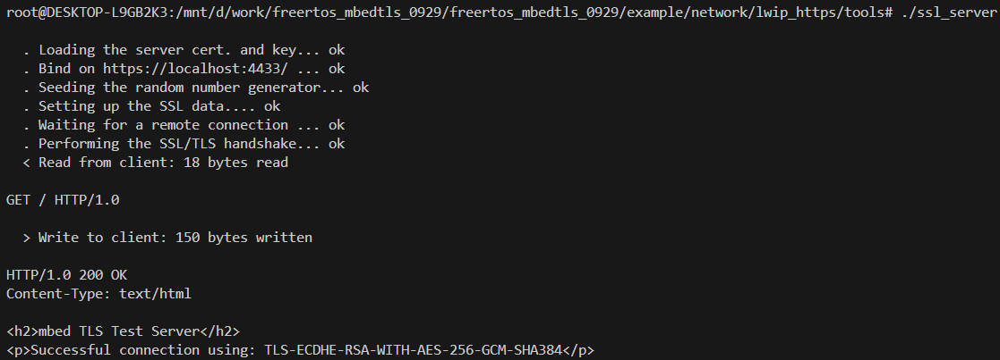
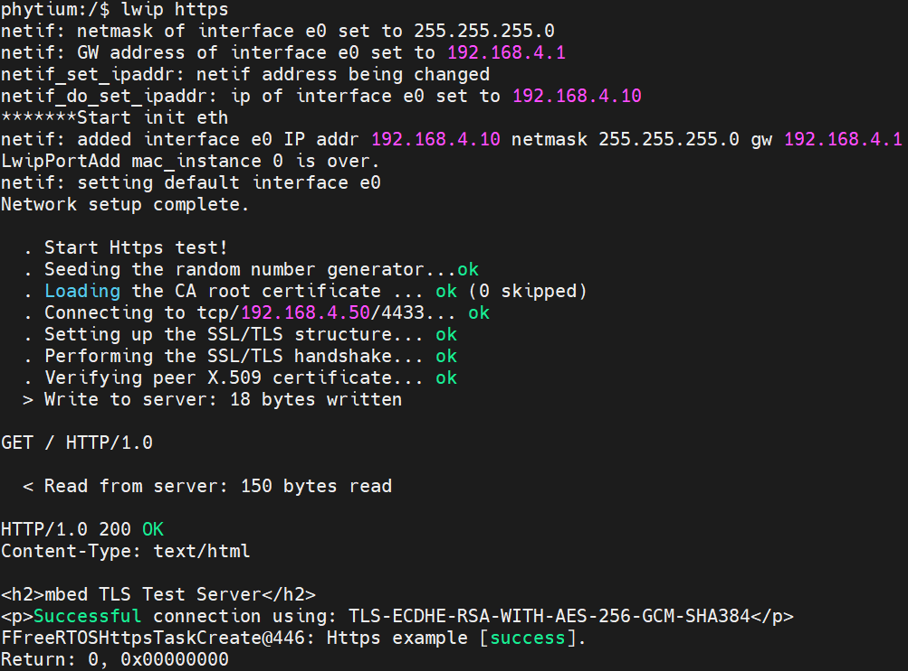

# LWIP HTTPS 测试
- MbedTLS 是一个轻量级的、适用于嵌入式设备的开源加密库，它为各种安全通信协议和加密算法提供实现，广泛用于资源受限的环境，如物联网设备、嵌入式系统、和微控制器等。该库原本叫做 PolarSSL，后来被 ARM 收购并更名为 MbedTLS。它可以用于实现许多加密功能，确保网络通信的安全性。
- MbedTLS 提供了如下的能力:
  - 完整的 SSL v3、TLS v1.0、TLS v1.1 和 TLS v1.2 协议实现
  - X.509 证书处理
  - 基于 TCP 的 TLS 传输加密
  - 基于 UDP 的 DTLS（Datagram TLS）传输加密
  - 其它加解密库实现

## 1. 例程介绍

><font size="1">介绍例程的用途，使用场景，相关基本概念，描述用户可以使用例程完成哪些工作</font><br />

本例程示范了一个简单的Https client，与测试网站建立TLS连接并获取加密数据。

### 1.1 Https client测试例程 (https_example.c)
- ipv4模式下初始化开发板上所有网口以及对应网卡控制器
- 为每个网卡配置静态IPv4地址
- client连接主机TLS测试网站
- client和server握手成功
- client发送请求
- server回应请求

## 2. 如何使用例程

><font size="1">描述开发平台准备，使用例程配置，构建和下载镜像的过程</font><br />

本例程需要以下硬件，

- E2000D/Q Demo板，FT2000/4开发板，D2000开发板，PhytiumPi，PD2408 Test a/b板
- 网线、串口线、路由器和串口上位机

### 2.1 硬件配置方法

><font size="1">哪些硬件平台是支持的，需要哪些外设，例程与开发板哪些IO口相关等（建议附录开发板照片，展示哪些IO口被引出）</font><br />
- 为方便测试，一般需要自带路由器设备。
- 利用路由器上的多个接口，我们可以更加方便的进行多网口测试。
- 路由器一般能够提供dhcp服务，利用该服务，我们可以在运行网卡dhcp模式初始化测试例程时看到相应的dhcp服务器分配地址的现象。
- 关于路由器配置，请参考网上相关资料自行配置。

### 2.2 SDK配置方法

><font size="1">依赖哪些驱动、库和第三方组件，如何完成配置（列出需要使能的关键配置项）</font><br />

本例程需要：
- LWIP组件，依赖 USE_LWIP
- Letter Shell组件，依赖 USE_LETTER_SHELL
- MBEDTLS组件，依赖 USE_MBEDTLS

对应的配置项是，

- CONFIG_USE_LWIP
- CONFIG_USE_LETTER_SHELL
- CONFIG_USE_MBEDTLS

- 本例子已经提供好具体的编译指令，以下进行介绍：

  1. make 将目录下的工程进行编译
  2. make clean  将目录下的工程进行清理
  3. make image   将目录下的工程进行编译，并将生成的elf 复制到目标地址
  4. make list_kconfig 当前工程支持哪些配置文件
  5. make load_kconfig LOAD_CONFIG_NAME=`<kconfig configuration files>`  将预设配置加载至工程中
  6. make menuconfig   配置目录下的参数变量
  7. make backup_kconfig 将目录下的sdkconfig 备份到./configs下
- 具体使用方法为：

  - 在当前目录下
  - 执行以上指令

### 2.3 构建和下载

><font size="1">描述构建、烧录下载镜像的过程，列出相关的命令</font><br />

本文档将以E2000D demo开发板为例，对于其它平台，使用对应的默认配置

- 在host端完成配置
- 选择目标平台

```
make load_kconfig LOAD_CONFIG_NAME=pe2202_aarch64_demo_lwip_https
```

- 选择例程需要的配置

```
make menuconfig
```

- 进行编译

```
make
```

- 将编译出的镜像放置到tftp目录下

```
make image
```

- host侧设置重启host侧tftp服务器

```
sudo service tftpd-hpa restart
```

- 开发板侧使用bootelf命令跳转

```
setenv ipaddr 192.168.4.20  
setenv serverip 192.168.4.50 
setenv gatewayip 192.168.4.1 
tftpboot 0x90100000 freertos.elf
bootelf -p 0x90100000
```

### 2.4 输出与实验现象

><font size="1">描述输入输出情况，列出存在哪些输出，对应的输出是什么（建议附录相关现象图片）</font><br />

#### 2.4.1 Https client测试例程 (https_example.c)

首先在主机端tools目录下启动https服务器，ssl_server是一个服务端程序



然后在开发板端启动https客户端，并连接到测试网站
```
lwip https
```




## 3. 如何解决问题

- Q: 如何静态配置开发板的ip地址？
- A: ipv4地址在board_mac_config静态变量中修改如下成员变量即可：

```
      .ipaddr="192.168.4.10",
      .gw="192.168.4.1",
      .netmask="255.255.255.0",
```

- A: ipv6地址在board_mac_config静态变量中修改如下成员变量即可：

```
      .mac_address={0x98, 0x0e, 0x24, 0x00, 0x11, 0x1},
```

## 4. 修改历史记录
