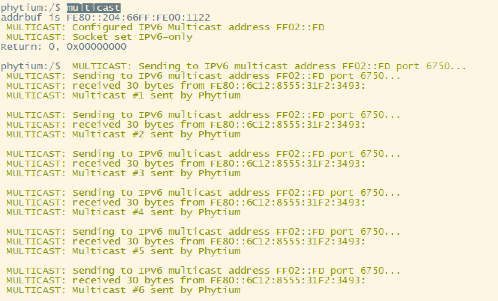
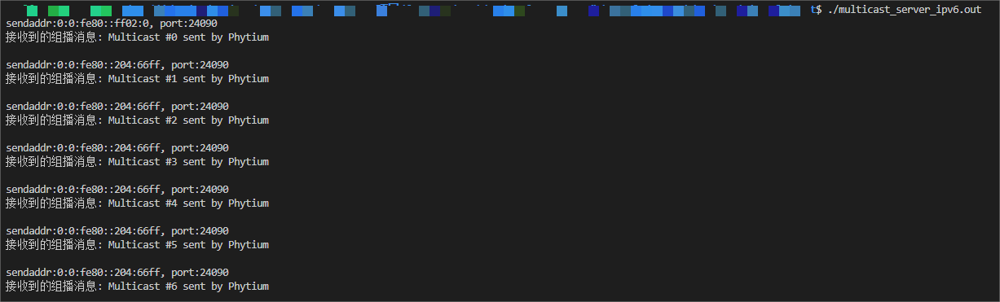

<!--
 * Copyright : (C) 2022 Phytium Information Technology, Inc. 
 * All Rights Reserved.
 *  
 * This program is OPEN SOURCE software: you can redistribute it and/or modify it  
 * under the terms of the Phytium Public License as published by the Phytium Technology Co.,Ltd,  
 * either version 1.0 of the License, or (at your option) any later version. 
 *  
 * This program is distributed in the hope that it will be useful,but WITHOUT ANY WARRANTY;  
 * without even the implied warranty of MERCHANTABILITY or FITNESS FOR A PARTICULAR PURPOSE.
 * See the Phytium Public License for more details. 
 *  
 * 
 * FilePath: README.md
 * Date: 2022-08-06 15:52:17
 * LastEditTime: 2022-08-06 15:52:17
 * Description:  This file is for 
 * 
 * Modify History: 
 *  Ver   Who  Date   Changes
 * ----- ------  -------- --------------------------------------
-->


# lwip udp multicast test on freertos

## 1. 例程介绍

本例程示范了freertos环境下的lwip移植。
本例程目前支持在freertos下，移植lwip，并且支持基于socket 编程风格的 IPV4 & IPV6 UDP multicast 特性。

## 2. 如何使用例程

本例程需要用到
- Phytium开发板（E2000）
- [Phytium freeRTOS SDK](https://gitee.com/phytium_embedded/phytium-free-rtos-sdk)
- [Phytium standalone SDK](https://gitee.com/phytium_embedded/phytium-standalone-sdk)
### 2.1 硬件配置方法

本例程支持的硬件平台包括

- E2000D/E2000Q
- D2000

对应的配置项是

- CONFIG_TARGET_E2000D
- CONFIG_TARGET_E2000Q
- CONFIG_TARGET_D2000

### 2.2 SDK配置方法

本例程需要:

- 使能LWIP

对应的配置项是:

- CONFIG_USE_LWIP
- CONFIG_USE_LETTER_SHELL


本例子已经提供好具体的编译指令，以下进行介绍:
- make 将目录下的工程进行编译
- make clean  将目录下的工程进行清理
- make boot   将目录下的工程进行编译，并将生成的elf 复制到目标地址
- make load_e2000d_aarch64  将预设64bit e2000d 下的配置加载至工程中
- make load_e2000d_aarch32  将预设32bit e2000d 下的配置加载至工程中
- make load_e2000q_aarch64  将预设64bit e2000q 下的配置加载至工程中
- make load_e2000q_aarch32  将预设32bit e2000q 下的配置加载至工程中 
- make test_code 编译./test 目录下的测试代码
- make menuconfig   配置目录下的参数变量
- make backup_kconfig 将目录下的sdkconfig 备份到./configs下

具体使用方法为:
- 在当前目录下
- 执行以上指令

### 2.3 构建和下载

#### 2.3.1 构建过程

- 在host侧完成配置
>对于其它平台，使用对于的默认配置，如E2000D `make load_e2000d_aarch32`

- 选择目标平台
```
make load_e2000d_aarch32
```

- 选择例程需要的配置
```
make menuconfig
```

- 将编译出的镜像放置到tftp目录下
```
make boot
```

- 以下命令用于编译测试用的例程 ,注意此时需要使用到编译环境中的gcc编译器，请确认您的环境能够进行此操作。

```
make test_code
```


#### 2.3.2 下载过程

- host侧设置重启host侧tftp服务器
```
sudo service tftpd-hpa start
```

- 开发板侧使用bootelf命令跳转
```
setenv ipaddr 192.168.4.20
setenv serverip 192.168.4.50 
setenv gatewayip 192.168.4.1 
tftpboot 0x90100000 freertos.elf
bootelf -p 0x90100000
```

### 2.4 输出与实验现象

- 启动进入后，根据连接的xmac口，输入指令完成网口初始化

### 2.4.1 如何进行实验

- 当开发者配置好程序之后,通过2.3.1/2.3.2的方式将编译好的镜像文件拷贝至开发板中。
- 以E2000D/Q demo 板为例,开发者输入以下命令则可以初始化网卡：

```
lwip probe 0 0 1 0 192.168.4.10 192.168.4.1 255.255.255.0
```

命令定义为:
```
lwip probe <device id> <interface id> <dhcp_en> <ipaddr> <gateway> <netmask> 
```
- driver id 为驱动类型 ， 0为xmac ，1为gmac
- device id 为mac控制器
- interface id 为gmii 控制器类型，0 is rgmii ,1 is sgmii
- dhcp_en 1为使能dhcp 功能，0为关闭dhcp 功能
- ipaddr 为ipv4 地址，示例为: 192.168.4.10
- gateway 为网关 ，示例为: 192.168.4.
- netmask 为子网掩码，示例为255.255.255.0

- 效果图如下


#### 2.4.2 基于IPv4下初始化

- 输入以下命令
  
```
make menuconfig
```

- 需将Multicast IP type 选为 IPV4
  


#### 2.4.3 IPv4$IPv6 共存的模式

- 输入以下命令

```
make menuconfig
```

- 需将Multicast IP type 选为 IPV4 & IPV6


- 关闭仅仅使用IPv4 选项
  


#### 2.4.4 进行multicast 测试

- 完成2.4.1 / 2.4.2 /2.4.3 之后 ，可以进行multcast 的相关实验 ，以下以ipv6 的实验为例
- 在串口终端上输入以下指令
```
multicast
```
- 在编译器环境下执行
```
./multicast_server_ipv6.out
```

- 串口终端下打印为



- 使用测试程序打印如下




#### 2.4.2 提供

## 3. 如何解决问题

1. 如何选择demo板的配置

- 开发者在编译终端下使用以下命令
```shell
    make menuconfig
```


2. 如果开发者使用E2000 demo板应该如何进行实验：


- 开发者在串口终端上请输入以下命令对控制器进行初始化
```shell
    lwip probe 0 1 1 192.168.4.10 192.168.4.1 255.255.255.0
```

## 4. 修改历史记录

v0.1.0  完成第一版初始化


