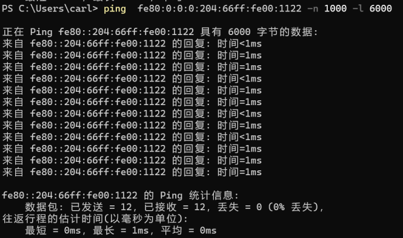
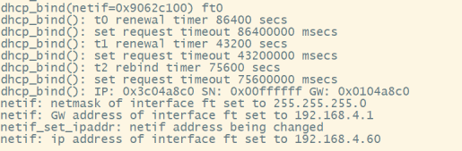

<!--
 * Copyright : (C) 2022 Phytium Information Technology, Inc. 
 * All Rights Reserved.
 *  
 * This program is OPEN SOURCE software: you can redistribute it and/or modify it  
 * under the terms of the Phytium Public License as published by the Phytium Technology Co.,Ltd,  
 * either version 1.0 of the License, or (at your option) any later version. 
 *  
 * This program is distributed in the hope that it will be useful,but WITHOUT ANY WARRANTY;  
 * without even the implied warranty of MERCHANTABILITY or FITNESS FOR A PARTICULAR PURPOSE.
 * See the Phytium Public License for more details. 
 *  
 * 
 * FilePath: README.md
 * Date: 2022-08-06 15:52:17
 * LastEditTime: 2022-08-06 15:52:17
 * Description:  This file is for 
 * 
 * Modify History: 
 *  Ver   Who  Date   Changes
 * ----- ------  -------- --------------------------------------
-->


# lwip base on freertos

## 1. 例程介绍

本例程示范了freertos环境下的lwip移植。
本例程目前支持在freertos下，移植lwip，使网络能够ping通，shell能够正常运行。

## 2. 如何使用例程

本例程需要用到
- Phytium开发板（E2000）
- [Phytium freeRTOS SDK](https://gitee.com/phytium_embedded/phytium-free-rtos-sdk)
- [Phytium standalone SDK](https://gitee.com/phytium_embedded/phytium-standalone-sdk)
### 2.1 硬件配置方法

本例程支持的硬件平台包括

- E2000D/Q

对应的配置项是，

- CONFIG_TARGET_E2000D
- CONFIG_TARGET_E2000Q

### 2.2 SDK配置方法

本例程需要，

- 使能LWIP

对应的配置项是，

- CONFIG_USE_LWIP
- CONFIG_USE_LETTER_SHELL

本例子已经提供好具体的编译指令，以下进行介绍:
- make 将目录下的工程进行编译
- make clean  将目录下的工程进行清理
- make boot   将目录下的工程进行编译，并将生成的elf 复制到目标地址
- make load_e2000d_aarch64  将预设64bit e2000d 下的配置加载至工程中
- make load_e2000d_aarch32  将预设32bit e2000d 下的配置加载至工程中
- make load_e2000q_aarch64  将预设64bit e2000q 下的配置加载至工程中
- make load_e2000q_aarch32  将预设32bit e2000q 下的配置加载至工程中
- make menuconfig   配置目录下的参数变量
- make backup_kconfig 将目录下的sdkconfig 备份到./configs下

具体使用方法为:
- 在当前目录下
- 执行以上指令

### 2.3 构建和下载

#### 2.3.1 构建过程

- 在host侧完成配置
>对于其它平台，使用对于的默认配置，如E2000D `make load_e2000d_aarch32`

- 选择目标平台
```
make load_e2000d_aarch32
```

- 选择例程需要的配置
```
make menuconfig
```

- 进行编译
```
make
```

- 将编译出的镜像放置到tftp目录下
```
make boot
```

#### 2.3.2 下载过程

- host侧设置重启host侧tftp服务器
```
sudo service tftpd-hpa start
```

- 开发板侧使用bootelf命令跳转
```
setenv ipaddr 192.168.4.20
setenv serverip 192.168.4.50 
setenv gatewayip 192.168.4.1 
tftpboot 0x90100000 freertos.elf
bootelf -p 0x90100000
```

### 2.4 输出与实验现象

- 启动进入后，根据连接的xmac口，输入指令完成网口初始化

#### 2.4.1 ipv4下的probe

- 输入以下命令

```
make menuconfig
```

- 将此项选择上


- 输入以下命令，初始化LWIP网络协议栈, 依次配置ip地址，子网掩码，网关地址和退出时间，运行完成退出后LWIP协议栈会被暂时去使能

```
xmac probe [device id] [interface id]
```

- 其中device id 为控制器id 
- interface id ,0 为rgmii ,1 为sgmii


#### 2.4.2 ipv6下的probe


- 先将配置恢复到初始配置状态，以E2000D 为例

```shell
    make load_e2000d_aarch32
```

- 输入以下命令

```
make menuconfig
```

- 将此项选择上


- 输入以下命令，初始化LWIP网络协议栈, 依次配置ip地址，子网掩码，网关地址和退出时间，运行完成退出后LWIP协议栈会被暂时去使能

```
xmac probe [device id] [interface id]
```

- 其中device id 为控制器id 
- interface id ,0 为rgmii ,1 为sgmii





#### 2.4.3 ipv4 dhcp

- 先将配置恢复到初始配置状态，以E2000D 为例

```shell
    make load_e2000d_aarch32
```

- 输入以下命令

```
make menuconfig
```

- 将此项选择上


- 输入以下命令，初始化LWIP网络协议栈, 并且会默认打开dhcp 线程

```
xmac probe [device id] [interface id]
```

- 其中device id 为控制器id 
- interface id ,0 为rgmii ,1 为sgmii




#### 2.4.2 提供

## 3. 如何解决问题

Q: 程序运行过程中queue.c的debug信息报错

A: 考虑自身任务创建时分配的栈空间大小，考虑tcpip_thread任务的栈空间大小TCPIP_THREAD_STACKSIZE

Q: 程序运行过程中ping大包异常

A: 考虑以下两个宏的大小：PBUF_POOL_SIZE定义缓冲池的个数，PBUF_POOL_BUFSIZE定义单个缓冲区的大小

Q: 如何选择demo板的配置

A: 开发者在编译终端下使用以下命令
```shell
    make menuconfig
```


Q: 如果开发者使用E2000 demo板应该如何进行实验：

A: 开发者在串口终端上输入以下命令对控制器进行初始化


```shell
    xmac probe 0 1
```

## 4. 修改历史记录

v0.2.0  重构lwip

