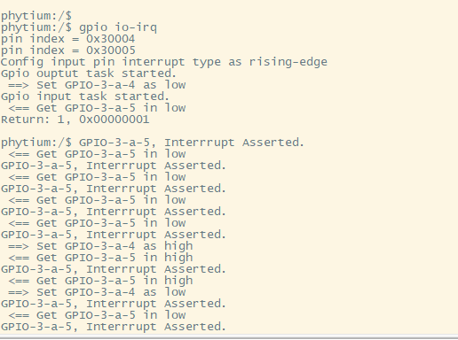

# GDMA内存搬运测试

## 1. 例程介绍

GPIO (General-purpose input/output)，即通用型输入输出，其引脚可以供使用者通过程序控制其输入、输出，常用于产生时钟，作为片选信号和模拟低速通信协议等场景

本例程通过 GPIO 控制器驱动，实现电平输出和电平输入功能，通过短接输出引脚和输入引脚，实现输入引脚中断触发功能

## 2. 如何使用例程

本例程需要用到
- Phytium开发板（E2000）
- [Phytium FreeRTOS SDK](https://gitee.com/phytium_embedded/phytium-free-rtos-sdk)
- [Phytium Standalone SDK](https://gitee.com/phytium_embedded/phytium-standalone-sdk)

### 2.1 硬件配置方法

本例程支持的硬件平台包括

- E2000

对应的配置项是，

- CONFIG_TARGET_E2000

本例程在 E2000-A测试板和B测试板完成测试

### 2.2 SDK配置方法

本例程需要，

- 使能Shell
- 使能GPIO

对应的配置项是，

- CONFIG_USE_LETTER_SHELL
- CONFIG_FREERTOS_USE_GPIO

本例子已经提供好具体的编译指令，以下进行介绍:
- make 将目录下的工程进行编译
- make clean  将目录下的工程进行清理
- make boot   将目录下的工程进行编译，并将生成的elf 复制到目标地址
- make load_e2000q_aarch64  将预设64bit e2000q 下的配置加载至工程中
- make load_e2000q_aarch32  将预设32bit e2000q 下的配置加载至工程中
- make menuconfig   配置目录下的参数变量
- make backup_kconfig 将目录下的sdkconfig 备份到./configs下

具体使用方法为:
- 在当前目录下
- 执行以上指令

### 2.3 构建和下载

#### 2.3.1 构建过程

- 在host侧完成配置
> 配置成 e2000q，对于其它平台，使用对于的默认配置，如,

- 选择目标平台
```
make load_e2000q_aarch64
```

- 选择例程需要的配置
```
make menuconfig
```

- 进行编译
```
make
```

- 将编译出的镜像放置到tftp目录下
```
make boot
```

#### 2.3.2 下载过程

- host侧设置重启host侧tftp服务器
```
sudo service tftpd-hpa restart
```

- 开发板侧使用bootelf命令跳转
```
setenv ipaddr 192.168.4.20  
setenv serverip 192.168.4.50 
setenv gatewayip 192.168.4.1 
tftpboot 0xa0100000 freertos.elf
bootelf -p 0xa0100000
```

### 2.4 输出与实验现象

- 系统进入后，创建两个任务，一个控制输出引脚电平，另一个检查输入引脚电平，同时等待中断触发

```
gpio io-irq
```




## 3. 如何解决问题


## 4. 修改历史记录


