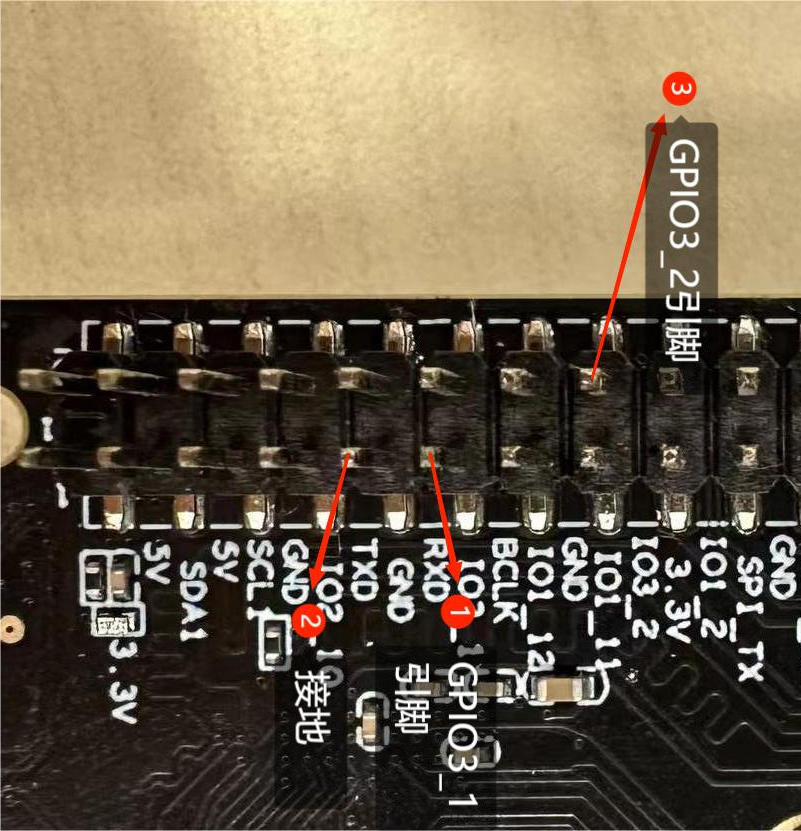
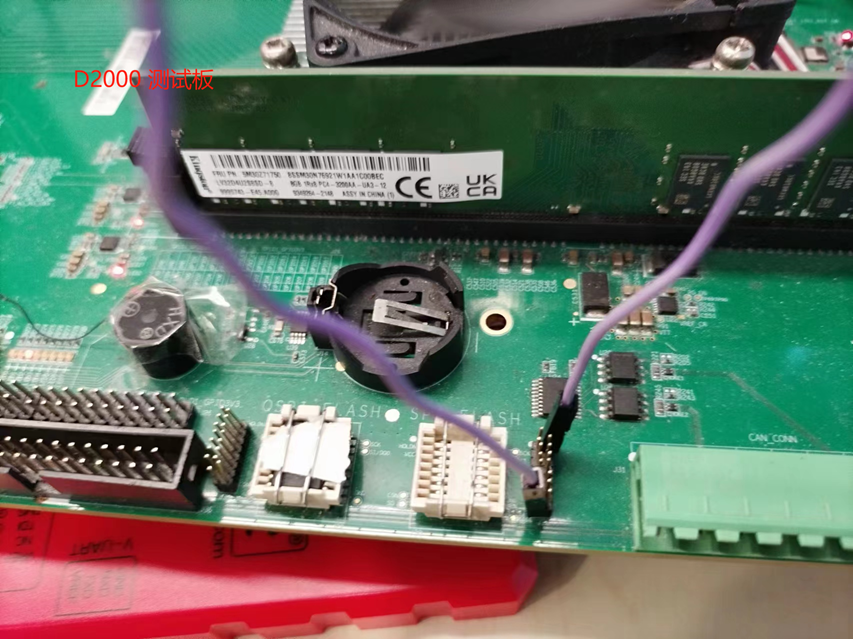
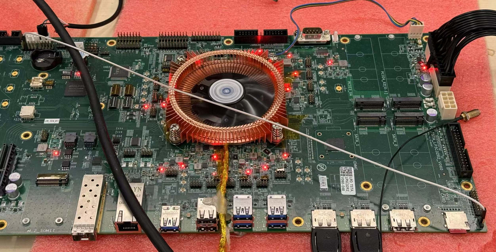
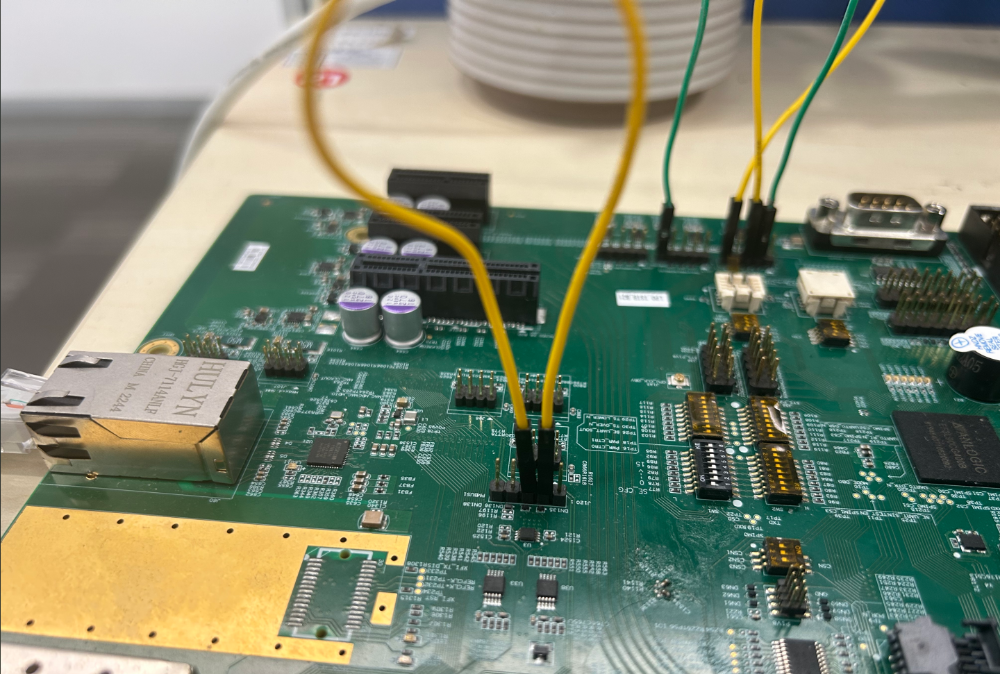
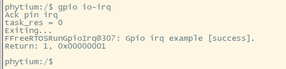

# GPIO测试

## 1. 例程介绍

GPIO (General-purpose input/output)，即通用型输入输出，其引脚可以供使用者通过程序控制其输入、输出，常用于产生时钟，作为片选信号和模拟低速通信协议等场景

本例程通过 GPIO 控制器驱动，实现电平输出和电平输入功能，通过短接输出引脚和输入引脚，实现输入引脚中断触发功能

## 2. 如何使用例程

本例程需要用到
- Phytium开发板（D2000 TEST、E2000 D/Q DEMO、PD2308 DEMO、PD2408 TEST_A/TEST_B、PhytiumPi）
- [Phytium FreeRTOS SDK](https://gitee.com/phytium_embedded/phytium-free-rtos-sdk)
- [Phytium Standalone SDK](https://gitee.com/phytium_embedded/phytium-standalone-sdk)

### 2.1 硬件配置方法
- D2000 TEST、E2000 D/Q DEMO、PD2308 DEMO、PD2408 TEST_A/TEST_B、PhytiumPi开发板
- 杜邦线

#### 2.1.1 对于E2000 D/Q DEMO 板
- 在本例程中短接 GPIO-4-A-11 和 GPIO-4-A-12，GPIO-4-A-11作为GPIO输入引脚，GPIO-4-A-12作为GPIO输出引脚，在J30位置如下图所示：


#### 2.1.2 对于PhytiumPi

- 需要用杜邦线短接GPIO0_0与GPIO4_13，如下图所示，分别为 36 号和 37 号引脚


注：在上述例程中，若想使用其他GPIO进行测试，则需要在例程gpio_io_irq.c文件中修改GPIO引脚号IN_PIN_INDEX，OUT_PIN_INDEX，并重新编译烧写。

#### 2.1.3 对于D2000 TEST板

- 需要用杜邦线短接GPIO1_A_6与GPIO1_A_7，分别对应飞腾派上的J1组引脚的第11号与第16号引脚,对应SPI0排线，如下图所示 左侧排线的最下面脚（SPI0-SO 对应 GPIO 1-A-7）和右侧排线的最上面脚（SPI0-SCK 对应 GPIO 1-A-6）


#### 2.1.4 对于PD2408 TEST_A板

- 使用 J71的2号引脚（sd控制器旁）（GPIO 0-14）和 J36的3号引脚（调试串口旁）（GPIO 0-7）复用成 GPIO 进行测试


#### 2.1.4 对于PD2408 TEST_B板

- 使用 J120 的2号引脚（GPIO 1-7）和3号引脚（GPIO 1-8）复用成 GPIO 进行测试


### 2.2 SDK配置方法

本例程需要：

- 使能Shell
- 使能GPIO

对应的配置项是：

- CONFIG_USE_LETTER_SHELL
- CONFIG_FREERTOS_USE_GPIO

本例子已经提供好具体的编译指令:
- make 将目录下的工程进行编译
- make clean  将目录下的工程进行清理
- make image   将目录下的工程进行编译，并将生成的elf 复制到目标地址
- make list_kconfig 当前工程支持哪些配置文件
- make menuconfig   配置目录下的参数变量
- make backup_kconfig 将目录下的sdkconfig 备份到./configs下

具体使用方法为:
- 在当前目录下，执行以上指令

### 2.3 构建和下载

#### 2.3.1 构建过程

- 在host侧完成配置
使用待测试平台对应的默认配置，例如在E2000D DEMO开发板上测试aarch64程序：
```
make load_kconfig LOAD_CONFIG_NAME=pe2202_aarch64_demo_gpio
```

- 选择例程需要的配置
```
make menuconfig
```

- 编译并将编译出的镜像放置到tftp目录下
```
make image
```

#### 2.3.2 下载过程

- host侧设置重启host侧tftp服务器
```
sudo service tftpd-hpa restart
```

- 开发板侧使用bootelf命令跳转
```
setenv ipaddr 192.168.4.20  
setenv serverip 192.168.4.50 
setenv gatewayip 192.168.4.1 
tftpboot 0xa0100000 freertos.elf
bootelf -p 0xa0100000
```

### 2.4 输出与实验现象

- 系统进入后，创建gpio irq测试任务，并根据引脚设置配置输入输出引脚，等待中断触发

```
gpio io-irq
```


注：在例程中设置time out时间，当此时间内未发生中断事件，则任务会自动退出，并报超时错误。

## 3. 如何解决问题

- 本例程中采用上升沿触发GPIO中断，若需要修改为下降沿触发方式，则需要将gpio_io_irq.c文件中'irq_type'修改为相应中断触发方式，上升沿触发与下降沿触发原理相同，故在此不作赘述；若需要修改为电平触发方式，应注意：在高电平或者低电平模式下，GPIO会持续触发中断，此特性在驱动中由irq_one_time决定，当值为TRUE时进入中断后关闭该引脚的中断，防止一直进入中断，当电平为FASLE时，进入电平中断后，在电平持续时间内，中断会一直触发，直到电平变化，在rtos中可能出现卡死在任务中的现象，用户可根据实际需要修改irq_one_time的值。

## 4. 修改历史记录