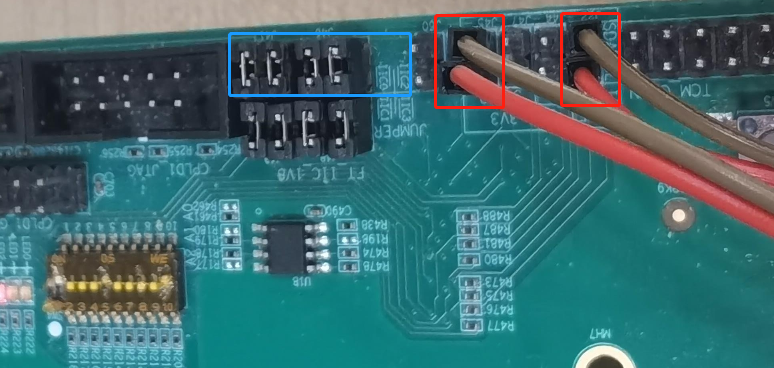
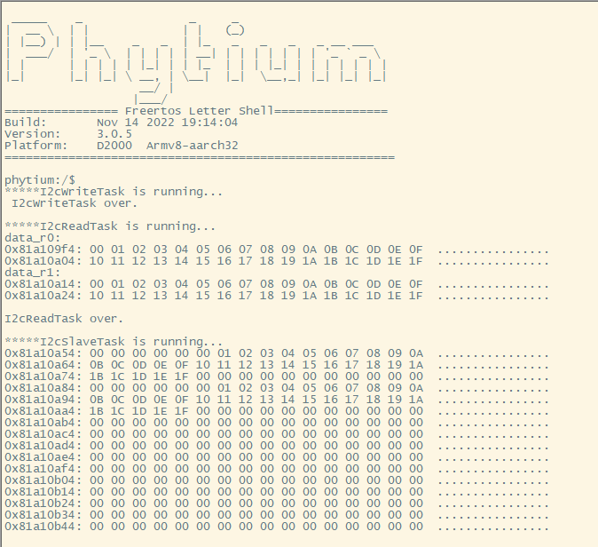
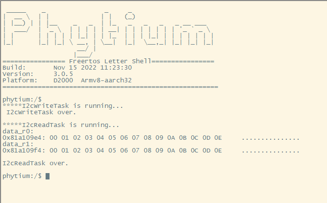

<!--
 * Copyright : (C) 2022 Phytium Information Technology, Inc. 
 * All Rights Reserved.
 *  
 * This program is OPEN SOURCE software: you can redistribute it and/or modify it  
 * under the terms of the Phytium Public License as published by the Phytium Technology Co.,Ltd,  
 * either version 1.0 of the License, or (at your option) any later version. 
 *  
 * This program is distributed in the hope that it will be useful,but WITHOUT ANY WARRANTY;  
 * without even the implied warranty of MERCHANTABILITY or FITNESS FOR A PARTICULAR PURPOSE.
 * See the Phytium Public License for more details. 
 *  
 * 
 * FilePath: README.md
 * Date: 2022-08-23 11:15:06
 * LastEditTime: 2022-08-23 11:15:06
 * Description:  This file is for i2c
 * 
 * Modify History: 
 *  Ver   Who        Date         Changes
 * ----- ------     --------    --------------------------------------
 * 0.1.0 liushengming 2022.08.23 init
-->

# i2c base on freertos

## 1. 例程介绍

本例程示范了freertos环境下的i2c的读写使用，包括i2c的初始化、写、读和去初始化操作；
程序启动后，创建i2c的初始化、写任务和读任务；
例程在D2000上使用i2c-0与i2c-2回环测试，也可进行eeprom读取（更改从机地址，取消slave任务初始化即可）（注意i2c-0本身连接的eeprom芯片，虚拟从机地址不要与其重合，不然会引起总线冲突）;
例程也可以作为ft2004的例程参考，只需自行解决从机地址替换，本例程没有直接演示。
E2000D上使用的demo板上的 RTC 进行iic测试，从机亦可参考D2000进行;
本例程目前仅仅适配了主机poll发送，从机中断接收的方式。

## 2. 如何使用例程

本例程需要用到
- Phytium开发板（D2000/E2000DQS of TestB板）
- [Phytium freeRTOS SDK](https://gitee.com/phytium_embedded/phytium-free-rtos-sdk)
- [Phytium standalone SDK](https://gitee.com/phytium_embedded/phytium-standalone-sdk)
### 2.1 硬件配置方法

本例程支持的硬件平台包括
- D2000、E2000DQS demo开发板

对应的配置项是
- CONFIG_TARGET_D2000
- CONFIG_TARGET_E2000D、 CONFIG_TARGET_E2000Q

### 2.1.1 硬件连线

- D2000



- E2000


### 2.2 SDK配置方法

本例程需要，

- 使能Shell
- 使能I2C
- 如果是E2000系列，使能MIO

对应的配置项是，

- CONFIG_USE_LETTER_SHELL
- CONFIG_FREERTOS_USE_I2C
如果是E2000系列
- CONFIG_FREERTOS_USE_MIO

本例子已经提供好具体的编译指令，以下进行介绍:
- make 将目录下的工程进行编译
- make clean  将目录下的工程进行清理
- make boot   将目录下的工程进行编译，并将生成的elf 复制到目标地址
- make load_d2000_aarch64  将预设64bit d2000 下的配置加载至工程中
- make load_d2000_aarch32  将预设32bit d2000 下的配置加载至工程中
- make load_e2000d_aarch64  将预设64bit e2000d 下的配置加载至工程中
- make load_e2000d_aarch32  将预设32bit e2000d 下的配置加载至工程中
- make load_e2000q_aarch64  将预设64bit e2000q 下的配置加载至工程中
- make load_e2000q_aarch32  将预设32bit e2000q 下的配置加载至工程中
- make menuconfig   配置目录下的参数变量
- make backup_kconfig 将目录下的sdkconfig 备份到./configs下

具体使用方法为:
- 在当前目录下
- 执行以上指令

### 2.3 构建和下载

#### 2.3.1 构建过程

- 在host侧完成配置
>配置成d2000，对于其它平台，使用对应的默认配置，如E2000D `make load_e2000d_aarch32`

- 选择目标平台
```
make load_d2000_aarch32
```

- 选择例程需要的配置
```
make menuconfig
```

- 进行编译
```
make
```

- 将编译出的镜像放置到tftp目录下
```
make boot
```

#### 2.3.2 下载过程

- host侧设置重启host侧tftp服务器
```
sudo service tftpd-hpa restart
```

- 开发板侧使用bootelf命令跳转
```
setenv ipaddr 192.168.4.20  
setenv serverip 192.168.4.50 
setenv gatewayip 192.168.4.1 
tftpboot 0x90100000 freertos.elf
bootelf -p 0x90100000
```

### 2.4 输出与实验现象

- 系统进入后，创建i2c初始化任务，创建i2c从机中断初始化，注册中断服务函数，创建i2c主机的读写任务函数。

- D2000





- E2000


## 3. 如何解决问题

- 若出现读写异常，需确认连接是否正确；

- 由于D2000开发板上的自带eeprom，因此不建议使用特殊地址0x57进行I2C-2模拟的从设备地址，因为这可能导致总线抢占，无法正常传输；

## 4. 修改历史记录


