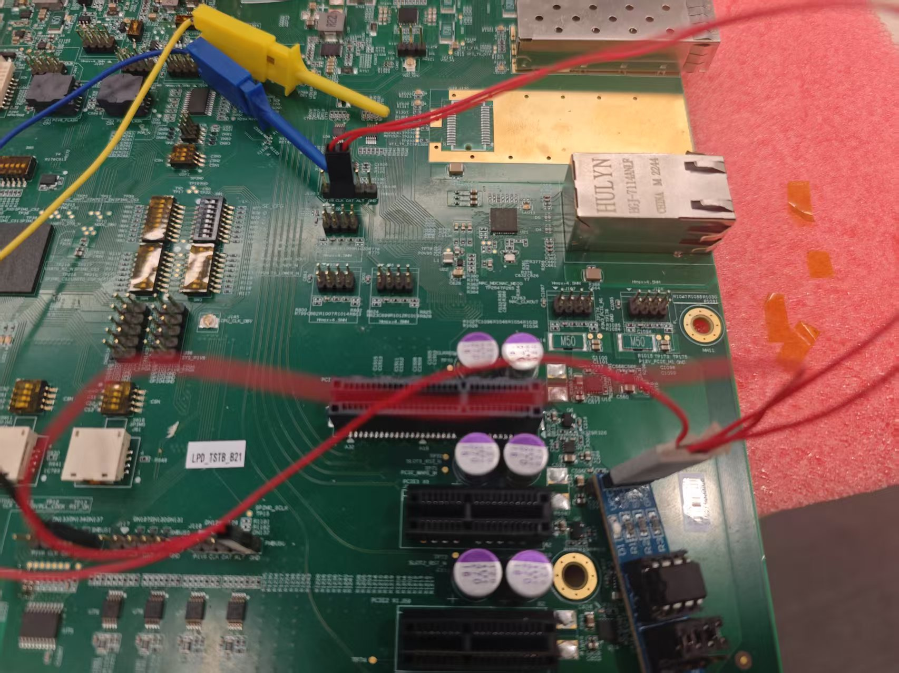

# i2c 传输测试

## 1. 例程介绍

> `<font size="1">`介绍例程的用途，使用场景，相关基本概念，描述用户可以使用例程完成哪些工作 `</font><br />`

I2C主从通信测试，主机侧负责发起I2C数据读写，此例程中master端为PD2408 TEST_A/TEST_B开发板的PMBUS1，从机侧为eeprom，负责响应I2C数据读写.

## 2. 如何使用例程

> `<font size="1">`描述开发平台准备，使用例程配置，构建和下载镜像的过程 `</font><br />`

### 2.1本例程需要用到

- PD2408 TEST_A/TEST_B 开发板
- 逻辑分析仪
- eeprom

### 2.1 硬件配置方法

> `<font size="1">`哪些硬件平台是支持的，需要哪些外设，例程与开发板哪些IO口相关等（建议附录开发板照片，展示哪些IO口被引出）`</font><br />`

本例程支持的硬件平台包括

- PD2408 TEST_A/TEST_B开发板

对应的配置项是：

- CONFIG_PD2408_TEST_A_BOARD
- CONFIG_PD2408_TEST_B_BOARD

### 2.2 SDK配置方法

> `<font size="1">`依赖哪些驱动、库和第三方组件，如何完成配置（列出需要使能的关键配置项）`</font><br />`

本例程需要，

- 使能FI2C_V2
- 使能Letter Shell
- 使能FMIO
- 使能MSG

对应的配置项是，

- CONFIG_USE_FI2C_V2
- CONFIG_FREERTOS_USE_MIO
- CONFIG_USE_LETTER_SHELL
-
- 本例子已经提供好具体的编译指令，以下进行介绍：

  1. make 将目录下的工程进行编译
  2. make clean  将目录下的工程进行清理
  3. make image   将目录下的工程进行编译，并将生成的elf 复制到目标地址
  4. make list_kconfig 当前工程支持哪些配置文件
  5. make load_kconfig LOAD_CONFIG_NAME=`<kconfig configuration files>`  将预设配置加载至工程中
  6. make menuconfig   配置目录下的参数变量
  7. make backup_kconfig 将目录下的sdkconfig 备份到./configs下
- 具体使用方法为：

  - 在当前目录下
  - 执行以上指令

### 2.3 构建和下载

> `<font size="1">`描述构建、烧录下载镜像的过程，列出相关的命令 `</font><br />`

- 在host侧完成配置

使用待测试平台对应的默认配置，例如在PD2408 TEST_B开发板上测试程序：
```
$ make load_kconfig LOAD_CONFIG_NAME=pd2408_aarch64_test_b_i2c
```

- 在host侧完成构建

```
$ make clean image
```

- host侧设置重启host侧tftp服务器

```
sudo service tftpd-hpa restart
```

- 开发板侧使用bootelf命令跳转

```
setenv ipaddr 192.168.4.20  
setenv serverip 192.168.4.50 
setenv gatewayip 192.168.4.1 
tftpboot 0x90100000 freertos.elf
bootelf -p 0x90100000
```

### 2.4 输出与实验现象

> `<font size="1">`描述输入输出情况，列出存在哪些输出，对应的输出是什么（建议附录相关现象图片）`</font><br />`

- PD2408 TEST_B开发板的接线如下：


- 使用PD2408 TEST_A/TEST_B开发板测试时，使用命令：

```
i2c msg_example
```

注：在使用i2c 例程中，因外部元器件或测量工具影响，可能导致读写速率存在一定偏差

## 3. 如何解决问题

> `<font size="1">`主要记录使用例程中可能会遇到的问题，给出相应的解决方案 `</font><br />`

## 4. 修改历史记录

> `<font size="1">`记录例程的重大修改记录，标明修改发生的版本号 `</font><br />`

v0.1.0  初次合入pd2408