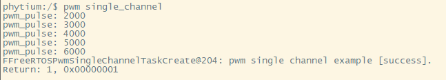
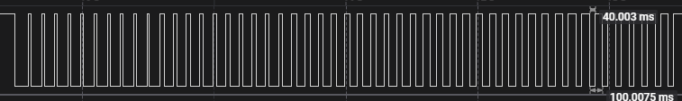
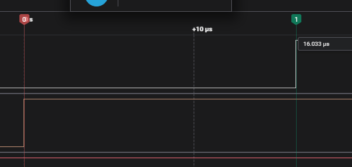
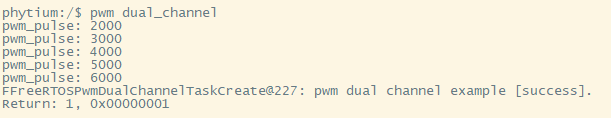
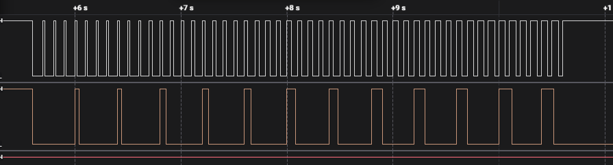

# pwm base on freertos

## 1. 例程介绍

注:E2000共有8个PWM控制器(PWM0~PWM7)，每个PWM控制器对应两路CHANNEL

PWM单通道测试例程 (pwm_single_channel_example.c)

- 初始化PWM基本配置
- 对CHANNEL0进行配置，设置为500分频，设置周期寄存器的值为10000(100ms)，设置初始脉冲为2000，即初始占空比为20%
- 打开CHANNEL0 COUNTER_OVERFLOW中断和FIFO_EMPTY中断
- 使能CHANNEL0，脉冲值每隔500ms增加1000，共进行5次变化，每次占空比增加10%，观察输出波形的变化
- 关闭CHANNEL0，去初始化PWM

PWM死区测试例程 (pwm_dead_band_example.c)

- 初始化PWM基本配置
- 对死区进行配置，上升沿和下降沿均打开延迟，延迟配置为800，极性不进行翻转，死区输入源默认选择为pwm0(CHANNEL0)，pwm1(CHANNEL1)根据输入源和死区属性的配置输出相应波形
- 对CHANNEL0进行配置，设置为500分频，设置周期寄存器的值为10000(100ms)，设置初始脉冲为2000，即初始占空比为20%
- 使能CHANNEL0，脉冲值每隔500ms增加1000，共进行5次变化，每次占空比增加10%，观察输出波形的变化
- CHANNEL1作为死区输出，观察死区输出波形的变化
- 关闭CHANNEL0，去初始化PWM

PWM双通道测试例程 (pwm_dual_channel_example.c)

- 初始化PWM基本配置
- 对CHANNEL0进行配置，设置为500分频，设置周期寄存器的值为10000(100ms)，设置初始脉冲为2000，即初始占空比为20%
- 对CHANNEL1进行配置，设置为1000分频，设置周期寄存器的值为20000(400ms)，设置初始脉冲为2000，即初始占空比为10%
- 打开CHANNEL0和CHANNEL1 COUNTER_OVERFLOW中断和FIFO_EMPTY中断
- 使能CHANNEL0，脉冲值每隔500ms增加1000，共进行5次变化，每次占空比增加10%，观察输出波形的变化
- 使能CHANNEL1，脉冲值每隔500ms增加1000，共进行5次变化，每次占空比增加5%，观察输出波形的变化
- 关闭CHANNEL0和CHANNEL1,去初始化PWM

## 2. 如何使用例程

本例程需要以下硬件，

- E2000D/Q demo板，PhytiumPi
- 串口线和串口上位机
- 逻辑分析仪/示波器
- 杜邦线
### 2.1 硬件配置方法

### 2.1.1 E2000
- E2000 demo板需外接逻辑分析仪或示波器测试，方法如下

- 选择控制器PWM2的pwm5_dat_out(CHANNEL1)作为输出，对应开发板上J30引脚3


- 上图所示为E2000 J30组引脚，将pwm_out与GND与逻辑分析仪或示波器相连即可

### 2.1.2 PhytiumPi
- PhytiumPi需外接逻辑分析仪或示波器测试，方法如下

PhytiumPI:飞腾派引出多个引脚可供PWM使用

|   **引脚**    | **控制器与通道** |
| :----------:  | :----------------- |
|  J1 PIN_32    | PWM1 CHANNEL0 |
|  J1 PIN_33    | PWM2 CHANNEL1 |
|  J1 PIN_7     | PWM3 CHANNEL0 |
|  J2 PIN_4     | PWM3 CHANNEL1 |
|  J1 PIN_3     | PWM4 CHANNEL0 |
|  J1 PIN_8     | PWM4 CHANNEL1 |
|  J1 PIN_16    | PWM5 CHANNEL0 |
|  J1 PIN_27    | PWM6 CHANNEL1 |

### 2.2 SDK配置方法

本例程需要，

- 使能Shell
- 使能Pwm

对应的配置项是，

- CONFIG_USE_LETTER_SHELL
- CONFIG_USE_PWM
- CONFIG_FREERTOS_USE_PWM

本例子已经提供好具体的编译指令，以下进行介绍:
- make 将目录下的工程进行编译
- make clean  将目录下的工程进行清理
- make image   将目录下的工程进行编译，并将生成的elf 复制到目标地址
- make list_kconfig 当前工程支持哪些配置文件
- make load_kconfig LOAD_CONFIG_NAME=<kconfig configuration files>  将预设配置加载至工程中
- make menuconfig   配置目录下的参数变量
- make backup_kconfig 将目录下的sdkconfig 备份到./configs下

具体使用方法为:
- 在当前目录下
- 执行以上指令

### 2.3 构建和下载

><font size="1">描述构建、烧录下载镜像的过程，列出相关的命令</font><br />

[参考 freertos 使用说明](../../../docs/reference/usr/usage.md)

#### 2.3.1 下载过程

- host侧设置重启host侧tftp服务器
```
sudo service tftpd-hpa restart
```

- 开发板侧使用bootelf命令跳转
```
setenv ipaddr 192.168.4.20  
setenv serverip 192.168.4.50 
setenv gatewayip 192.168.4.1 
tftpboot 0x90100000 freertos.elf
bootelf -p 0x90100000
```

### 2.4 输出与实验现象

><font size="1">描述输入输出情况，列出存在哪些输出，对应的输出是什么（建议附录相关现象图片）`</font><br />`

#### 2.4.1 PWM单通道测试例程

```
$ pwm single_channel
```



pwm单通道测试对应波形



#### 2.4.2 PWM死区测试例程

```
$ pwm dead_band
```


pwm死区测试对应波形,参考时钟 FPWM_CLK_FREQ_HZ = 50MHz，上升沿延迟寄存器配置为800，延迟时间为 (1/50MHz)*800 = 16μs



#### 2.4.3 PWM双通道测试例程

```
$ pwm dual_channel
```



pwm双通道测试对应波形



## 3. 如何解决问题

- 如默认用例无法使用或无波形输出，请根据不同的开发板，修改`pwm_common.h`文件中`PWM_TEST_ID`和`PWM_TEST_CHANNEL`两个宏定义，确保`FIOPadSetPwmMux`引脚复用设置正确
- PWM双通道测试例程，默认使用两个通道观测。
- PWM死区测试例程中，`PWM_TEST_CHANNEL`决定死区输入源，另一个CHANNEL作为输出源。

- E2000 DEMO V0.8板无法使用PWM4至PWM7，故无法进行本用例
## 4. 修改历史记录