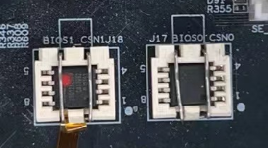

<!--
 * Copyright : (C) 2022 Phytium Information Technology, Inc. 
 * All Rights Reserved.
 *  
 * This program is OPEN SOURCE software: you can redistribute it and/or modify it  
 * under the terms of the Phytium Public License as published by the Phytium Technology Co.,Ltd,  
 * either version 1.0 of the License, or (at your option) any later version. 
 *  
 * This program is distributed in the hope that it will be useful,but WITHOUT ANY WARRANTY;  
 * without even the implied warranty of MERCHANTABILITY or FITNESS FOR A PARTICULAR PURPOSE.
 * See the Phytium Public License for more details. 
 *  
 * 
 * FilePath: README.md
 * Date: 2022-02-24 16:55:00
 * LastEditTime: 2022-03-21 17:00:59
 * Description:  This file is for 
 * 
 * Modify History: 
 *  Ver   Who        Date         Changes
 * ----- ------     --------    --------------------------------------
-->

# qspi base on freertos

## 1. 例程介绍

本例程示范了freertos环境下的qspi的读写使用，包括qspi的初始化、读、写、读id和去初始化操作；
程序启动后，创建qspi的初始化、读和写任务；
创建单次模式的软件定时器，回调函数为删除qspi的读和写任务；
例程在FT2000/4上使用的Nor Flash介质型号是GD25Q256，容量为32MB;
E2000D上使用的Nor Flash介质型号是GD25Q128，容量为16MB;

## 2. 如何使用例程

本例程需要用到
- Phytium开发板（FT2000-4/D2000/E2000D）
- [Phytium freeRTOS SDK](https://gitee.com/phytium_embedded/phytium-free-rtos-sdk)
- [Phytium standalone SDK](https://gitee.com/phytium_embedded/phytium-standalone-sdk)
### 2.1 硬件配置方法

本例程支持的硬件平台包括
- FT2000/4、D2000、E2000D开发板

对应的配置项是
- CONFIG_TARGET_F2000_4
- CONFIG_TARGET_D2000
- CONFIG_TARGET_E2000D



- 本例程适配了GD25Q256、GD25Q128、GD25Q64、S25FS256的Nor-Flash芯片，如使用其他型号，需自行参考适配

### 2.2 SDK配置方法

本例程需要，

- 使能Shell
- 使能Qspi

对应的配置项是，

- CONFIG_USE_LETTER_SHELL
- CONFIG_USE_GD25Q128
- CONFIG_FREERTOS_USE_QSPI

本例子已经提供好具体的编译指令，以下进行介绍:
- make 将目录下的工程进行编译
- make clean  将目录下的工程进行清理
- make boot   将目录下的工程进行编译，并将生成的elf 复制到目标地址
- make load_d2000_aarch64  将预设64bit d2000 下的配置加载至工程中
- make load_d2000_aarch32  将预设32bit d2000 下的配置加载至工程中
- make load_ft2004_aarch64  将预设64bit ft2004 下的配置加载至工程中
- make load_ft2004_aarch32  将预设32bit ft2004 下的配置加载至工程中
- make load_e2000d_aarch64  将预设64bit e2000d 下的配置加载至工程中
- make load_e2000d_aarch32  将预设32bit e2000d 下的配置加载至工程中
- make menuconfig   配置目录下的参数变量
- make backup_kconfig 将目录下的sdkconfig 备份到./configs下

具体使用方法为:
- 在当前目录下
- 执行以上指令

### 2.3 构建和下载

#### 2.3.1 构建过程

- 在host侧完成配置
>配置成d2000，对于其它平台，使用对于的默认配置，如ft2004 `make load_ft2004_aarch32`

- 选择目标平台
```
make load_d2000_aarch32
```

- 选择例程需要的配置
```
make menuconfig
```

- 进行编译
```
make
```

- 将编译出的镜像放置到tftp目录下
```
make boot
```

#### 2.3.2 下载过程

- host侧设置重启host侧tftp服务器
```
sudo service tftpd-hpa restart
```

- 开发板侧使用bootelf命令跳转
```
setenv ipaddr 192.168.4.20  
setenv serverip 192.168.4.50 
setenv gatewayip 192.168.4.1 
tftpboot 0x90100000 freertos.elf
bootelf -p 0x90100000
```

### 2.4 输出与实验现象

- 系统进入后，创建qspi初始化任务，读取flash id信息，创建qspi的读写任务，周期10000ms，并创建软件定时器，周期50000ms


- 50000ms时间到，触发软件定时器的回调函数，去初始化qspi，删除qspi的读写任务，删除软件定时器


## 3. 如何解决问题

- 若出现读写异常，需确认menuconfig中是否选择了正确的Norflash型号；

- 由于开发板上的QSPI接口的NorFlash用于固件启动，因此不建议在不了解固件大小的情况下，使用qspi write写数据，因为这可能导致固件无法正常启动；

## 4. 修改历史记录


