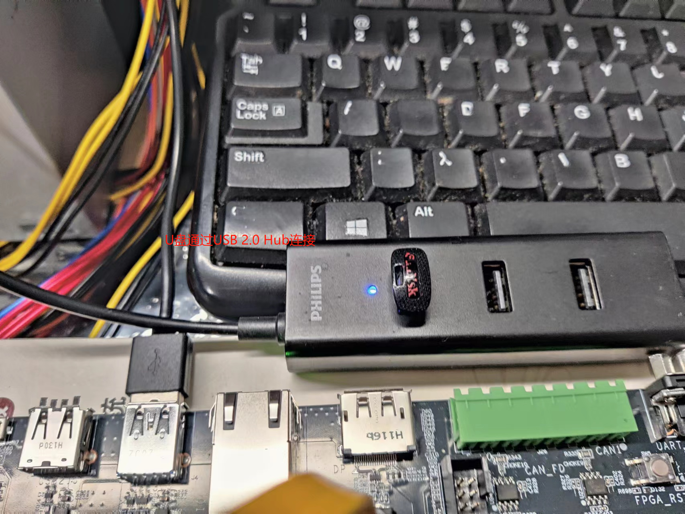
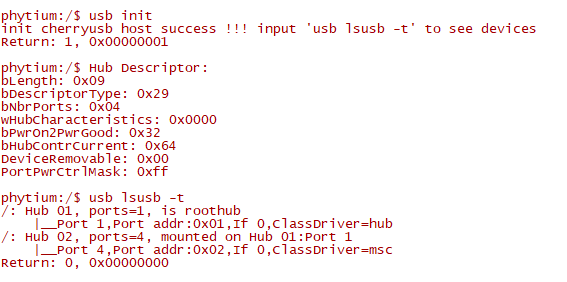
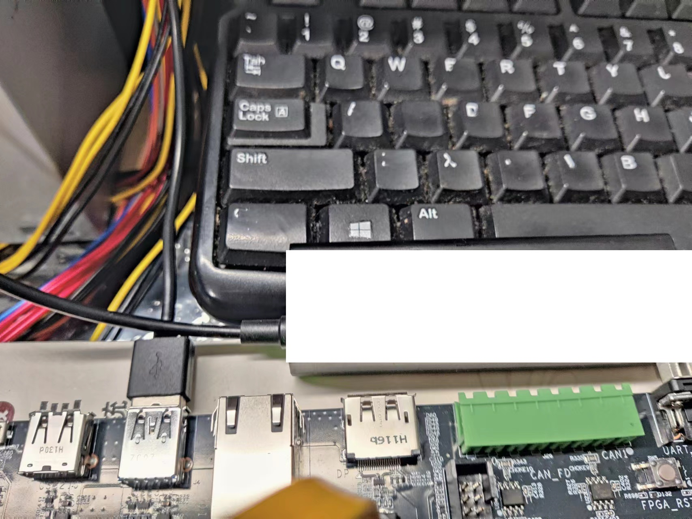
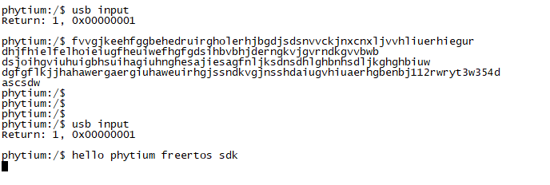
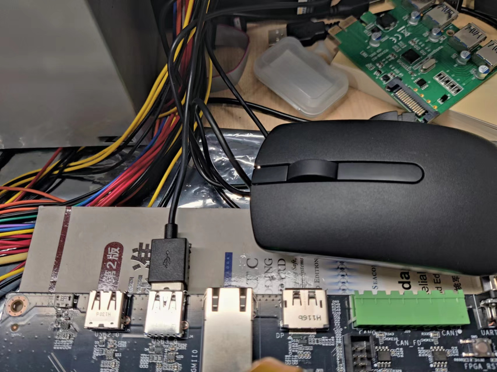
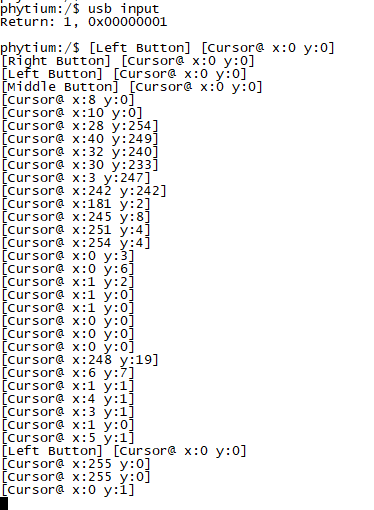

# CherryUSB Host 测试

## 1. 例程介绍

><font size="1">介绍例程的用途，使用场景，相关基本概念，描述用户可以使用例程完成哪些工作</font><br />

CherryUSB 是一个用于嵌入式系统 USB 协议栈，支持运行在Host模式和Device模式

## 2. 如何使用例程

><font size="1">描述开发平台准备，使用例程配置，构建和下载镜像的过程</font><br />

### 2.1 硬件配置方法

><font size="1">哪些硬件平台是支持的，需要哪些外设，例程与开发板哪些IO口相关等（建议附录开发板照片，展示哪些IO口被引出）</font><br />

本例程在 E2000 平台测试通过，您可以参考以下方法配置本例程所需要的硬件和软件环境，
- E2000开发板
- 本例程基于E2000 Demo 开发板，使用logitech键盘、Dell鼠标和Sandisk盘完成测试

### 2.2 SDK配置方法

><font size="1">依赖哪些驱动、库和第三方组件，如何完成配置（列出需要使能的关键配置项）</font><br />

本例程需要的配置包括，
- Letter Shell组件，依赖 USE_LETTER_SHELL
- FATFS组件，依赖 USE_FATFS 和 SELECT_FATFS_FSATA_PCIE
- PCIE组件，作为转接接口，依赖USE_PCIE
- SATA组件，依赖 USE_SATA

本例子已经提供好具体的编译指令，以下进行介绍:
- make 将目录下的工程进行编译
- make clean  将目录下的工程进行清理
- make boot   将目录下的工程进行编译，并将生成的elf 复制到目标地址
- make load_e2000d_aarch64  将预设64bit e2000d 下的配置加载至工程中
- make load_e2000d_aarch32  将预设32bit e2000d 下的配置加载至工程中
- make menuconfig   配置目录下的参数变量
- make backup_kconfig 将目录下的sdkconfig 备份到./configs下

- 具体使用方法为：
    - 在当前目录下
    - 执行以上指令

### 2.3 构建和下载

><font size="1">描述构建、烧录下载镜像的过程，列出相关的命令</font><br />

使用例程的一般过程为

- 选择目标平台和例程需要的配置
```
make load_e2000d_aarch64
```

- 进行编译
```
make
```

- 将编译出的镜像放置到tftp目录下
```
make boot
```

- host侧设置重启host侧tftp服务器
```
sudo service tftpd-hpa restart
```

- 开发板侧使用bootelf命令跳转
```
setenv ipaddr 192.168.4.20  
setenv serverip 192.168.4.50 
setenv gatewayip 192.168.4.1 
tftpboot 0x90100000 freertos.elf
bootelf -p 0x90100000
```

### 2.4 输出与实验现象

><font size="1">描述输入输出情况，列出存在哪些输出，对应的输出是什么（建议附录相关现象图片）</font><br />


#### 2.4.1 读写 U 盘

- 目前 CherryUSB 的 USB 3.0 支持尚未完成，超高速设备需要通过2.0 Hub连接进行测试

```
usb init
usb disk
```





- 输入`usb disk`后，启动一个任务不断读写U盘

#### 2.4.2 获取键盘输入

- 目前 USB (xhci port) 协议栈中 hub 的支持还不够完善，低速设备需要直连板上的 USB 插槽进行测试

```
usb init
usb input
```

- 输入`usb input`后，可以通过中断处理键盘输入





#### 2.4.3 获取鼠标输入

- 目前 USB (xhci port) 协议栈中 hub 的支持还不够完善，低速设备需要直连板上的 USB 插槽进行测试

```
usb init
usb input
```

- 输入`usb input`后，可以通过中断处理鼠标输入





## 3. 如何解决问题

><font size="1">主要记录使用例程中可能会遇到的问题，给出相应的解决方案</font><br />

- 目前CherryUSB(xhci port)上的hub支持不完善，主要的影响是
1. 不支持枚举hub上的低速设备，例如鼠标、键盘等需要直接插槽

- 目前CherryUSB上的USB3.0支持尚未完成，主要的影响是
1. 不支持枚举超高速设备，例如高速U盘直接插槽枚举会失败
2. 不支持枚举USB 3.0超高速hub

- 因此，目前支持的两种连接方式是
1. 板上USB插槽直连鼠标、键盘 
2. 通过USB 2.0全速/高速hub，连接U盘等超高速设备

## 4. 修改历史记录

><font size="1">记录例程的重大修改记录，标明修改发生的版本号 </font><br />

V0.3.1 首次合入


