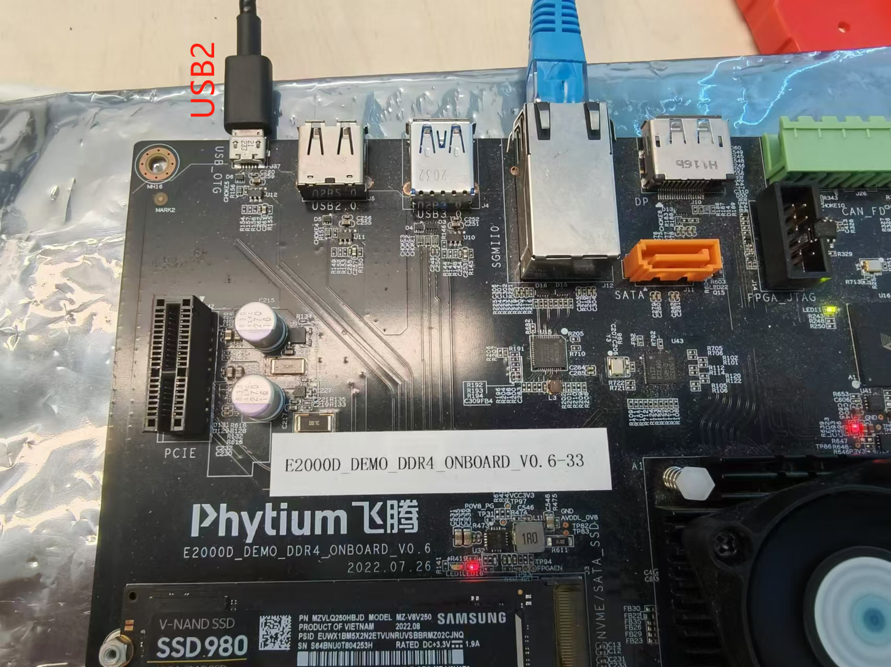
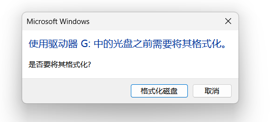
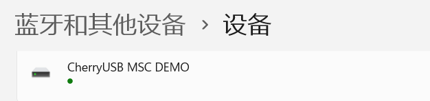
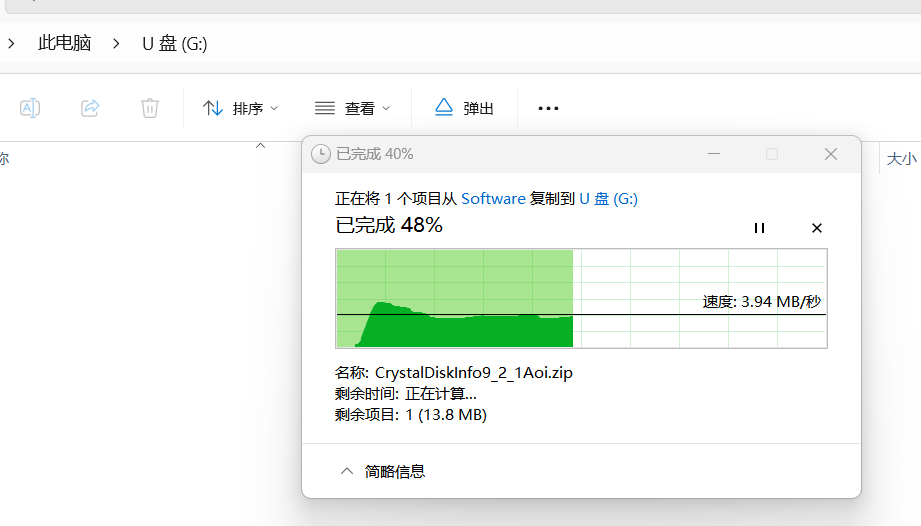
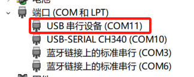

# PUSB2 Device 模式测试

## 1. 例程介绍

><font size="1">介绍例程的用途，使用场景，相关基本概念，描述用户可以使用例程完成哪些工作</font><br />

E2000 和 PhytiumPI 上提供了 USB2.0 OTG 控制器，本例程通过 CherryUSB 提供了 USB2.0 Device 模式的例程，支持将开发板模拟为一个一个 U 盘供 PC 上位机读写，以及模拟成一个串口设备与 PC 上位机通信，本例程中使用的 PC 上位机是 Windows 11 PC

使用例程前注意以下几点：
- 1）本例程不支持模式切换，需要确认开发板固件将 USB2.0 OTG 控制器置于 Host 模式还是 Device 模式，只有固件将板子默认设置为 Device 模式才能使用此例程，一般的，E2000 D/Q Demo 用 MicroUSB 接口引出，固件会默认设置为 Device 模式（可以使用例程），PhytiumPI 用 TypeA 接口引出，固件默认设置为 Host 模式（不能使用例程）

## 2. 如何使用例程

><font size="1">描述开发平台准备，使用例程配置，构建和下载镜像的过程</font><br />

### 2.1 硬件配置方法

><font size="1">哪些硬件平台是支持的，需要哪些外设，例程与开发板哪些IO口相关等（建议附录开发板照片，展示哪些IO口被引出）</font><br />

本例程在 E2000 平台测试通过，您可以参考以下方法配置本例程所需要的硬件和软件环境，
- E2000 D/Q Demo 开发板
- Windows PC
- Micro-USB 线

- 本例程基于 E2000 D/Q Demo 开发板完成



### 2.2 SDK配置方法

><font size="1">依赖哪些驱动、库和第三方组件，如何完成配置（列出需要使能的关键配置项）</font><br />

本例程需要的配置包括，
- Letter Shell组件，依赖 USE_LETTER_SHELL

本例子已经提供好具体的编译指令，以下进行介绍:
- make 将目录下的工程进行编译
- make clean  将目录下的工程进行清理
- make boot   将目录下的工程进行编译，并将生成的elf 复制到目标地址
- make load_e2000d_aarch64  将预设64bit e2000d 下的配置加载至工程中
- make load_e2000d_aarch32  将预设32bit e2000d 下的配置加载至工程中
- make load_e2000q_aarch64  将预设64bit e2000q 下的配置加载至工程中
- make load_e2000q_aarch32  将预设32bit e2000q 下的配置加载至工程中
- make menuconfig   配置目录下的参数变量
- make backup_kconfig 将目录下的sdkconfig 备份到./configs下

- 具体使用方法为：
    - 在当前目录下
    - 执行以上指令

### 2.3 构建和下载

><font size="1">描述构建、烧录下载镜像的过程，列出相关的命令</font><br />

使用例程的一般过程为

- 选择目标平台和例程需要的配置
```
make load_e2000d_aarch64
```

- 进行编译
```
make
```

- 将编译出的镜像放置到tftp目录下
```
make image
```

- host侧设置重启host侧tftp服务器
```
sudo service tftpd-hpa restart
```

- 开发板侧使用bootelf命令跳转
```
setenv ipaddr 192.168.4.20  
setenv serverip 192.168.4.30 
setenv gatewayip 192.168.4.1 
tftpboot 0x90100000 freertos.elf
bootelf -p 0x90100000
```

### 2.4 输出与实验现象

><font size="1">描述输入输出情况，列出存在哪些输出，对应的输出是什么（建议附录相关现象图片）</font><br />

- 首先如上图所示将开发板和 PC 通过 USB 线连接

#### 2.4.1 将开发板模拟成 U 盘

- 首先如上图所示将开发板和 PC 通过 USB 线连接

#### 2.4.1 将开发板模拟成 U 盘

- 将开发板模拟成 U 盘，U 盘的存储介质用开发板的内存实现
- 完成开发板和 PC 的连接后，将编译好的裸机镜像加载到开发板上
- 输入下列命令启动任务，开始模拟 U 盘

```
pusb2 mass_storage
```

- PC 识别到开发板模拟的 U 盘后，会弹出弹出提示信息，由于 U 盘里没有文件系统，同时保存在开发板内存中的数据掉电后就会全部丢失，所以每次识别后都需要进行格式化才能使用




- 之后可以在 U 盘中创建文件，同时通过设备管理器可以看到 U 盘对应的设备 `CherryUSB USB MSC DEMO`



- 识别到 U 盘后，可以尝试拷贝文件进行使用，拷贝的数据实际上存在开发板内存空间中




#### 2.4.2 将开发板模拟成串口

- 输入下列命令，开始模拟串口
```
pusb2 virtual_serial
```

- PC 识别到开发板模拟的串口后，会增加一个串口设备和USB设备，然后通过 Putty 等串口工具可以发送字符，然后在开发板串口上可以观察到输入的字符




- 随后打开新识别到的 COM11, 输入一系列字符后会回显在控制台串口侧


## 3. 如何解决问题

><font size="1">主要记录使用例程中可能会遇到的问题，给出相应的解决方案</font><br />


## 4. 修改历史记录

><font size="1">记录例程的重大修改记录，标明修改发生的版本号 </font><br />

- V1.1.1 首次合入


