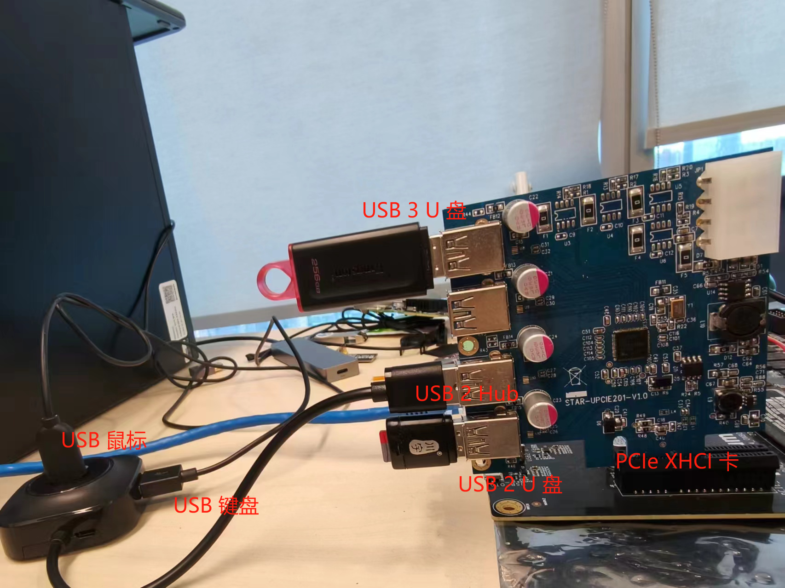
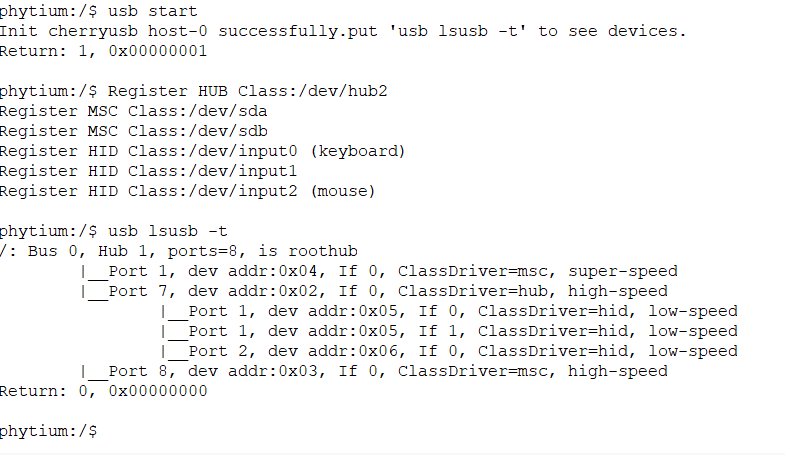
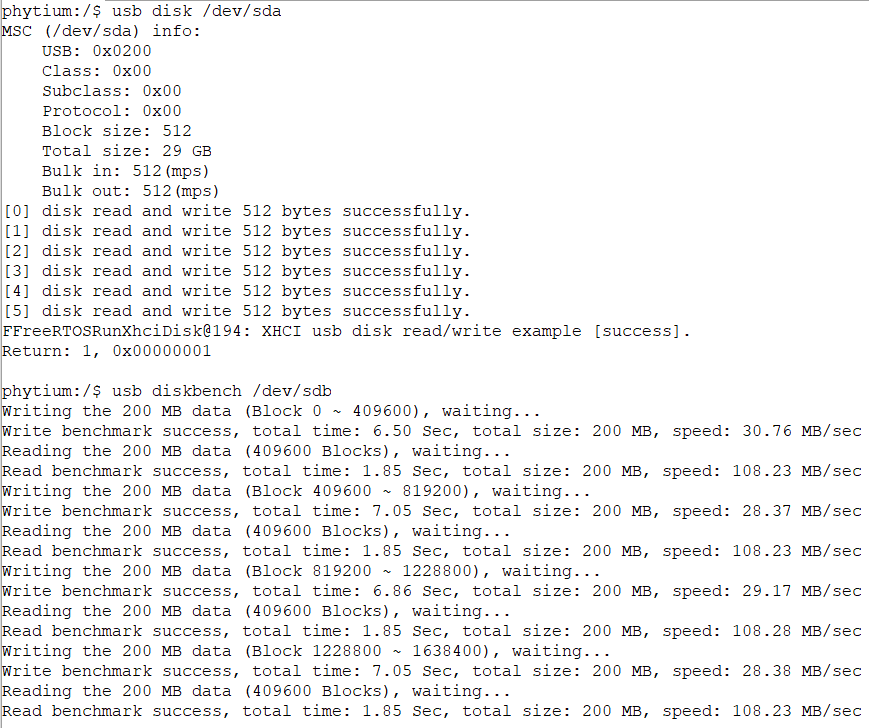
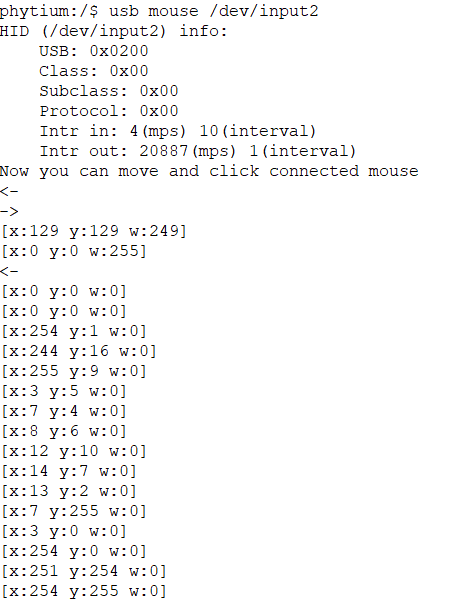
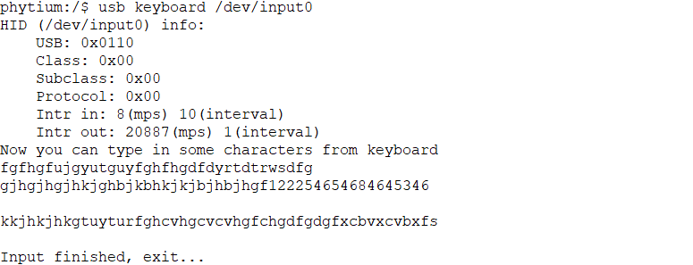
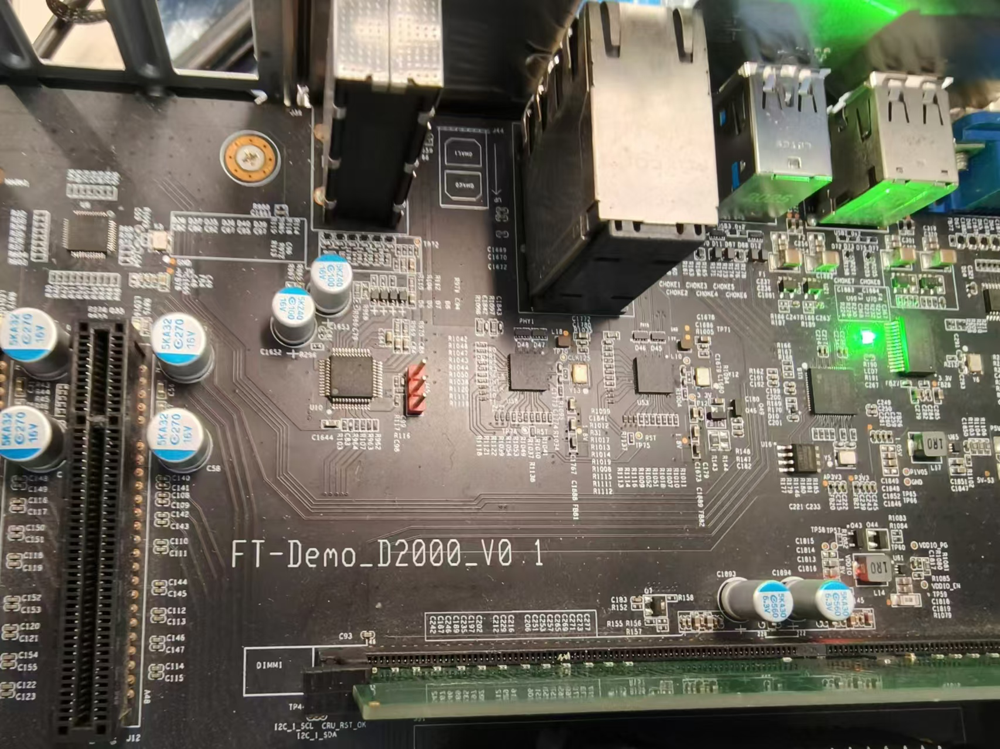
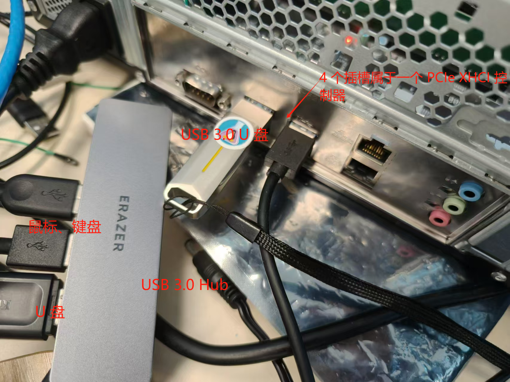
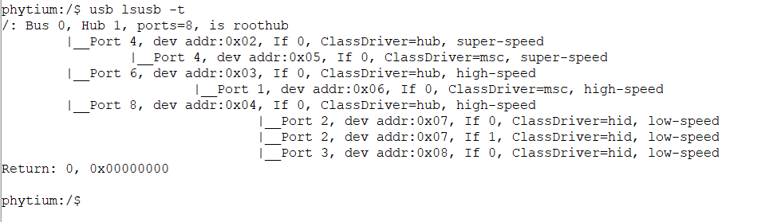

# XHCI Host 测试 (PCIe 设备)

## 1. 例程介绍

><font size="1">介绍例程的用途，使用场景，相关基本概念，描述用户可以使用例程完成哪些工作</font><br />

XHCI(eXtensible Host Controller Interface)，即可扩展的主机控制器接口，是英特尔公司开发的一个USB主机控制器接口，主要是面向USB 3.0的，同时它也支持USB 2.0及以下的设备，XHCI 控制器有两种类型，一种是平台设备，另外一种是 PCIe 扩展设备

CherryUSB 是一个用于嵌入式系统 USB 协议栈，支持运行在 Host 模式和 Device 模式

本例程展示了如何使用 CherryUSB 驱动 PCIe 扩展的 XHCI 控制器，识别和使用 USB 设备，如果使用 PCIe 扩展的 XHCI 控制器可以参考[xhci_platfrom 例程](../xhci_platform/README.md)

## 2. 如何使用例程

><font size="1">描述开发平台准备，使用例程配置，构建和下载镜像的过程</font><br />

### 2.1 硬件配置方法

><font size="1">哪些硬件平台是支持的，需要哪些外设，例程与开发板哪些IO口相关等（建议附录开发板照片，展示哪些IO口被引出）</font><br />

本例程在 E2000 平台测试通过，您可以参考以下方法配置本例程所需要的硬件和软件环境，
- E2000 开发板
- 本例程使用的是 STAR-UPCIE201-V1.0 PCIe 卡(兼容XHCI 1.0)，芯片组是 瑞萨 μPD720201, 通过一个 Roothub 扩充支持最多四路 USB


- 本例程基于E2000 Demo 开发板，使用logitech键盘、Dell鼠标和Sandisk盘完成测试
- 本例程支持D200 Demo 开发板

### 2.2 SDK配置方法

><font size="1">依赖哪些驱动、库和第三方组件，如何完成配置（列出需要使能的关键配置项）</font><br />

本例程需要的配置包括，
- Letter Shell组件，依赖 USE_LETTER_SHELL

本例子已经提供好具体的编译指令，以下进行介绍:
- make 将目录下的工程进行编译
- make clean  将目录下的工程进行清理
- make image   将目录下的工程进行编译，并将生成的elf 复制到目标地址
- make list_kconfig 当前工程支持哪些配置文件
- make load_kconfig LOAD_CONFIG_NAME=<kconfig configuration files>  将预设配置加载至工程中
- make menuconfig   配置目录下的参数变量
- make backup_kconfig 将目录下的sdkconfig 备份到./configs下

具体使用方法为：
- 在当前目录下
- 执行以上指令

### 2.3 构建和下载

><font size="1">描述构建、烧录下载镜像的过程，列出相关的命令</font><br />

使用例程的一般过程为

- 选择目标平台和例程需要的配置
```
make load_kconfig LOAD_CONFIG_NAME=e2000d_aarch64_demo_cherry_usb
```

- 进行编译
```
make
```

- 将编译出的镜像放置到tftp目录下
```
make image
```

- host侧设置重启host侧tftp服务器

- 开发板侧使用bootelf命令跳转
```
setenv ipaddr 192.168.4.20  
setenv serverip 192.168.4.50 
setenv gatewayip 192.168.4.1 
tftpboot 0x90100000 freertos.elf
bootelf -p 0x90100000
```

### 2.4 输出与实验现象 (E2000D/Q Demo 板)

><font size="1">描述输入输出情况，列出存在哪些输出，对应的输出是什么（建议附录相关现象图片）</font><br />

#### 2.4.1 枚举 USB 设备

- 将 USB 设备连接在 PCIe XHCI 卡上



- 输入下面的命令，开始枚举 USB 设备

```
usb start
```

- 设备枚举完成后，输入命令查看枚举到的 USB 设备的拓扑结构，

```
usb lsusb -t
```



#### 2.4.2 使用 U 盘

- 主要的测试方法和 [XHCI_Platform 例程](../xhci_platform/README.md) 中一致

```
usb disk /dev/sda
usb diskbench /dev/sdb
```



#### 2.4.3 使用 USB 鼠标和键盘

- 主要的测试方法和 [XHCI_Platform 例程](../xhci_platform/README.md) 中一致，这次枚举过程中鼠标对应设备 `/dev/input2`，具体使用时要看枚举打印信息

```
usb mouse /dev/input2
```



```
usb keyboard /dev/input0
```




#### 2.4.4 D2000 Demo 板上进行测试

- 在 D2000 Demo 板上可以进行测试，在开发板上有四个 USB 插槽，它们属于同一个 PCIe XHCI 控制器，对应控制器上不同的 Rootport，Rootport 中部分是 USB 3.X 协议的，另外一部分是 USB 2.X 协议的 





- 在开发板上连接若干设备后，输入 `usb start` 开始枚举设备，完成设备枚举后输入命令查看设备，键盘对应

```
usb lsusb -t
```



## 3. 如何解决问题

><font size="1">主要记录使用例程中可能会遇到的问题，给出相应的解决方案</font><br />

## 4. 修改历史记录

><font size="1">记录例程的重大修改记录，标明修改发生的版本号 </font><br />

- V0.3.1 首次合入
- v0.1.0 支持USB 3.0 设备枚举
- v0.7.1 区分 XHCI 平台设备和 PCIe 设备
- v1.0.0 更新 CherryUSB，解决 Hub 遗留问题，支持 D2000