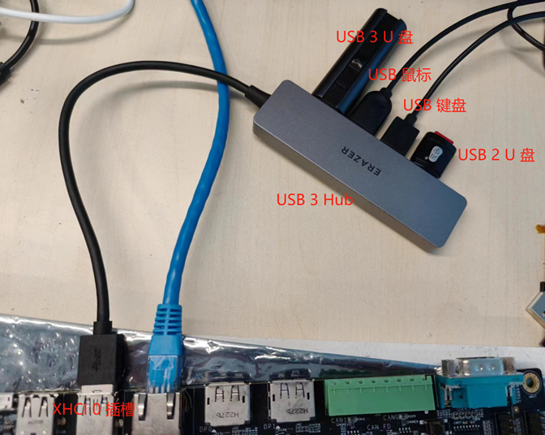
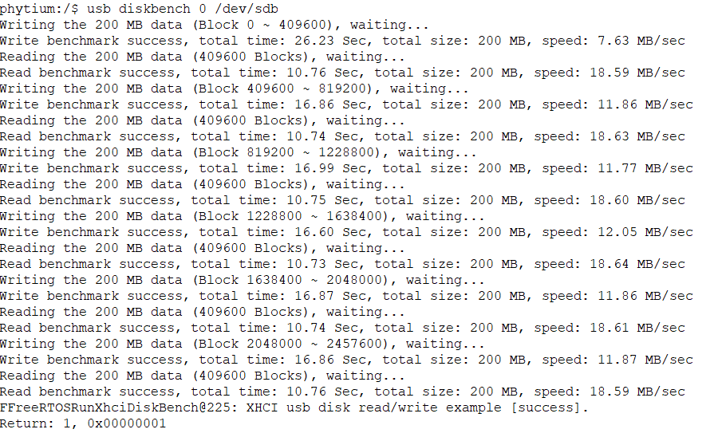
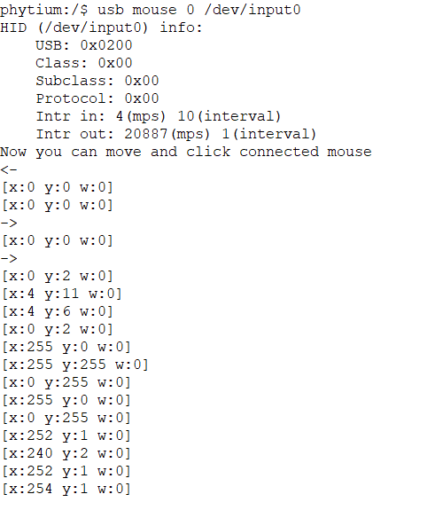
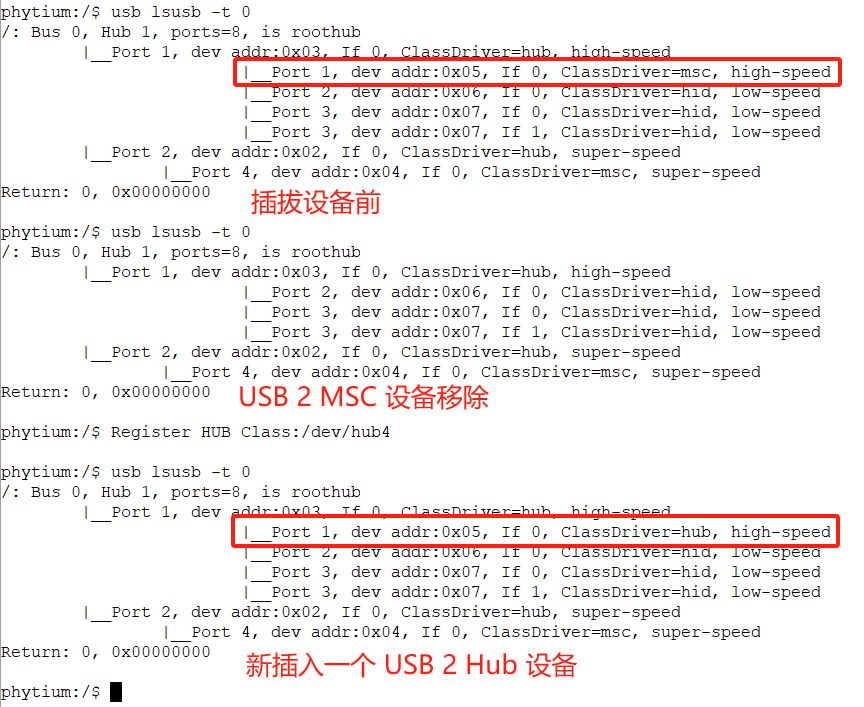
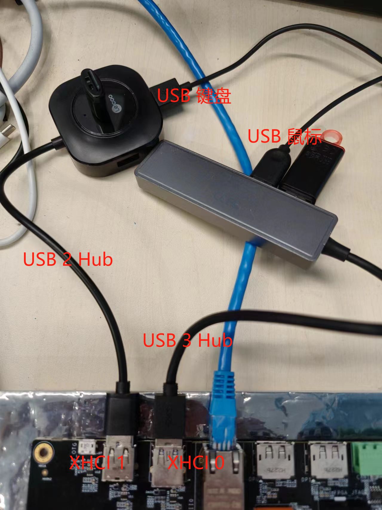

# XHCI Host 测试 (平台设备)

## 1. 例程介绍

><font size="1">介绍例程的用途，使用场景，相关基本概念，描述用户可以使用例程完成哪些工作</font><br />

XHCI(eXtensible Host Controller Interface)，即可扩展的主机控制器接口，是英特尔公司开发的一个USB主机控制器接口，主要是面向USB 3.0的，同时它也支持USB 2.0及以下的设备，XHCI 控制器有两种类型，一种是平台设备，另外一种是 PCIe 扩展设备

CherryUSB 是一个用于嵌入式系统 USB 协议栈，支持运行在Host模式和Device模式

本例程展示了如何使用 CherryUSB 驱动平台 XHCI 控制器，识别和使用 USB 设备，如果使用 PCIe 扩展的 XHCI 控制器可以参考[xhci_pcie 例程](../xhci_pcie/README.md)

## 2. 如何使用例程

><font size="1">描述开发平台准备，使用例程配置，构建和下载镜像的过程</font><br />

### 2.1 硬件配置方法

><font size="1">哪些硬件平台是支持的，需要哪些外设，例程与开发板哪些IO口相关等（建议附录开发板照片，展示哪些IO口被引出）</font><br />

本例程在 E2000 平台测试通过，您可以参考以下方法配置本例程所需要的硬件和软件环境，
- E2000 开发板/飞腾派
- 本例程基于E2000 Demo 开发板，使用logitech键盘、Dell鼠标和 Kingston U盘完成测试

### 2.2 SDK配置方法

><font size="1">依赖哪些驱动、库和第三方组件，如何完成配置（列出需要使能的关键配置项）</font><br />

本例程需要的配置包括，
- Letter Shell组件，依赖 USE_LETTER_SHELL

本例子已经提供好具体的编译指令，以下进行介绍:
- make 将目录下的工程进行编译
- make clean  将目录下的工程进行清理
- make image   将目录下的工程进行编译，并将生成的elf 复制到目标地址
- make list_kconfig 当前工程支持哪些配置文件
- make load_kconfig LOAD_CONFIG_NAME=<kconfig configuration files>  将预设配置加载至工程中
- make menuconfig   配置目录下的参数变量
- make backup_kconfig 将目录下的sdkconfig 备份到./configs下

具体使用方法为：
- 在当前目录下
- 执行以上指令


### 2.3 构建和下载

><font size="1">描述构建、烧录下载镜像的过程，列出相关的命令</font><br />

使用例程的一般过程为

- 选择目标平台和例程需要的配置
```
make load_kconfig LOAD_CONFIG_NAME=e2000d_aarch64_demo_cherry_usb
```

- 进行编译
```
make
```

- 将编译出的镜像放置到tftp目录下
```
make image
```

- host侧设置重启host侧tftp服务器
```
sudo service tftpd-hpa restart
```

- 开发板侧使用bootelf命令跳转
```
setenv ipaddr 192.168.4.20  
setenv serverip 192.168.4.30 
setenv gatewayip 192.168.4.1 
tftpboot 0x90100000 freertos.elf
bootelf -p 0x90100000
```

### 2.4 输出与实验现象（E2000 D/Q Demo 板）

><font size="1">描述输入输出情况，列出存在哪些输出，对应的输出是什么（建议附录相关现象图片）</font><br />

#### 2.4.1 枚举 USB 设备

- 将 USB 设备通过 USB Hub 连接到 XHCI 0 上



- 输入下面的命令，开始枚举 USB 设备

```
usb start 0
```

- 设备枚举完成后，输入命令查看枚举到的 USB 设备的拓扑结构，其中，USB 3 Hub 会枚举出 High-speed 和 Super-speed 两个 Hub 设备，后续 USB 3 设备挂在 Super-speed Hub 上，USB 2 （Low/Full/High speed）设备挂在 High-speed Hub 上面，XHCI 控制器也至少提供两个 Roothub port，分别支持 USB 2 设备和 USB 3 设备

```
usb lsusb -t 0
```


- 在 CherryUSB 中，后面通过注册的设备号，如 `/dev/sda`、`/dev/input0` 来获取 USB 设备实例访问设备功能

#### 2.4.2 使用 U 盘

- 输入下面的命令，对 XHCI 0 上刚刚枚举出来的 U 盘进行读写，可以看到标量 256GB 的 U 盘可以访问的空间大小为 230GB，U 盘的读写功能由两个 Bulk 端点提供

```
usb disk 0 /dev/sda
```


- 输入下面的命令，对 U 盘进行读写，每次读写 200MB 的内容，计算读写速度，具体的读写速度和 测试 U 盘的性能有关

```
usb diskbench 0 /dev/sda
```


- /dev/sdb 是一个 High-speed 设备，可以看到读写速度会比 /dev/sda 对应的 Super-speed U 盘慢很多



#### 2.4.3 使用 USB 鼠标

- 枚举打印信息中显示 `/dev/input0` 是一个鼠标，输入下面的命令接收鼠标的输入，随后移动鼠标或者按键后打印相应的鼠标坐标信息和按键信息，输入会持续一段时间后自动退出

```
usb mouse 0 /dev/input0
```



#### 2.4.4 使用 USB 键盘

- 枚举打印信息中显示 `/dev/input1` 是一个键盘，输入下面的命令接收键盘的输入，随后通过键盘输入的字符会打印在控制台上，输入会持续一段时间后自动退出

```
usb keyboard 0 /dev/input1
```


#### 2.4.5 热插拔 USB 设备

- 使用过程中可以拔下当前不在工作的 USB 设备，插入新的设备，如下所示，先拔出 USB 2 U 盘，然后插入一个 USB 2 Hub



#### 2.4.6 级联 USB HUB

- Hub 上可以通过新 Hub 扩展连接端口，2.4.5 中新加入的 USB 2 Hub 后，再新 Hub 上可以继续连接设备，如下图

> 一般来说，Hub 不宜级联多级，一方面，USB 协议中有最多级联 5 级的限制，另一方面，Hub 本身供电不足，级联接入的设备可能不能正常工作


### 2.5 输出与实验现象 (飞腾派)

- 加载飞腾派配置，然后编译镜像

```
make load_kconfig LOAD_CONFIG_NAME=phytiumpi_aarch64_firefly_cherry_usb
```

- 连接 USB 设备到 XHCI 0，注意不要连错，只有靠板子正面一侧的蓝色插槽对应的是 XHCI 控制器


- 输入下列命令，枚举完成后查看 USB 设备信息

```
usb start 0
usb lsusb -t 0
```


- 其它设备的使用方法和 2.4 中描述的一致


### 2.6 输出与实验现象 (E2000 D/Q Demo 板，同时使用 XHCI 0 和 XHCI 1)

- USB 协议栈中支持同时使用多路同类的 USB 控制器（如果 USB 控制器依赖的驱动不同现在是不支持的）
> 在 E2000 D/Q Demo 板中，XHCI 1 最多只能支持 High-speed 速率

- 如下图所示连接 USB 设备



- 输入下面的命令，开始枚举 USB 设备

```
usb start 0
usb start 1
```

```
usb lsusb -t
```


- 具体的设备使用方法和 2.4 中的描述一致

## 3. 如何解决问题

><font size="1">主要记录使用例程中可能会遇到的问题，给出相应的解决方案</font><br />

## 4. 修改历史记录

><font size="1">记录例程的重大修改记录，标明修改发生的版本号 </font><br />

- V0.3.1 首次合入
- v0.1.0 支持USB 3.0 设备枚举
- v0.7.1 区分 XHCI 平台设备和 PCIe 设备
- v1.0.0 更新 CherryUSB，解决 Hub 遗留问题