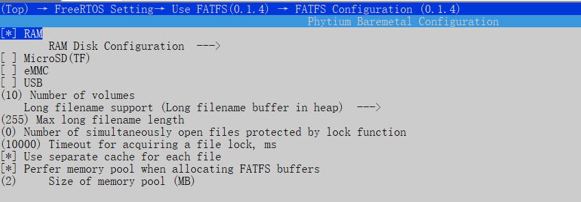
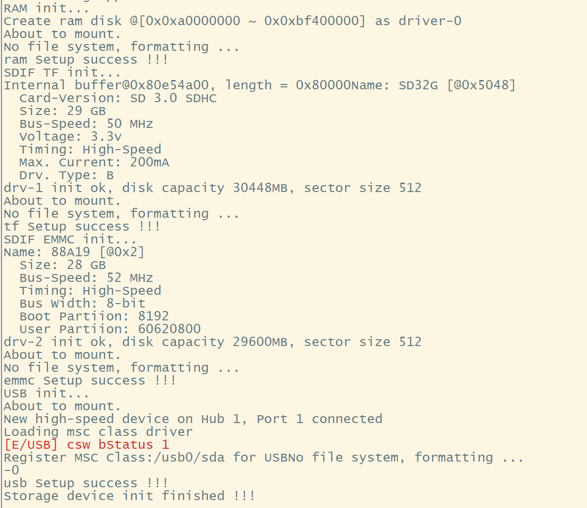
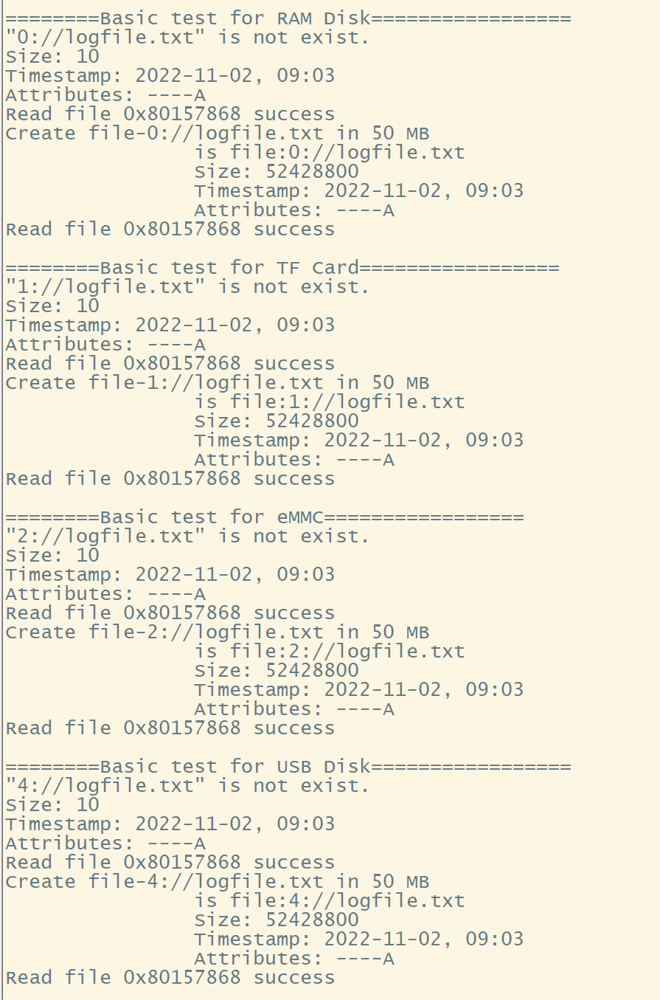
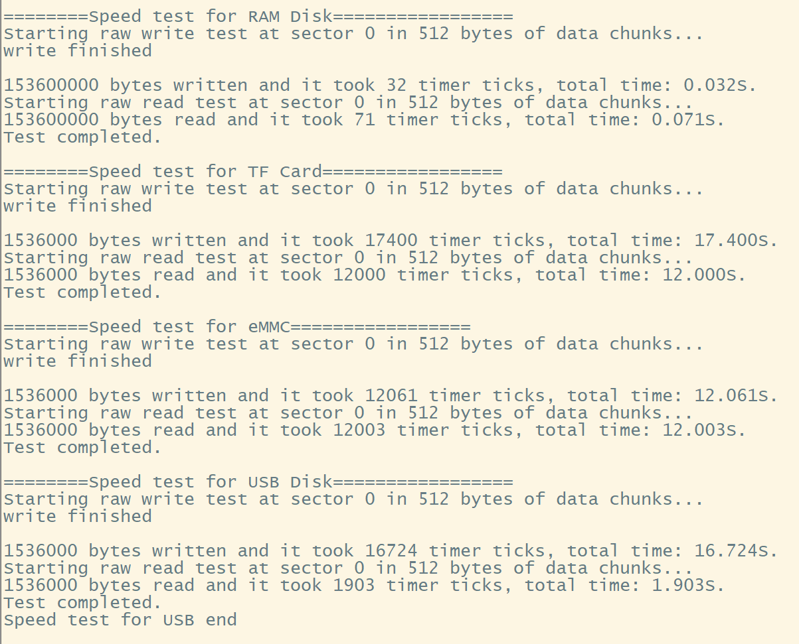

# FATFS 文件系统测试

## 1. 例程介绍

- 文件系统是一类负责管理和存储文件信息的软件机构，在磁盘上组织文件的方法。作为常用的文件系统，FATFS免费开源，专门为小型嵌入式系统设计。
- 本例程中通过在文件系统的根目录下挂载多个目录，支持在 RAM Disk, MicroSD 卡，eMMC 卡和 U盘上同时使用和测试 FATFS 文件系统


## 2. 如何使用例程

本例程在 E2000 平台测试通过，您可以参考以下方法配置本例程所需要的硬件和软件环境，
- E2000 开发板
- 本例程基于 E2000 Q Demo 板


### 2.1 硬件配置方法

本例程支持的硬件平台包括

- E2000Q

对应的配置项是，

- CONFIG_TARGET_E2000Q

### 2.2 SDK配置方法

本例程需要，

- 使能Shell

对应的配置项是，

- CONFIG_USE_LETTER_SHELL

本例子已经提供好具体的编译指令，以下进行介绍:
- make 将目录下的工程进行编译
- make clean  将目录下的工程进行清理
- make boot   将目录下的工程进行编译，并将生成的elf 复制到目标地址
- make load_e2000d_aarch64  将预设64bit e2000d 下的配置加载至工程中
- make load_e2000d_aarch32  将预设32bit e2000d 下的配置加载至工程中
- make menuconfig   配置目录下的参数变量
- make backup_kconfig 将目录下的sdkconfig 备份到./configs下

具体使用方法为:
- 在当前目录下
- 执行以上指令

### 2.3 构建和下载

#### 2.3.1 构建过程

- 在host侧完成配置
>配置成 e2000，对于其它平台，使用对于的默认配置，如 e2000q `make load_e2000q_aarch32`

- 选择目标平台
```
make load_e2000q_aarch32
```

- 选择例程需要的配置
```
make menuconfig
```

- 进行编译
```
make
```

- 将编译出的镜像放置到tftp目录下
```
make boot
```

#### 2.3.2 下载过程

- host侧设置重启host侧tftp服务器
```
sudo service tftpd-hpa restart
```

- 开发板侧使用bootelf命令跳转
```
setenv ipaddr 192.168.4.20  
setenv serverip 192.168.4.50 
setenv gatewayip 192.168.4.1 
tftpboot 0x90100000 freertos.elf
bootelf -p 0x90100000
```

### 2.4 输出与实验现象

- 打开配置 CONFIG_FATFS_SDIO_TF, 使能 MicroSD(TF) 卡
- 打开配置 CONFIG_FATFS_SDIO_EMMC, 使能 eMMC
- 打开配置 CONFIG_FATFS_USB, 使能 U 盘

- 打开配置 CONFIG_FATFS_BASIC_TEST，测试 FATFS 的基本功能
- 打开配置 CONFIG_FATFS_SPEED_TEST, 测试 FATFS 的读写速度，会破环文件系统
- 打开配置 CONFIG_FATFS_CYCLE_TEST, 运行 FATFS 的测试项，会破环文件系统
- 编译镜像，加载到开发板上电启动




- 加载镜像启动后，自动开始测试





## 3. 如何解决问题
