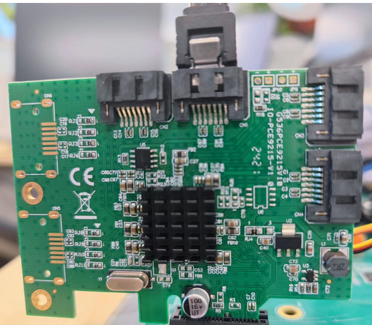
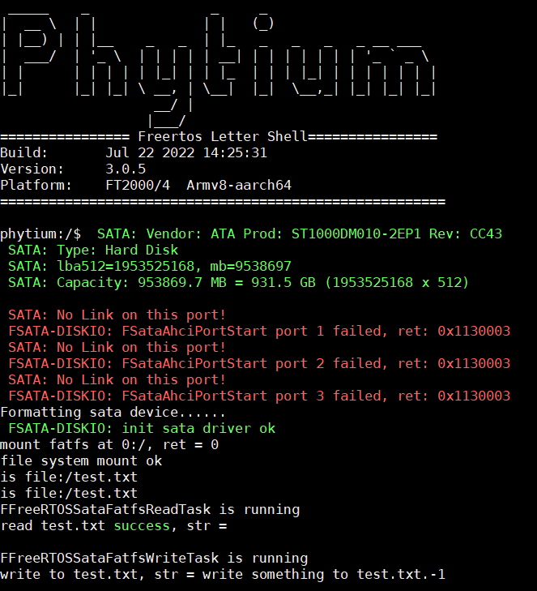
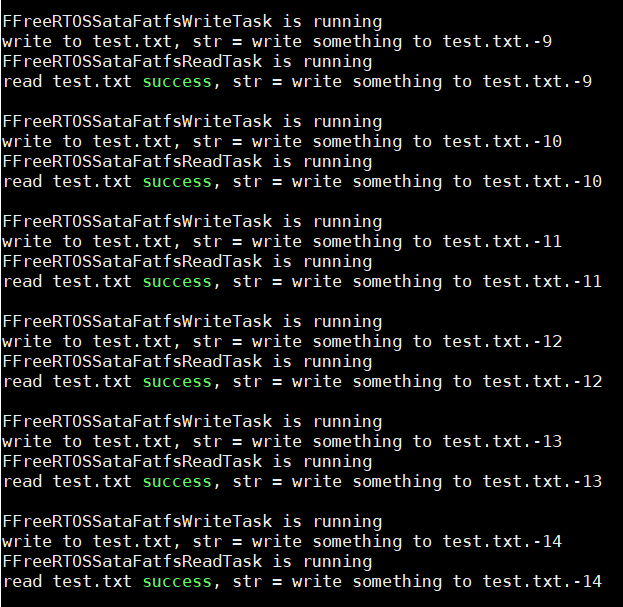
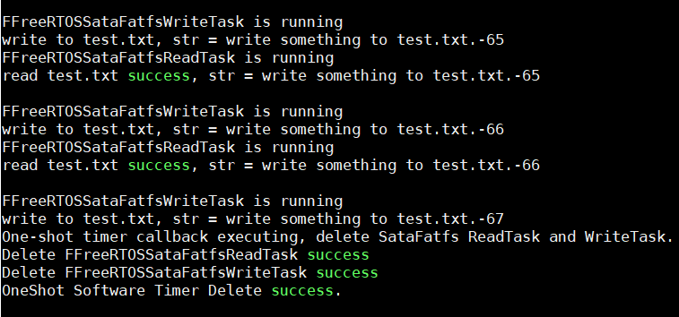
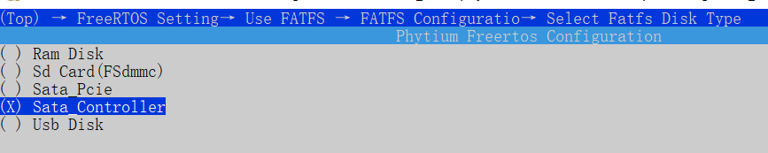

<!--
 * Copyright : (C) 2022 Phytium Information Technology, Inc. 
 * All Rights Reserved.
 *  
 * This program is OPEN SOURCE software: you can redistribute it and/or modify it  
 * under the terms of the Phytium Public License as published by the Phytium Technology Co.,Ltd,  
 * either version 1.0 of the License, or (at your option) any later version. 
 *  
 * This program is distributed in the hope that it will be useful,but WITHOUT ANY WARRANTY;  
 * without even the implied warranty of MERCHANTABILITY or FITNESS FOR A PARTICULAR PURPOSE.
 * See the Phytium Public License for more details. 
 *  
 * 
 * FilePath: README.md
 * Date: 2022-02-24 16:55:00
 * LastEditTime: 2022-03-21 17:00:59
 * Description:  This file is for 
 * 
 * Modify History: 
 *  Ver   Who        Date         Changes
 * ----- ------     --------    --------------------------------------
-->
# Sata FATFS测试

## 1. 例程介绍

><font size="1">介绍例程的用途，使用场景，相关基本概念，描述用户可以使用例程完成哪些工作</font><br />

文件系统是一类负责管理和存储文件信息的软件机构，在磁盘上组织文件的方法。作为常用的文件系统，FATFS免费开源，专门为小型嵌入式系统设计。

本例程在Sata上实现FATFS的存储媒介读／写接口（disk I/O），支持文件系统格式化加载，文件创建读写和遍历等基本操作。

## 2. 如何使用例程

><font size="1">描述开发平台准备，使用例程配置，构建和下载镜像的过程</font><br />

### 2.1 硬件配置方法

><font size="1">哪些硬件平台是支持的，需要哪些外设，例程与开发板哪些IO口相关等（建议附录开发板照片，展示哪些IO口被引出）</font><br />

本例程在FT2000/4，D2000，E2000平台测试通过，您可以参考以下方法配置本例程所需要的硬件和软件环境，
- FT2000/4，D2000或E2000开发板
- 本例程基于FT2000/4平台，使用Marvell 88SE9215芯片通过PCIE接口转接Sata，外接Sata硬盘
- 将转接板插入PCIE插槽，接入sata硬盘至转接板的CN1(也就是port 0)



### 2.2 SDK配置方法

><font size="1">依赖哪些驱动、库和第三方组件，如何完成配置（列出需要使能的关键配置项）</font><br />

本例程需要的配置包括，
- Letter Shell组件，依赖 USE_LETTER_SHELL
- FATFS组件，依赖 USE_FATFS 和 SELECT_FATFS_FSATA_PCIE
- PCIE组件，作为转接接口，依赖USE_PCIE
- SATA组件，依赖 USE_SATA

本例子已经提供好具体的编译指令，以下进行介绍:
- make 将目录下的工程进行编译
- make clean  将目录下的工程进行清理
- make boot   将目录下的工程进行编译，并将生成的elf 复制到目标地址
- make load_d2000_aarch64  将预设64bit d2000 下的配置加载至工程中
- make load_d2000_aarch32  将预设32bit d2000 下的配置加载至工程中
- make load_ft2004_aarch64  将预设64bit ft2004 下的配置加载至工程中
- make load_ft2004_aarch32  将预设32bit ft2004 下的配置加载至工程中
- make load_e2000d_aarch64  将预设64bit e2000d 下的配置加载至工程中
- make load_e2000d_aarch32  将预设32bit e2000d 下的配置加载至工程中
- make load_e2000q_aarch64  将预设64bit e2000q 下的配置加载至工程中
- make load_e2000q_aarch32  将预设32bit e2000q 下的配置加载至工程中
- make menuconfig   配置目录下的参数变量
- make backup_kconfig 将目录下的sdkconfig 备份到./configs下

具体使用方法为：
- 在当前目录下
- 执行以上指令

### 2.3 构建和下载

><font size="1">描述构建、烧录下载镜像的过程，列出相关的命令</font><br />

使用例程的一般过程为

- 选择目标平台和例程需要的配置
```
make load_ft2004_aarch32
```

- 进行编译
```
make
```

- 将编译出的镜像放置到tftp目录下
```
make boot
```

- host侧设置重启host侧tftp服务器
```
sudo service tftpd-hpa restart
```

- 开发板侧使用bootelf命令跳转
```
setenv ipaddr 192.168.4.20  
setenv serverip 192.168.4.50 
setenv gatewayip 192.168.4.1 
tftpboot 0x90100000 freertos.elf
bootelf -p 0x90100000
```

### 2.4 输出与实验现象

><font size="1">描述输入输出情况，列出存在哪些输出，对应的输出是什么（建议附录相关现象图片）</font><br />
程序启动后，依次创建Init、Read、Write任务，创建单次模式软件定时器用于删除任务，Init任务会首先初始化并挂载sata盘（如果sata盘不是fat格式，还会进行格式化操作），随后创建一个文件，然后释放信号量通知Read和Write任务开始执行;
- Init完成，目前只在port0上接了sata盘


- 读写任务周期性执行


- 软件定时器触发，删除读写任务


## 3. 如何解决问题

><font size="1">主要记录使用例程中可能会遇到的问题，给出相应的解决方案</font><br />
- 如果使用E2000D开发板，可以选择使用sata控制器，只需要在fatfs的介质选择中使能SELECT_FATFS_FSATA_CONTROLLER


- 在configs文件夹的默认配置中，ft2004和d2000是使用的pcie转sata配置，e2000是使用的sata控制器配置

## 4. 修改历史记录

><font size="1">记录例程的重大修改记录，标明修改发生的版本号 </font><br />

V0.0.1 首次合入


