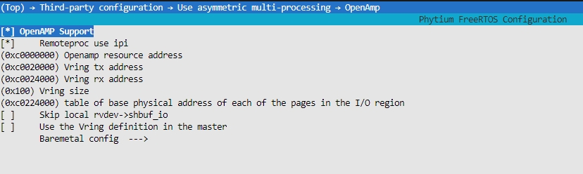
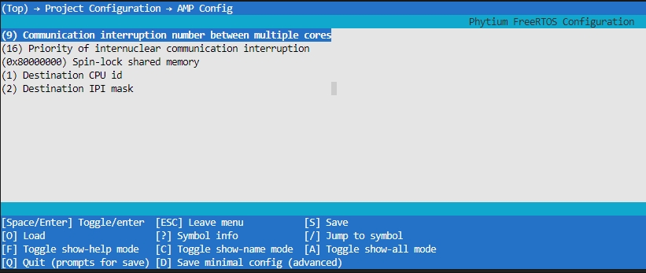
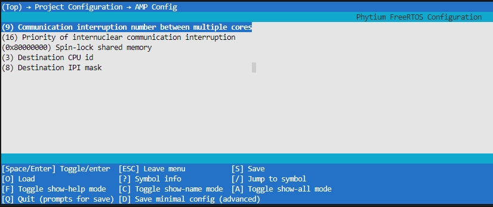
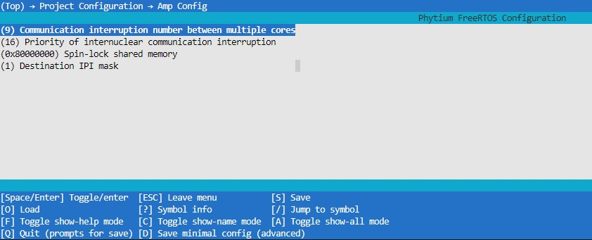
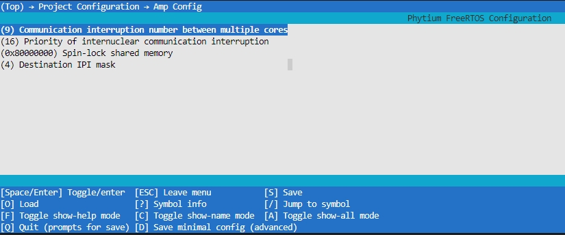
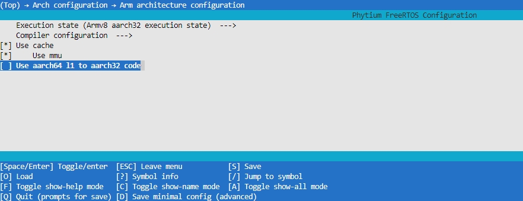
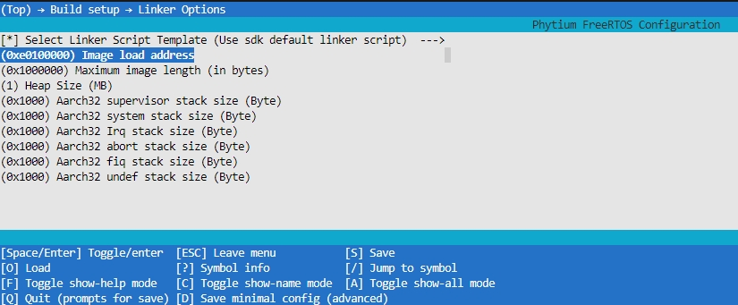

# OPENAMP 测试

## 1. 例程介绍

> `<font size="1">`介绍例程的用途，使用场景，相关基本概念，描述用户可以使用例程完成哪些工作 `</font><br />`

- OpenAMP(Open Asymmetric Multi-processing) 是一个软件架构，为多核之间非对称运行提供软件支持 。

### 1.1 OpenAMP 提供了以下关键特性

1. 提供生命周期管理
2. 兼容裸跑、RTOS等不同的软件环境
3. 当前此目录不兼容linux系统中的 remoteproc, rpmsg and VirtIO 模块，兼容版本已经移动至openamp_for_linux目录中

### 1.2 OpenAMP组件

1. RPMsg (Remote Processor Messaging)
2. VirtIO (Virtualization Module)
3. remoteproc

### 1.3 driver_core与device_core

- 本例程基于开源openamp项目
  [OpenAMP](https://github.com/OpenAMP/open-amp.git)

1. 例程结构介绍（与裸机类似）：

- 本例程主要提供了D2000/FT2004/E2000/firefly开发板 freertos与freertos之间的测试例程，也很容易实现freertos与裸机。
- 角色介绍：管理核作为交互管理的核心，主要进行任务分配，也承担一部分的任务反馈功能，性能核作为任务的运算执行核心，主要承担接受管理核的指令和任务运算的工作。
- 本例程中 `driver_core` 目录下的程序为管理核程序、`device_core`目录下为性能核程序。管理核程序功能为初始化创建platform和rpmsg_device（主VIRTIO_DEV_MASTER），创建成功后，创建管理endpoint节点与性能核构建通信机制。性能核功能为初始化创建platform和与管理核绑定的rpmsg_device（从VIRTIO_DEV_SLAVE），创建成功后，创建监听endpoint节点接收管理核的命令来运行相关的例程。
- 创建流程以及参考文档

remoteproc-design:
   [remoteproc-design](../../../../standalone/third-party/openamp/docs/remoteproc-design.md)

rpmsg-design:
   [rpmsg-design](../../../../standalone/third-party/openamp/docs/rpmsg-design.md)

OpenAMP回调与中断通知机制:
   

openamp初始化运行图：
   

2.demo介绍：

- demo1：管理核rpmsg-echo.c与性能核rpmsg-ping.c

- demo2：管理核rpmsg-sample-echo.c与性能核rpmsg-sample-ping.c

- demo3：管理核matrix_multiplyd.c与性能核matrix_multiply.c

- demo4：管理核rpmsg-nocopy-echo.c与性能核rpmsg-nocopy-ping.c

具体功能可以阅读 管理核`driver_core`对应.c文件的头描述 Description 

## 2. 如何使用例程

> <font size="1">描述开发平台准备，使用例程配置，构建和下载镜像的过程 </font><br />

### 2.1 硬件配置方法

> <font size="1">哪些硬件平台是支持的，需要哪些外设，例程与开发板哪些IO口相关等（建议附录开发板照片，展示哪些IO口被引出）</font><br />

1. 准备一块d2000 或者 E2000Q/D 或者 firefly 或者FT2004开发板
2. 将串口连接好电脑，波特率设为 115200-8-1-N

### 2.2 SDK配置方法

> <font size="1">依赖哪些驱动、库和第三方组件，如何完成配置（列出需要使能的关键配置项）</font><br />

- 本例子已经提供好具体的编译指令，以下进行介绍(快速测试，使用默认部署请看2.4)：

  1. make clean_driver_core 将./driver_core 目录下的工程进行清理
  2. make clean_device_core 将./device_core 目录下的工程进行清理
  3. make config_d2000_aarch64 将预设64bit d2000 下的配置分别加载至 ./driver_core ./device_core
  4. make config_d2000_aarch32 将预设32bit d2000 下的配置分别加载至 ./driver_core ./device_core
  5. make config_ft2004_aarch64 将预设64bit ft2004 下的配置分别加载至 ./driver_core ./device_core
  6. make config_ft2004_aarch32 将预设32bit ft2004 下的配置分别加载至 ./driver_core ./device_core
  7. make config_e2000d_aarch64 将预设64bit e2000d 下的配置分别加载至 ./driver_core ./device_core
  8. make config_e2000d_aarch32 将预设32bit e2000d 下的配置分别加载至 ./driver_core ./device_core
  9. make config_e2000q_aarch64 将预设64bit e2000q 下的配置分别加载至 ./driver_core ./device_core
  10. make config_e2000q_aarch32 将预设32bit e2000q 下的配置分别加载至 ./driver_core ./device_core
  11. make config_phytiumpi_aarch64 将预设64bit phytiumpi 下的配置分别加载至 ./driver_core ./device_core
  12. make config_phytiumpi_aarch32 将预设32bit phytiumpi 下的配置分别加载至 ./driver_core ./device_core
  13. make menuconfig_driver_core 配置 ./driver_core 目录下的配置变量
  14. make menuconfig_device_core 配置 ./device_core 目录下的配置变量
  15. make backupconfig 将 ./driver_core ./device_core 的当前配置保存为 config 文件
  16. make clean 清理 ./driver_core ./device_core 下的编译结果
  17. make image 将 ./driver_core ./device_core 下的工程清理、编译并将目录下的编译后的 .elf 文件复制到目标路径下

- 具体使用方法为:

  - 在 /example/system/amp/openamp 下
   - 执行以上指令

### 2.3 构建和下载

> <font size="1">描述构建、烧录下载镜像的过程，列出相关的命令 </font><br />

#### OpenAMP 配置

以 driver_core 管理核为例：` make menuconfig_driver_core `



#### driver_core 构建配置

e2000d driver_core配置,`Destination CPU id`=1设置启动core1核心（自身运行在core0），`Destination IPI cpu mask` = 2 表示 1 << `Destination CPU id`



e2000q driver_core配置,`Destination CPU id`=3设置启动core3核心(小核)（自身运行在core2(小核)），`Destination IPI cpu mask` = 8 表示 1 << `Destination CPU id`



#### device_core 构建配置

以 device_core 性能核为例：` make menuconfig_device_core `

e2000d device_core配置,上面e2000q driver_core运行在core0，所以`Destination CPU id` = 0,`Destination IPI mask` = 1 表示 1 << `Destination CPU id`



e2000q device_core配置,上面e2000q driver_core运行在core2，所以`Destination CPU id` = 2,`Destination IPI mask` = 4 表示 1 << `Destination CPU id`



aarch32状态下还需要在 device_core 的 config 中关闭 CONFIG_USE_AARCH64_L1_TO_AARCH32 选项：



device_core 的 elf 文件加载地址需要修改为 0xe0100000 :



- Remoteproc use ipi       : 使用ipi 中断模式进行提醒
- Openamp resource address : OpenAMP 中共享资源表中地址
- Vring tx address         : 共享发送缓冲区的起始地址，同时也是共享buffer 区域的起始地址
- Vring rx address         : 共享接收缓冲区的起始地址
- table of base physical address of each of the pages in the I/O region : 用于核心间提醒机制的共享内存初始点
- DEBUG_CODE                         : 增加裸跑shell 功能
- Destination CPU communication mask : 主核心用于唤醒从核的掩码
- Destination IPI mask               : ipi 中断中，用于唤醒其他核心的掩码
- Spin-lock shared memory            : 互斥锁中关注的共享内存
- Select mem default attribute       : 提供内存属性选择

### 2.4 输出与实验现象

> <font size="1">描述输入输出情况，列出存在哪些输入，对应的输出是什么（建议附录相关现象图片）</font><br />

#### aarch32 裸跑程序测试 （rtos间）

以E2000D为例

1. 在编译环境下，切换至 phytium-free-rtos-sdk/example/system/amp/openamp 目录
   1.1 输入 'make config_e2000d_aarch32' 加载默认配置信息
   1.2 输入 'make clean' 清理 ./driver_core ./device_core 下的编译结果
   1.3 输入 'make image' 编译driver_core / device_core 代码，生成对应的elf 文件，并拷贝至 tftp 目录下
   1.4 先将 ./driver_core/makefile 与 ./device_core/makefile 中 的 USR_BOOT_DIR 修改为您的 tftp 所覆盖的目录

2. 使用串口连接E2000开发板 ，并且打开串口终端工具
   2.1 复位开发板之后，将E2000开发板的网络与tftp 服务器在同一局域网中
   2.2 在板子串口终端工具下输入以下命令

```
   setenv ipaddr 192.168.4.20    
   setenv serverip 192.168.4.50   
   setenv gatewayip 192.168.4.1  
   tftpboot f0000000 openamp_driver_core.elf  
   tftpboot f1000000 openamp_device_core.elf  
   bootelf -p f0000000          
```

- 2.3 会显示如下内容


- 2.4 输入 'openamp auto' 运行openamp 测试程序
- 2.5 结果显示为(openamp和libmetal版本号可能存在区别)


#### aarch64 裸跑程序测试 （rtos间）

以E2000D为例

1. 在编译环境下，切换至 phytium-standalone-sdk/example/system/amp/openamp 目录
   1.1 输入 'make config_e2000d_aarch64' 加载默认配置信息
   1.2 输入 'make clean' 清理 ./driver_core ./device_core 下的编译结果
   1.3 输入 'make image' 编译driver_core / device_core 代码，生成对应的elf 文件，并拷贝至 tftp 目录下
   1.4 先将 ./driver_core/makefile 与 ./device_core/makefile 中 的 USR_BOOT_DIR 修改为您的tftp 所覆盖的目录

2. 使用串口连接E2000开发板 ，并且打开串口终端工具
   2.1 复位开发板之后，将E2000开发板的网络与tftp 服务器在同一局域网中
   2.2 在板子串口终端工具下输入以下命令

```
   setenv ipaddr 192.168.4.20 ;
   setenv serverip 192.168.4.50;
   setenv gatewayip 192.168.4.1;
   tftpboot f0000000 openamp_driver_core.elf;
   tftpboot f1000000 openamp_device_core.elf;
   bootelf -p f0000000       
```

- 2.3 会显示如下内容


- 2.4 输入 'openamp auto' 运行openamp 测试程序
- 2.5 结果显示为(openamp和libmetal版本号可能存在区别)


## 3. 如何解决问题 (Q&A)

> 主要记录使用例程中可能会遇到的问题，给出相应的解决方案

## 4. 修改历史记录

> 记录例程的重大修改记录，标明修改发生的版本号

- 2021-03-21 ：v0.1.0 初始化项目
- 2023-03-09 : v0.2.0 增加对e2000 的支持
- 2023-10-26 : v0.3.0 openamp所以测试例程适配
- 2024-03-07 ：v0.3.1 修复命令错误描述