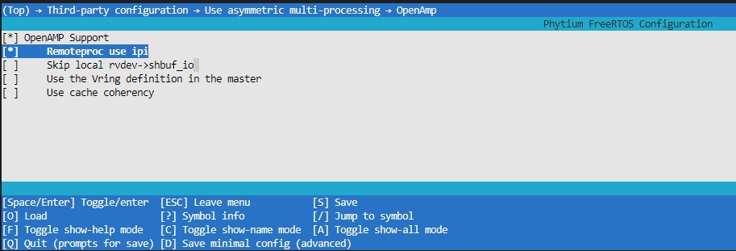
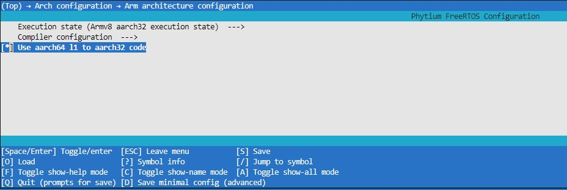
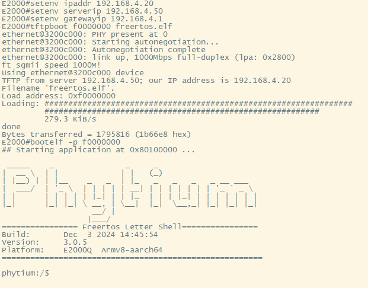
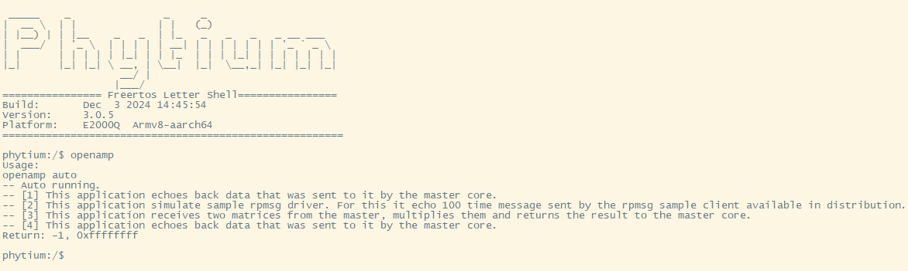
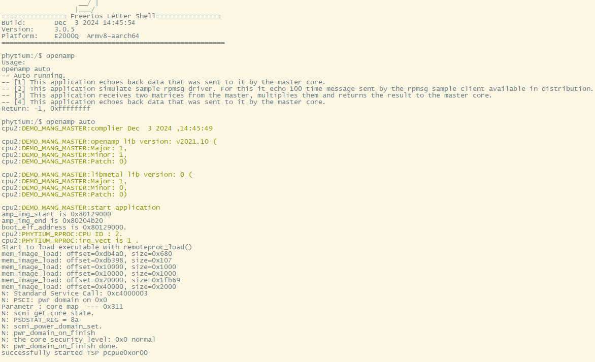
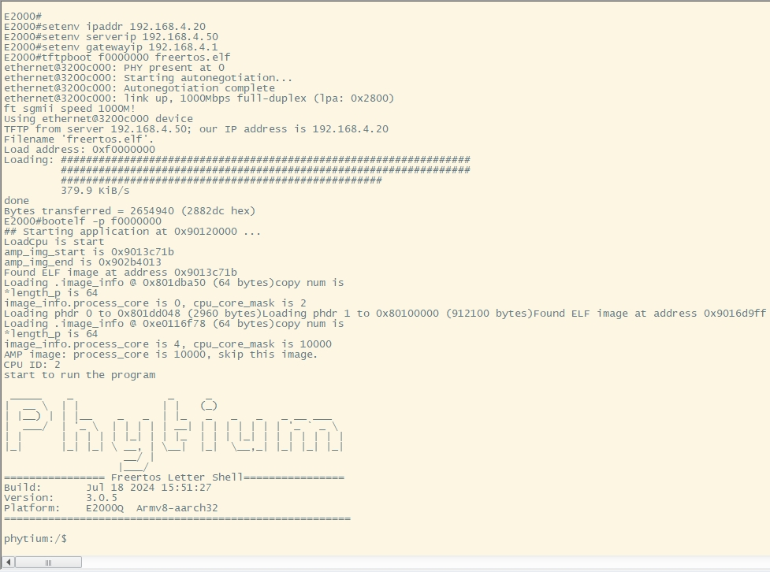
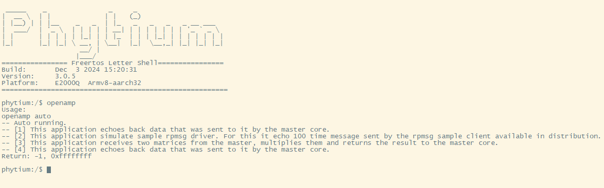
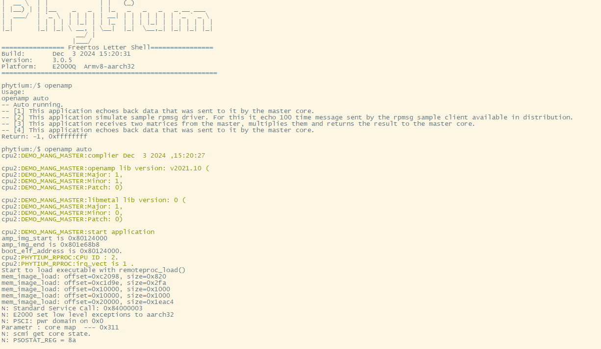

# OPENAMP 测试

## 1. 例程介绍

> `<font size="1">`介绍例程的用途，使用场景，相关基本概念，描述用户可以使用例程完成哪些工作 `</font><br />`

- OpenAMP(Open Asymmetric Multi-processing) 是一个软件架构，为多核之间非对称运行提供软件支持 。

### 1.1 OpenAMP 提供了以下关键特性

1. 提供生命周期管理
2. 兼容裸跑、RTOS等不同的软件环境
3. 当前此目录不兼容linux系统中的 remoteproc, rpmsg and VirtIO 模块，兼容版本已经移动至openamp_for_linux目录中

### 1.2 OpenAMP组件

1. RPMsg (Remote Processor Messaging)
2. VirtIO (Virtualization Module)
3. remoteproc

### 1.3 driver_core与device_core

- 本例程基于开源openamp项目
  [OpenAMP](https://github.com/OpenAMP/open-amp.git)

1. 例程结构介绍：

- 本例程主要为D2000 TEST、E2000 D/Q DEMO、PD2308 DEMO、PD2408 TEST_A/TEST_B、PhytiumPi开发板上的freertos系统提供openamp驱动测试支持

#### 系统架构

- 角色介绍：管理核作为交互管理的核心，主要进行任务分配，也承担一部分的任务反馈功能，性能核作为任务的运算执行核心，主要承担接受管理核的指令和任务运算的工作。
- 本例程中 `driver_core` 目录下的程序为管理核（模拟）程序、`device_core`目录下为性能核（模拟）程序。管理核程序功能为初始化创建platform和rpmsg_device（主VIRTIO_DEV_DRIVER），创建成功后，创建管理endpoint节点与性能核构建通信机制。性能核功能为初始化创建platform和与管理核绑定的rpmsg_device（从VIRTIO_DEV_DEVICE），创建成功后，创建监听endpoint节点接收管理核的命令来运行相关的例程。
- 核心的分配以及架构参考amp_config.json文件(具体描述参考 `Phytium-Standalone-SDK/example/system/amp/README.md` 的介绍)
- common目录下为公共配置文件，方便管理核和性能核共用，也方便了解使用的资源以及修改配置。
- rpmsg 创建流程以及参考文档

rpmsg-design:
   [rpmsg-design](../../../../../standalone/third-party/openamp/docs/rpmsg-design.md)

2.demo介绍(模拟角色)：

- demo1：管理核rpmsg-echo.c与性能核rpmsg-ping.c

- demo2：管理核rpmsg-sample-echo.c与性能核rpmsg-sample-ping.c

- demo3：管理核matrix_multiplyd.c与性能核matrix_multiply.c

- demo4：管理核rpmsg-nocopy-echo.c与性能核rpmsg-nocopy-ping.c

具体功能可以阅读 管理核`driver_core`对应.c文件的头描述 Description 

## 2. 如何使用例程

> `<font size="1">`描述开发平台准备，使用例程配置，构建和下载镜像的过程 `</font><br />`

### 2.1 硬件配置方法

> `<font size="1">`哪些硬件平台是支持的，需要哪些外设，例程与开发板哪些IO口相关等（建议附录开发板照片，展示哪些IO口被引出）`</font><br />`

本例程支持的硬件平台包括
  - D2000 TEST、E2000 D/Q DEMO、PD2308 DEMO、PD2408 TEST_A/TEST_B、PhytiumPi开发板

将串口连接好电脑，波特率设为 115200-8-1-N

### 2.2 SDK配置方法

> `<font size="1">`依赖哪些驱动、库和第三方组件，如何完成配置（列出需要使能的关键配置项）`</font><br />`

- 本例子driver_core目录与device_core目录已经提供好具体的编译指令，以下进行介绍(快速测试，使用默认部署请看2.4)：

  1. make menuconfig          配置目录下的参数变量
  2. make clean               将目录下的工程进行清理
  3. make backup_kconfig      如果对上述的项目配置修改后需要分别重新保存到默认配置目录中
  4. make list_kconfig        当前工程支持哪些配置文件
  5. make amp_make AMP_CONFIG=config`[num]` 将当前目录下的amp_config.json定义的配置项编译打包,config`[num]`为配置项的名称（在driver_core目录下有效支持）
- 具体使用方法为：
  6. 为了方便快速配置测试，本项目配置文件列举了8个默认配置项目，会同时加载apu、rpu的默认配置，然后使用make amp_make AMP_CONFIG=config`[num]` 命令进行对应soc的对应aarch编译

- 具体使用方法为：

  - 在 /example/system/amp/openamp/driver_core 目录 下
  - 执行上述指令

### 2.3 构建和下载

> `<font size="1">`描述构建、烧录下载镜像的过程，列出相关的命令 `</font><br />`

#### driver_core 构建配置

- 以driver_core管理核（主）为例：` make menuconfig `



- 选择要编译的配置项，如上图所示，选择配置项后，保存并退出，`make backup_kconfig`保存到默认项，才能被`amp_make`打包编译。

#### device_core 构建配置

- 以 device_core 设备核（从）为例：在 `../device_core` 目录下 ` make menuconfig `


- 选择要编译的配置项，如上图所示，选择配置项后，保存并退出 ,`make backup_kconfig`保存到默认项，才能被`amp_make`打包编译。

#### 用户自定义修改配置项

- 因为多核采用的是脚本自动寻找 `amp_config.json` 文件描述的工程目录，加载配置好的默认配置项（在目标路径的 configs 目录下），进行编译。所以，需要先保存修改好的配置项到默认配置目录中。

- 可以单个进入工程目录中，单个调试完工程后再组合编译（遇到启动问题，推荐此构建方式排查调试多核启动问题）（注意：aarch32模式单个调试启动需要打开CONFIG_USE_AARCH64_L1_TO_AARCH32）。

> aarch32需要注意的点



- 单个工程目录中使用`make backup_kconfig`保存调试好的AARCH32配置到默认配置，如果是子工程（`amp_config.json`非bootstrap配置项）别忘了在工程中关闭CONFIG_USE_AARCH64_L1_TO_AARCH32，否则会导致启动失败。

#### 编译

- 输入 `make clean` 清理 `./` 目录下的编译结果
- 编译指令：` make amp_make AMP_CONFIG=config[num] `
- 其中，config`[num]`为配置项的名称，如上述步骤中选择的配置项名称。

### 2.4 输出与实验现象

> `<font size="1">`描述输入输出情况，列出存在哪些输入，对应的输出是什么（建议附录相关现象图片）`</font><br />`

#### aarch64 程序测试 （FreeRTOS 间）

以E2000Q DEMO为例

1. 在编译环境下，切换至 phytium-free-rtos-sdk/example/system/amp/openamp/driver_core 目录

- 1.1 输入` make clean ` 清理 `./` 目录下的编译结果
- 1.2 输入` make amp_make AMP_CONFIG=config0 ` 编译config0配置项代码，并且生成对应的elf 文件

2. 使用串口连接E2000Q DEMO开发板 ，并且打开串口终端工具

- 2.1 复位开发板之后，将E2000Q DEMO开发板的网络与tftp 服务器在同一局域网中
- 2.2  在板子串口终端工具下输入以下命令

```
   setenv ipaddr 192.168.4.20
   setenv serverip 192.168.4.50
   setenv gatewayip 192.168.4.1
   tftpboot f0000000 freertos.elf
   bootelf -p f0000000       
```

2.3 会显示如下内容



2.4 输入 'openamp' 运行openamp 命令程序示例,结果显示为:



- 其中 "openamp auto" 表示命令的完整格式，一次性测试4个demo，红色方框为核2调用函数启动核心0的过程




- 其中 "Test Results:Error count =" 表示通信过程中出现错误的次数


#### aarch32 程序测试 （FreeRTOS 间）

以E2000Q DEMO为例

1. 在编译环境下，切换至 phytium-free-rtos-sdk/example/system/amp/openamp/driver_core 目录

- 1.1 输入` make clean ` 清理 `./` 目录下的编译结果
- 1.2 输入` make amp_make AMP_CONFIG=config1 ` 编译config1配置项代码，并且生成对应的elf 文件

2. 使用串口连接E2000Q DEMO开发板，并且打开串口终端工具

- 2.1 复位开发板之后，将E2000Q DEMO开发板的网络与tftp服务器在同一局域网中
- 2.2  在板子串口终端工具下输入以下命令

```
   setenv ipaddr 192.168.4.20
   setenv serverip 192.168.4.50
   setenv gatewayip 192.168.4.1
   tftpboot f0000000 freertos.elf
   bootelf -p f0000000       
```

2.3 会显示如下内容



2.5 输入 'openamp' 运行openamp 命令程序示例



2.6 输入 'openamp auto' 表示命令的完整格式，一次性测试4个demo



- 其中 "Test Results:Error count =" 表示通信过程中出现错误的次数


## 3. 如何解决问题 (Q&A)

> `<font size="1">`主要记录使用例程中可能会遇到的问题，给出相应的解决方案 `</font><br />`

- 在首次使用'openamp auto'命令时候，由于会有核心启动得打印，造成乱码，可以再次运行'openamp auto'来看效果
- 在修改例程中，注意从核和主核两者在任务的创建和调度临界时发生中断屏蔽的情况，避免在此时发送数据导致通信异常。

## 4. 修改历史记录

> `<font size="1">`记录例程的重大修改记录，标明修改发生的版本号 `</font><br />`

- 2023-05-12 ：v0.1.0 初始化项目
- 2023-05-31 : v0.1.1 增加自动加载从核elf并启动的功能
- 2024-07-18 : v0.1.2 完善openamp生命周期管理，修改配置方式
- 2024-12-03 : v0.1.3 增加新多元异构系统架构支持，完善readme文档