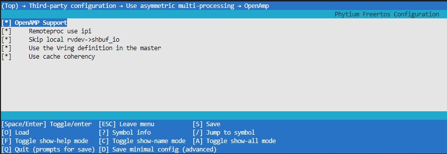
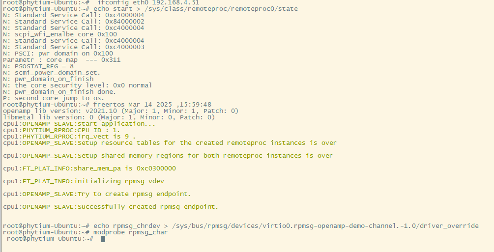

# OPENAMP 测试

## 1. 例程介绍

> `<font size="1">`介绍例程的用途，使用场景，相关基本概念，描述用户可以使用例程完成哪些工作 `</font><br />`

- OpenAMP(Open Asymmetric Multi-processing) 是一个软件架构，为多核之间非对称运行提供软件支持 。
- OpenAMP 提供了以下关键特性:

1. 提供生命周期管理
2. 兼容裸跑、RTOS等不同的软件环境
3. 兼容linux系统中的 remoteproc, rpmsg and VirtIO 模块

- 本例程基于开源openamp项目
  [OpenAMP](https://github.com/OpenAMP/open-amp.git)
- 本例程主要提供了D2000/E2000D/E2000Q/PHYTIUMPI Linux与RTOS之间的测试例程
- 本例程演示rpmsg用法的示例演示应用程序。此应用core0 中的程序为从机程序，core1 中的程序为主机linux程序，其目标是从核程序工作在echo 模式下，主核主动发送数据之后，从机程序会将收到的数据重新回复发送回去
- 如果需要添加其他应用任务，则要求应用任务优先级比RpmsgEchoTask优先级（默认是4）高，否则应用任务无法执行。
- 参阅《飞腾嵌入式OpenAMP技术解决方案与用户操作手册》配置好linux环境，本例程只提供freertos的编译镜像
  [手册链接](https://gitee.com/phytium_embedded/phytium-embedded-docs/tree/master/open-amp)
- 注意linux4.19内核只支持aarch32编译的镜像 *.elf 文件,linux5.1内核支持aarch64和32位编译的镜像。
- 多核共享资源的调整主要集中在 `common` 目录下，可以根据需要进行修改。

## 2. 如何使用例程

> `<font size="1">`描述开发平台准备，使用例程配置，构建和下载镜像的过程 `</font><br />`

### 2.1 硬件配置方法

> `<font size="1">`哪些硬件平台是支持的，需要哪些外设，例程与开发板哪些IO口相关等（建议附录开发板照片，展示哪些IO口被引出）`</font><br />`

1. 准备一块 D2000 、 E2000Q/D 、firefly开发板中任意一款
2. 将串口连接好电脑，波特率设为 115200-8-1-N

### 2.2 SDK配置方法

> `<font size="1">`依赖哪些驱动、库和第三方组件，如何完成配置（列出需要使能的关键配置项）`</font><br />`

本例子已经提供好具体的编译指令(本SDK通用指令)，以下进行介绍:

- make 将目录下的工程进行编译
- make clean  将目录下的工程进行清理
- make image   将目录下的工程进行编译，并将生成的elf 复制到目标地址
- make list_kconfig 当前工程支持哪些配置文件
- make load_kconfig LOAD_CONFIG_NAME=`<kconfig configuration files>`  将预设配置加载至工程中
- make menuconfig   配置目录下的参数变量
- make backup_kconfig 将目录下的sdkconfig 备份到./configs下

具体使用方法为:

- 在当前目录下
- 执行以上指令

### 2.3 构建和下载

> `<font size="1">`描述构建、烧录下载镜像的过程，列出相关的命令 `</font><br />`

#### OpenAMP 配置

- 以E2000Q为例,加载E2000Q aarch64位，输入 `make config_e2000q_aarch64`

- 选择好配置项目后，输入 `make menuconfig` 打开配置项目,查阅一下



- Remoteproc use ipi       : 使用ipi 中断模式进行提醒
- Skip local rvdev->shbuf_io
- Use the Vring definition in the master
- Use cache coherency

### 2.4 输出与实验现象

> `<font size="1">`描述输入输出情况，列出存在哪些输入，对应的输出是什么（建议附录相关现象图片）`</font><br />`

#### E2000Q aarch64 freertos程序测试 （与linux）

以E2000为例

1. 进入amp/openamp_for_linux 目录
2. 输入 `make config_e2000q_aarch64` 加载E2000Q默认配置项目，`config_e2000q_aarch64`指令为本例程makefile中为了方便快捷配置的指令，其他配置项可以输入 `make config_` 后按tab键查看支持哪些默认配置项目
3. 选择好配置项目后，输入 `make menuconfig` 打开配置项目
4. 在 Sdk common configuration → Use default interrupt configuration → Interrupt role select  选项中选择 use slave role(默认配置好的)

   
5. 如果进行本地单独freertos调试，则在 Sdk common configuration → Use default interrupt configuration → Interrupt role select  选项中选择 use master role
6. 目录下输入 "make clean"  "make image" ,生成openamp_core0.elf 文件之后，将其拷贝至linux 指定目录下(注意linux加载的镜像名称必须是openamp_core0.elf，否则无法识别到)

#### E2000 aarch32 freertos程序测试 （与linux）

以E2000q为例

1. 进入amp/openamp_for_linux 目录
2. 输入 `make config_e2000q_aarch32` 加载E2000Q默认配置项目，`config_e2000q_aarch32`指令为本例程makefile中为了方便快捷配置的指令，其他配置项可以输入 `make config_` 后按tab键查看支持哪些默认配置项目
3. 选择好配置项目后，输入 `make menuconfig` 打开配置项目
4. 在 Sdk common configuration → Use default interrupt configuration → Interrupt role select  选项中选择 use slave role(默认配置好的)

   
5. 如果进行本地单独freertos调试，则在 Sdk common configuration → Use default interrupt configuration → Interrupt role select  选项中选择 use master role
6. 目录下输入 "make clean"  "make image" ,生成openamp_core0.elf 文件之后，将其拷贝至linux 指定目录下(注意linux加载的镜像名称必须是openamp_core0.elf，否则无法识别到)

#### 加载运行

1. 编译好镜像之后，将其发送到对应的开发板中，本例程采用网线直连 scp 命令传输，配置好目标板的IP地址` ifconfig eth0 192.168.4.51`,本地主机电脑IP地址`192.168.4.50`，在主机端使用命令如下：

```
make scp
```

2. 后续参考《飞腾嵌入式OpenAMP技术解决方案与用户操作手册v1.5》 type-A 与 type-B的说明操作



## 3. 如何解决问题 (Q&A)

> 主要记录使用例程中可能会遇到的问题，给出相应的解决方案

## 4. 修改历史记录

> 记录例程的重大修改记录，标明修改发生的版本号

- 2021-03-21 ：v0.1.0 初始化项目
- 2023-03-09 : v0.2.0 增加对e2000 的支持
- 2023-11-14 ：v0.3.0 重新适配
- 2025-03-14 ：v1.0.0 完成启停的相关测试
