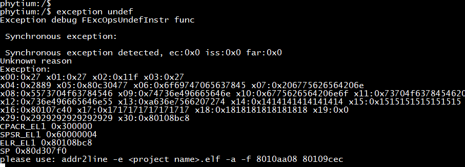
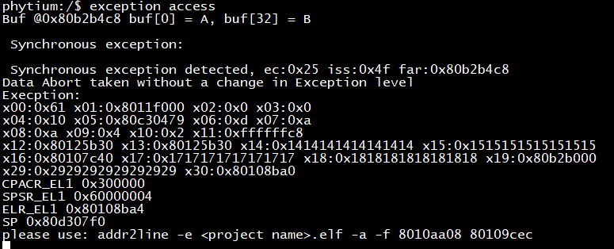
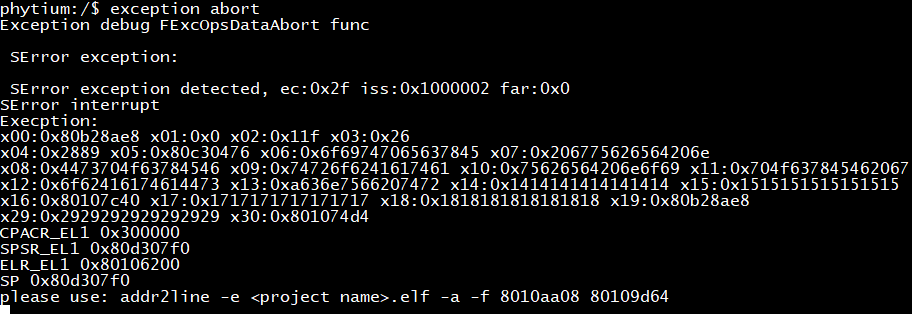

# exception debug

## 1. 例程介绍

本例程示范了freertos环境下测试Synchronous exception和Asynchronous exception.

Synchronous exception包含未定义指令Invalid instruction和写只读内存区域Memory access permission error两种测试.

Asynchronous exception包含越界访问地址空间Memory access violation一种测试.

注意aarch32和aarch64下，其异常分类有所差异，具体查看手册.

## 2. 如何使用例程

本例程需要用到

- Phytium开发板（D2000 TEST、FT2000/4 DSK、E2000 D/Q DEMO、PD2308 DEMO、PD2408 TEST_A/TEST_B、PhytiumPi）
- [Phytium FreeRTOS SDK](https://gitee.com/phytium_embedded/phytium-free-rtos-sdk)
- [Phytium standalone SDK](https://gitee.com/phytium_embedded/phytium-standalone-sdk)

### 2.1 硬件配置方法

本例程支持的硬件平台包括

- D2000 TEST、FT2000/4 DSK、E2000 D/Q DEMO、PD2308 DEMO、PD2408 TEST_A/TEST_B、PhytiumPi开发板

对应的配置项是，

- CONFIG_FT2004_DSK_BOARD
- CONFIG_D2000_TEST_BOARD
- CONFIG_E2000D_DEMO_BOARD
- CONFIG_E2000Q_DEMO_BOARD
- CONFIG_PD2308_DEMO_BOARD
- CONFIG_PD2408_TEST_A_BOARD
- CONFIG_PD2408_TEST_B_BOARD
- CONFIG_PHYTIUMPI_FIREFLY_BOARD

### 2.2 SDK配置方法

本例程需要，

- 使能Shell

对应的配置项是，

- CONFIG_USE_LETTER_SHELL

本例子已经提供好具体的编译指令，以下进行介绍:

- make 将目录下的工程进行编译
- make clean  将目录下的工程进行清理
- make image   将目录下的工程进行编译，并将生成的elf 复制到目标地址
- make list_kconfig 当前工程支持哪些配置文件
- make menuconfig   配置目录下的参数变量
- make backup_kconfig 将目录下的sdkconfig 备份到./configs下

具体使用方法为:

- 在当前目录下
- 执行以上指令

### 2.3 构建和下载

#### 2.3.1 构建过程

- 在host侧完成配置

使用待测试平台对应的默认配置，例如在E2000D DEMO开发板上测试aarch64程序：
```
make load_kconfig LOAD_CONFIG_NAME=pe2202_aarch64_demo_exception
```

- 选择例程需要的配置.

```
make menuconfig
```

- 编译并将编译出的镜像放置到tftp目录下

```
make image
```

#### 2.3.2 下载过程

- host侧设置重启host侧tftp服务器

```
sudo service tftpd-hpa restart
```

- 开发板侧使用bootelf命令跳转

```
setenv ipaddr 192.168.4.20  
setenv serverip 192.168.4.50 
setenv gatewayip 192.168.4.1 
tftpboot 0x90100000 freertos.elf
bootelf -p 0x90100000
```

### 2.4 输出与实验现象

```
$ exception undef
```


```
$ exception access
```


```
$ exception abort
```


## 3. 如何解决问题

本例程每次只能测试一种异常，需要重启后才能测试另一种。