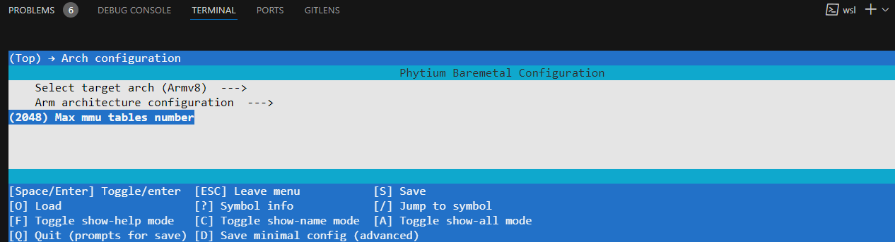
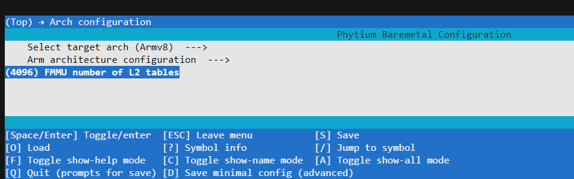

# MMU

## 1. 概述

- 虚拟内存系统（VMSA）提供了一套内存管理单元（MMU）， 它控制着地址转换、访问权限和内存属性的确定和检查。
- 地址转换过程将CPU使用的虚拟地址(VAs)映射到物理内存系统的物理地址(PAs)上。
- 在本SDK中 aarch32 state 采用 L1 section 、L2 page 格式的转换表
- 在本SDK中 aarch64 state 采用  L2 2MB 粒度 ,L3 4KB 粒度 格式的转换表

## 2. 功能

- MMU功能支持用户根据需要修改MMU表的默认内存属性。

## 3. 配置方法

## 4. 应用示例

### [libmetal_test例程](../../../example/system/amp/libmetal_test)

### [openamp例程](../../../example/system/amp/openamp)

## 5. API参考

### 5.1 用户定义

/* 访问权限 */

```c
#define MT_P_NA_U_NA  /* higher Exception level access=NA, user=NA */
#define MT_P_RW_U_NA  /* higher Exception level access=RW, user=NA */
#define MT_P_RW_U_RO  /* higher Exception level access=RW, user=RO */
#define MT_P_RW_U_RW  /* higher Exception level access=RW, user=RW */
#define MT_P_RO_U_NA  /* higher Exception level access=RO, user=NA */
#define MT_P_RO_U_RO  /* higher Exception level access=RO, user=RO */
```

/* 内存属性参数 */

```c
#define MT_DEVICE_NGNRNE       /* Device-nGnRnE , Outer Shareable */
#define MT_DEVICE_NGNRE        /* Device-nGnRE , Outer Shareable */
#define MT_DEVICE_GRE 	       /* Device-GRE , Outer Shareable */

#define MT_NORMAL_WT           /* Outer and Inner Write-Through, Read-Allocate No Write-Allocate , Outer Shareable  */
#define MT_NORMAL_NC          /* Outer and Inner Non-cacheable , Outer Shareable , Outer Shareable */
#define MT_NORMAL             /* Outer and Inner Write-Back, Read-Allocate Write-Allocate , Outer Shareable , Outer Shareable  */

```

```c

#define CONFIG_MAX_XLAT_TABLES 256   /* 在aarch64状态下，最大转换表数量 ，用户通过make menuconfig 进行修改 ，此参数如果太小将会导致 FMmuMap 无法分配多余的页表 */

```


```c

#define CONFIG_FMMU_NUM_L2_TABLES 256  /* 在aarch32状态下，LEVEL2 最大转换表数量 ，用户通过make menuconfig 进行修改 ，此参数如果太小将会导致 FMmuMap 无法分配多余的页表 */

```


### 5.2 用户API接口

- 此函数用于配置转换表中地址对应条目的内存属性与访问权限

```c
void MmuInit(void);
```

**注释**:

- 初始化内存管理单元 (MMU)，设置转换表和内存属性。

**输入**:

- 无

**返回**:

- `void`：此函数不返回任何值。

```c
void FSetTlbAttributes(uintptr addr, fsize_t size, u32 attrib);
```

**注释**:

- aarch32状态采用section页表，建议 `addr`使用4KB地址对齐，`size`为4KB的整数倍。
- aarch64状态采用4KB粒度页表，建议 `addr`使用4KB地址对齐，`size`为4KB的整数倍。

**输入**:

- `addr`：需要为内存区域设置属性与权限的起始地址。
- `size`：内存区域的范围。
- `attrib`：指定内存区域的属性，内存属性的取值由访问权限与内存属性参数组成，具体类型参考用户定义的部分。

**返回**:

- `void`：此函数不返回任何值。

```c
void FMmuMap(uintptr virt_addr, uintptr phys_addr, fsize_t size, u32 flags);
```

**注释**:

- 映射虚拟地址到物理地址。

**输入**:

- `virt_addr`：虚拟地址。
- `phys_addr`：物理地址。
- `size`：内存区域的范围。
- `flags`：映射标志，指定内存区域的属性和访问权限。

**返回**:

- `void`：此函数不返回任何值。

```c
void FMmuUnMap(uintptr virt_addr, fsize_t size);
```

**注释**:

- 解除虚拟地址到物理地址的映射。

**输入**:

- `virt_addr`：虚拟地址。
- `size`：内存区域的范围。

**返回**:

- `void`：此函数不返回任何值。

```c
void FMmuPrintReconstructedTables(void);
```

**注释**:

- 打印重构的转换表。

**输入**:

- 无

**返回**:

- `void`：此函数不返回任何值。

```c
void DisplayMmuUsage(void);
```

**注释**:

- 打印当前系统内存管理单元 (MMU) 剩余的表和剩余的内存空间。

**输入**:

- 无

**返回**:

- `void`：此函数不返回任何值。

```c
void FMmuMapRetopology(void);
```

**注释**:

- 重构映射。此接口必须在 DisplayMmuUsage、FMmuPrintReconstructedTables 、FMmuGetMappingsByPA 、FMmuGetMappingByVA 、FMmuGetAllVaByPA 、FMmuGetPAByVA 接口之前调用。

**输入**:

- 无

**返回**:

- `void`：此函数不返回任何值。

```c
void FMmuGetMappingsByPA(uintptr phys_addr);
```

**注释**:

- 通过物理地址获取映射。

**输入**:

- `phys_addr`：物理地址。

**返回**:

- `void`：此函数不返回任何值。

```c
fsize_t FMmuGetMappingByVA(uintptr_t va, struct ArmMmuRegion *mmu_region_out);
```

**注释**:

- 此函数遍历所有的映射，查找包含指定虚拟地址的映射。如果找到，使用 `FMmuMapping2Region`函数将映射信息转换为更详细的区域信息，然后存储在 `mmu_region_out`中。

**输入**:

- `va`：需要查询的虚拟地址。
- `mmu_region_out`：指针，用于输出找到的映射区域的详细信息。

**返回**:

- `fsize_t`：如果找到映射返回1，否则返回0。

```c
void FMmuGetAllVaByPA(uintptr phys_addr);
```

**注释**:

- 通过物理地址获取所有对应的虚拟地址。

**输入**:

- `phys_addr`：物理地址。

**返回**:

- `void`：此函数不返回任何值。

```c
void FMmuGetPAByVA(uintptr virt_addr);
```

**注释**:

- 通过虚拟地址获取对应的物理地址。

**输入**:

- `virt_addr`：虚拟地址。

**返回**:

- `void`：此函数不返回任何值。
