## 调试教程

### 创建调试配置

* 点击调试按钮下拉框，进入Debug Configurations.                   
  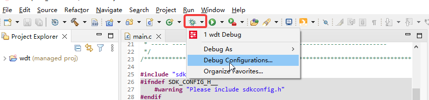

* 单击左上角红框中图标，或者双击Phytium GDB OpenOCD Debugging,创建调试配置。                             
  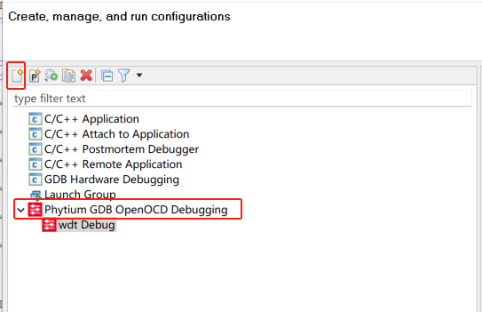

* 选中工程，Main选项卡中C/C++ Application自动填充好工程编译后生成的同名二进制文件。                   
  

* Debugger选项卡中，包含启动openocd和gdb的调试配置。Probe对应使用的调试适配器。选择不同的Probe会有不同的Config options启动脚本来启动openocd。                          
  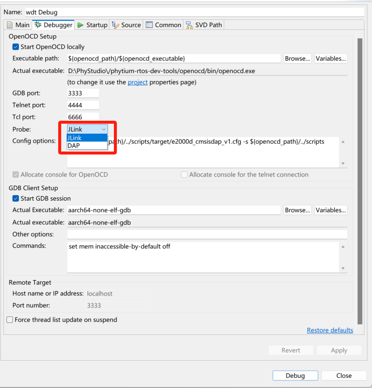 

* Startup选项卡，包括一些用于配置调试会话的openocd选项。           
  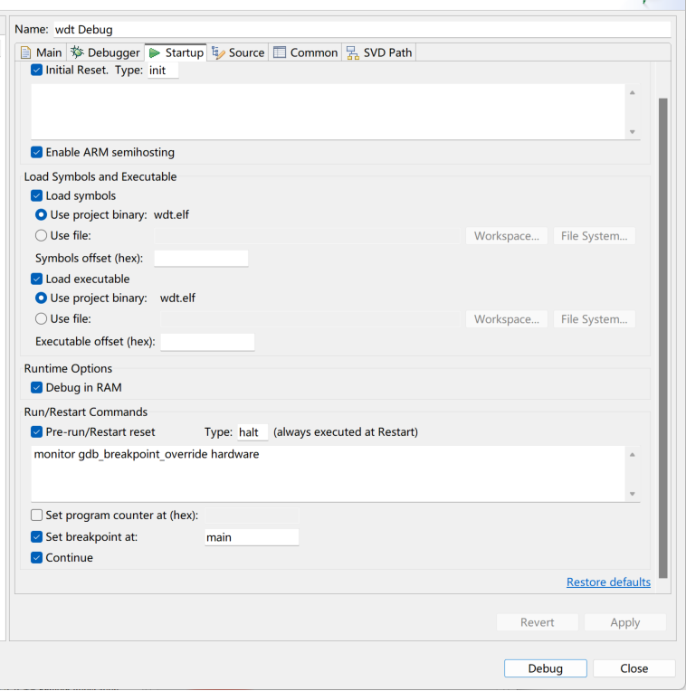                        
  上述字段会按照如下顺序生成命令发送给gdb：

```csharp
monitor reset init
monitor halt
monitor arm semihosting enable
symbol-file ".../wdt/Debug/est.elf"
load ".../wdt/Debug/est.elf"
monitor gdb_breakpoint_override hardware
break main
monitor reset halt
monitor halt
```

* Common选项卡，选择调试配置保存的位置。选择Local file，即保存在本地工作区；选择Shared file，即保存在工程中。        
  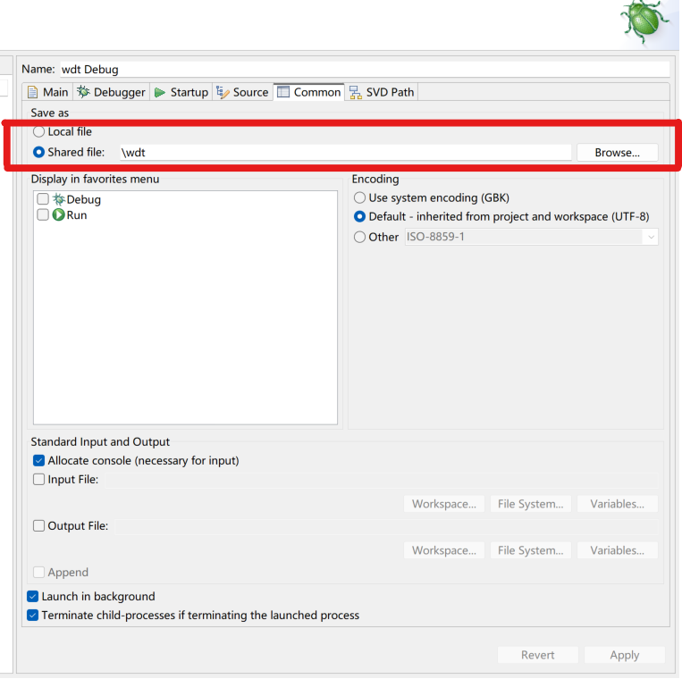

### 启动调试会话

* 启动调试会话前，确保：

  * 开发板具有JTAG接口，并且通过调试适配器将开发板的JTAG接口和主机的USB接口连接起来。

  * 开发板上电。

* 选中工程，完成调试配置后，点击Debug按钮，启动调试，默认断点在main函数入口。
  

* 如果需要再次启动同一工程的调试，可以点击Debug下拉图标，选择第一项，启动调试。                         
  

* 注意：启动调试会话时，Phytium的视图会发生更改。

* 如果成功启动了调试会话，可以看到openocd和aarch-none-elf-gdb这两个进程。                 
  

* 同时，PhyStudio中的视图会从Edit视图切换到Debug视图，Debug视图中会展示：         

  * 函数调用堆栈。

  * 源代码视图显示断点位置。

  * Variables、Expressions、Breaks等视图也会处于打开状态。

  * Console视图打开。

  如果是第一次在PhyStudio进入调试，可能会弹出一个确认视图切换的对话框，点击Switch按钮切换即可。               
  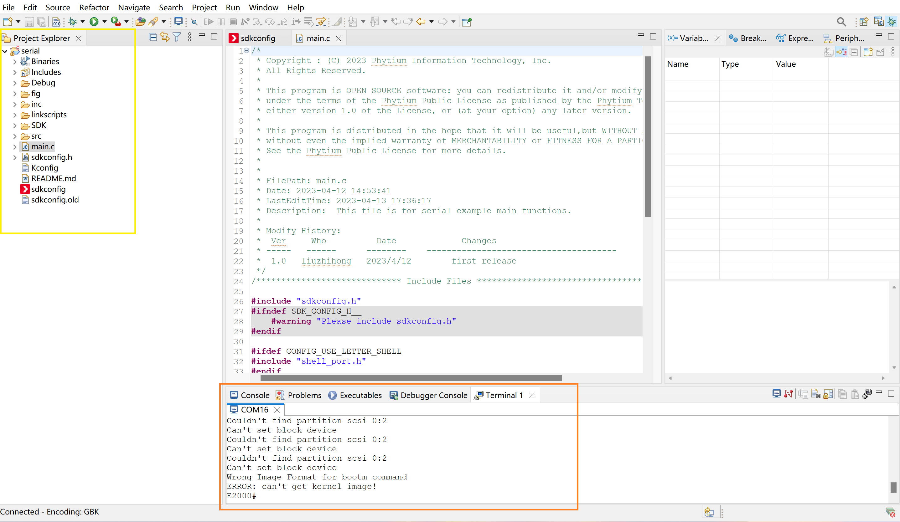        
  

  ### 调试应用

* 基本调试功能位于顶部的栏中。下图按钮从左至右依次为：      
  

  * Resume：继续执行程序；如果没有断点就一直执行，直到执行结束；如果运行过程中有断点，就跳转到该断点。             

  * Suspend：停止执行。

  * Terminate：终止调试会话。

  * Connect/Disconnect：断开调试连接，已禁用。

  * Step Into：下一步，若下一步是函数，则会进入函数体内部执行。

  * Step Over：下一步，不会进入函数体。

  * Step Return：从进入的函数中跳出来或者跳转到所在函数中的下一个断点。

* Variables视图             
  
  该视图中自动填充调试程序的上下文中存在的变量。包含三列：

  * Name 变量名称。

  * Type 变量数据类型。

  * Value 变量的值。

* 注：该视图不允许添加或删除行，只允许自动填充变量。

* Breakpoints视图                      
  显示当前所有断点信息。

     

  添加断点方式：在源代码区域。双击需要添加的断点的代码显示代码行数的位置。

  

* Disassembly视图
  
  点击红框中图标将会跳出Disassembly视图，可以查看对应执行的汇编指令。    

  

* Console视图
  
  显示openocd进程执行情况。                               
  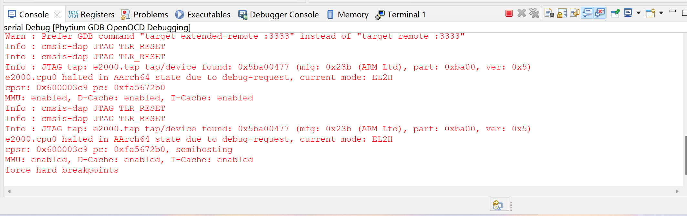

* Registers视图              
  显示所有寄存器的值。                
  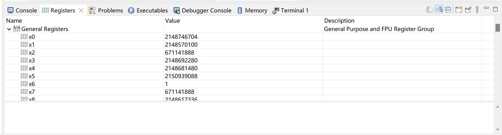

* Problems视图               
  显示编译、运行和调试过程中产生的警告和错误信息。               
  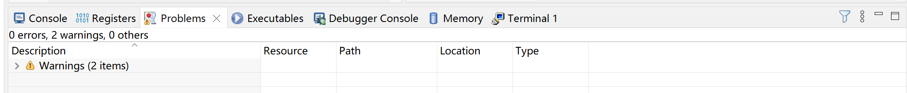

* Executables视图                     
                      

* Debugger Console视图                 
  显示gdb调试信息。                         
                     
  可添加需要监测的地址，监测该地址中的值的变化。                 
  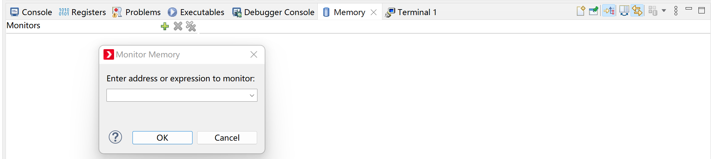

* Terminal视图                 
  点击Window->Show View->Terminal,生成该视图，显示连接开发板的串口信息。          
  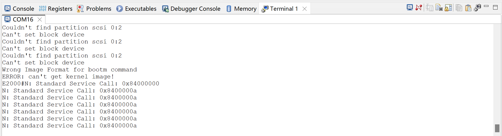               