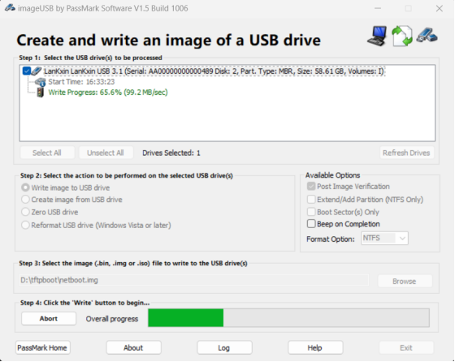
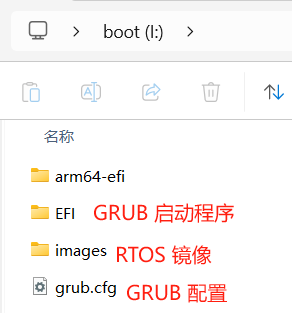
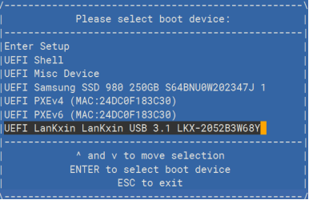

# UEFI 环境引导启动裸机镜像

- 准备 U 盘或者其它存储盘作为启动介质
- 下载引导裸机/RTOS 用的 GRUB 引导程序 [netboot.img](https://pan.baidu.com/s/13EjynjXf_IlGkyIpgQklnA)，提取码：PHYT
- 通过 imageUSB 或者其它工具将下载的 netboot.img 少量到启动介质盘里



- 烧录完成后，启动介质会出现一个 boot 分区（FAT格式），可以将待启动的裸机/RTOS 镜像手动拷贝到这个 FAT 文件系统中启动，也可以参考后面的教程，使用 TFTP 网络加载裸机/RTOS 镜像启动



- 将启动盘连接到 UEFI 环境启动的开发板上，启动后按 F2 选择启动盘，或者按 F3 进入 UEFI Shell，cd 到启动盘然后找到并运行其中的 EFI/BOOT/BOOTAA64.EFI



### 加载启动硬盘中的镜像

- 启动后进入 GRUB shell，输入下面的命令启动 ELF 或者 BIN 格式的裸机/RTOS 镜像

```
grub> loadelf /images/baremetal.elf
grub> boot

# 裸机镜像的启动地址默认为 0x80100000
grub> loadbin /images/baremetal.bin 0x80100000
grub> boot
```

- 输入 boot 后启动进入裸机/RTOS系统

### 通过网络加载启动的镜像

- 如果上位机是 Linux 系统，可以参考 Phytium Standalone SDK 中提供的方法安装和配置 TFTP 服务，如果上位机是 Windows 系统，可以使用 [Open TFTP Server](https://sourceforge.net/projects/tftp-server/) 配置 TFTP 服务

- 按实际情况配置 Open TFTP Server，编辑 OpenTFTPServerMT.ini，指定 TFTP 服务器 IP 和 TFTP 文件的目录，然后运行脚本 RunStandAloneMT.bat 启动 TFTP 服务

```
[LISTEN-ON]
192.168.4.30
[HOME]
d:\tftpboot
```

- 启动 BOOTAA64.EFI 后进入 GRUB shell，然后加载镜像

```
grub> net_add_addr tftp efinet0 192.168.4.20 
grub> net_add_route tftp 192.168.4.30 tftp
grub> loadelf (tftp,192.168.4.30)/baremetal.elf
Load ELF image (tftp,192.168.4.30)/baremetal.elf to 0x80100000, size 9228288 bytes
grub> boot

grub> net_add_addr tftp efinet0 192.168.4.20                                                                 
grub> net_add_route tftp 192.168.4.30 tftp                                                                   
grub> loadbin (tftp,192.168.4.30)/baremetal.bin 0x80100000                                                   
Load binary image (tftp,192.168.4.30)/baremetal.bin to 0x80100000, size 184320 bytes                         
grub> boot
```

### 通过 grub.cfg 配置启动自加载硬盘/网络镜像

- 如果是从硬件加载镜像，修改 grub.cfg 添加启动项，之后上电就可以自动加载

```
menuentry "Baremetal(ELF)" {
    echo "Loading baremetal elf image..."
    loadelf /images/baremetal.elf
}

或

menuentry "Baremetal(BIN)" {
    echo "Loading baremetal binary image..."
    loadbin /images/baremetal.bin 0x80100000
}
```

- 如果是从 TFTP 网络位置加载，修改 grub.cfg 添加启动项，之后上电就可以自动加载 (前提是 TFTP 服务可以正常访问)

```
set board_ip="192.168.4.20"
set server_ip="192.168.4.30"
net_add_addr tftp efinet0 $board_ip
net_add_route tftp $server_ip tftp

menuentry "Baremetal(ELF) network boot" {
    echo "Loading baremetal elf image from network ..."
    loadelf (tftp,$server_ip)/baremetal.elf
}

menuentry "Baremetal(BIN) network boot" {
    echo "Loading baremetal binary image from network..."
    loadbin (tftp,$server_ip)/baremetal.bin 0x80100000
}
```