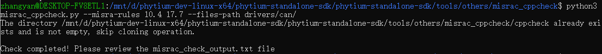
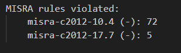

# misrac_cppcheck工具
    使用Cppcheck中的misra检测功能对代码进行静态检查。

## 环境搭建与使用步骤
- 该工具已在 Ubuntu22.04/20.04 上进行测试使用

1. 安装Cppcheck工具, 请安装1.90及以上版本, 不同版本对于检测结果有很大影响, 请尽量使用新版本
```
$ sudo apt-get install cppcheck
```

2. 可直接运行python脚本，进行检测

```
$ python3 misrac_cppcheck.py --misra-rules 10.4 17.7 --files-path drivers/can
```



注:执行脚本时会拉取[Cppcheck Gitee社区](https://gitee.com/mirrors/cppcheck.git)Cppcheck Gitee社区代码，请确保网络环境支持或手动下载代码放置在`misrac_cppcheck/cppcheck/`目录下

3. 可在任意`example`下执行`make`指令调用脚本，进行检测

```
$ make misrac_check MISRA_RULES="10.3 17.7" FILES_PATH="drivers/can/"
```


4. 查看`misrac_check_output.txt`文件，获取检测结果



